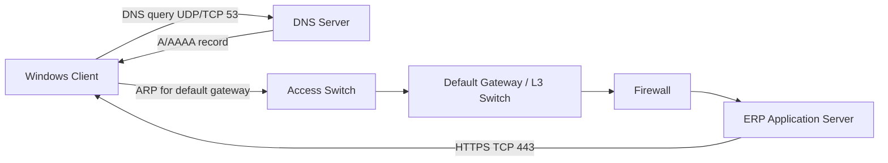

# Networking Fundamentals

This module provides a comprehensive introduction to the core concepts of computer networking. It aims to equip learners with a solid understanding of how networks operate, the essential components involved, and the fundamental protocols that enable seamless communication across diverse systems.

---

## مقدمة في أساسيات الشبكات

تغطي هذه الوحدة المفاهيم الأساسية لشبكات الحاسوب. تهدف إلى توفير فهم قوي لكيفية عمل الشبكات، والمكونات المختلفة المتضمنة، والبروتوكولات التي تمكن الاتصال.

---

## Table of Contents

1.  [Introduction](#introduction)
2.  [Topics Covered](#topics-covered)
3.  [Labs and Exercises](#labs-and-exercises)
4.  [Learning Objectives](#learning-objectives)
5.  [Prerequisites](#prerequisites)
6.  [Module Structure](#module-structure)
7.  [Resources](#resources)
8.  [Next Module](#next-module)

---

## Introduction

This module covers the foundational concepts of computer networking. It aims to provide a solid understanding of how networks operate, the various components involved, and the protocols that enable communication.

---

## مقدمة

تغطي هذه الوحدة المفاهيم الأساسية لشبكات الحاسوب. تهدف إلى توفير فهم قوي لكيفية عمل الشبكات، والمكونات المختلفة المتضمنة، والبروتوكولات التي تمكن الاتصال.

---

## Topics Covered

This section outlines the key areas that will be explored within this module.

| Topic                 | Description                                                                                             |
| :-------------------- | :------------------------------------------------------------------------------------------------------ |
| **Network Topologies**| Understanding different ways networks can be structured (e.g., bus, star, ring, mesh).                  |
| **Network Devices**   | Introduction to essential hardware like routers, switches, hubs, and access points.                     |
| **Network Models**    | Exploring the OSI and TCP/IP models to understand the layered approach to networking.                   |
| **IP Addressing**     | Basics of IPv4 and IPv6 addressing, including subnetting concepts.                                      |
| **Protocols**         | Overview of key networking protocols such as TCP, UDP, HTTP, DNS, DHCP, etc.                            |
| **Network Media**     | Understanding different types of cables and wireless technologies used for network transmission.        |
| **Basic Configuration**| Introduction to configuring network interfaces and common network services.                             |

---

## المواضيع التي تغطيها الوحدة

يستعرض هذا القسم المجالات الرئيسية التي سيتم استكشافها ضمن هذه الوحدة.

| الموضوع                 | الوصف                                                                                                                            |
| :-------------------- | :------------------------------------------------------------------------------------------------------------------------------- |
| **طوبولوجيا الشبكات**   | فهم الطرق المختلفة التي يمكن بها هيكلة الشبكات (مثل: الناقل، النجمة، الحلقة، الشبكة المتشابكة).                                       |
| **أجهزة الشبكات**       | مقدمة للأجهزة الأساسية مثل الموجهات (Routers)، المحولات (Switches)، الموزعات (Hubs)، ونقاط الوصول (Access Points).                   |
| **نماذج الشبكات**       | استكشاف نموذجي OSI و TCP/IP لفهم النهج الطبقي للشبكات.                                                                             |
| **عنونة IP**           | أساسيات عنونة IPv4 و IPv6، بما في ذلك مفاهيم تقسيم الشبكات الفرعية (Subnetting).                                                    |
| **البروتوكولات**        | نظرة عامة على بروتوكولات الشبكات الرئيسية مثل TCP، UDP، HTTP، DNS، DHCP، إلخ.                                                      |
| **وسائط الشبكة**        | فهم أنواع الكابلات المختلفة وتقنيات الشبكات اللاسلكية المستخدمة لنقل البيانات في الشبكة.                                            |
| **الإعداد الأساسي**     | مقدمة لإعداد واجهات الشبكة وخدمات الشبكة الشائعة.                                                                                 |

---

## Labs and Exercises

This module includes practical labs designed to reinforce theoretical concepts. You will have the opportunity to:

*   Configure basic network settings on virtual machines.
*   Analyze network traffic using tools like Wireshark.
*   Simulate network topologies using packet tracer or similar tools.

*(Note: Specific lab titles or more detailed descriptions would enhance this section.)*

---

## المختبرات والتمارين

تتضمن هذه الوحدة مختبرات عملية مصممة لتعزيز المفاهيم النظرية. ستتاح لك الفرصة لـ:

*   إعداد إعدادات الشبكة الأساسية على الأجهزة الافتراضية.
*   تحليل حركة مرور الشبكة باستخدام أدوات مثل Wireshark.
*   محاكاة طوبولوجيا الشبكات باستخدام Packet Tracer أو أدوات مشابهة.

*(ملاحظة: عناوين المختبرات المحددة أو الأوصاف الأكثر تفصيلاً ستعزز هذا القسم.)*

---

## Learning Objectives

Upon successful completion of this module, you will be able to:

*   Describe the fundamental concepts of computer networking.
*   Identify and explain the purpose of common network devices.
*   Understand the layered architecture of the OSI and TCP/IP models.
*   Explain the basics of IP addressing (IPv4 and IPv6).
*   Recognize key networking protocols and their functions.

---

## أهداف التعلم

عند الانتهاء بنجاح من هذه الوحدة، ستكون قادرًا على:

*   وصف المفاهيم الأساسية لشبكات الحاسوب.
*   تحديد وشرح الغرض من أجهزة الشبكات الشائعة.
*   فهم البنية الطبقية لنموذجي OSI و TCP/IP.
*   شرح أساسيات عنونة IP (IPv4 و IPv6).
*   التعرف على بروتوكولات الشبكات الرئيسية ووظائفها.

---

## Prerequisites

*   Basic computer literacy.
*   Familiarity with operating systems (Windows or Linux).

---

## المتطلبات المسبقة

*   الإلمام الأساسي بالحاسوب.
*   التعرف على أنظمة التشغيل (Windows أو Linux).

---

## Module Structure

This module is structured to build your understanding progressively:

1.  **Introduction to Networking:** Core concepts and terminology.
2.  **Network Devices and Media:** Hardware and physical connections.
3.  **Network Models:** OSI and TCP/IP layers.
4.  **IP Addressing and Subnetting:** Understanding IP addresses and network segmentation.
5.  **Key Protocols:** How devices communicate.
6.  **Basic Configuration and Troubleshooting:** Practical application.

---

## هيكل الوحدة

تم تنظيم هذه الوحدة لبناء فهمك بشكل تدريجي:

1.  **مقدمة في الشبكات:** المفاهيم والمصطلحات الأساسية.
2.  **أجهزة الشبكات والوسائط:** الأجهزة والاتصالات المادية.
3.  **نماذج الشبكات:** طبقات OSI و TCP/IP.
4.  **عنونة IP وتقسيم الشبكات الفرعية:** فهم عناوين IP وتقسيم الشبكة.
5.  **البروتوكولات الرئيسية:** كيفية تواصل الأجهزة.
6.  **الإعداد الأساسي واستكشاف الأخطاء وإصلاحها:** التطبيق العملي.

---

## Resources

This section provides links to supplementary materials that will aid in your learning.

*   [Cheatsheet](cheatsheet.md)
*   [Lab Guide](lab-guide.md)
*   [Notes](notes.md)
*   [Troubleshooting](troubleshooting.md)

---

## الموارد

يوفر هذا القسم روابط للمواد التكميلية التي ستساعد في تعلمك.

*   [ملخص سريع](cheatsheet.md)
*   [دليل المختبر](lab-guide.md)
*   [ملاحظات](notes.md)
*   [استكشاف الأخطاء وإصلاحها](troubleshooting.md)

---

## Next Module

*   **Module:** OSI Model
    *   **Description:** Delve deeper into the intricacies of the Open Systems Interconnection (OSI) model, understanding each layer's function and how they interact.
    *   **Link:** [01-Networking/02-OSI-Model/README.md](01-Networking/02-OSI-Model/README.md)

---

## الوحدة التالية

*   **الوحدة:** نموذج OSI
    *   **الوصف:** تعمق في تفاصيل نموذج الربط المفتوح للأنظمة (OSI)، وفهم وظيفة كل طبقة وكيفية تفاعلها.
*   **الرابط:** [01-Networking/02-OSI-Model/README.md](01-Networking/02-OSI-Model/README.md)

---

# Enterprise Foundation | الأساس المؤسسي

> يقدّم هذا القسم الصورة العملية التي يحتاجها مهندس الدعم أو الشبكات في بيئة **Enterprise Network**. لا يحل محل الوحدات اللاحقة المتخصصة؛ بل يربط المفاهيم الأساسية بسيناريو عمل حقيقي.

## رحلة طلب المستخدم (User Request Journey)

عندما يفتح مستخدم تطبيقاً داخلياً مثل `https://erp.corp.example`، تتعاون طبقات وأجهزة متعددة. نجاح `ping` وحده لا يثبت أن التطبيق يعمل، لأن التطبيق يعتمد أيضاً على DNS وTCP وTLS والمنفذ والخدمة نفسها.



```text
PC-01 ── Access Port ── SW-Access ── Trunk ── L3 Switch ── Firewall ── ERP
  |                         |                |                 |
 NIC/MAC                  VLAN 20        Gateway .1        Policy + NAT
```

## مقارنة تشغيلية (Operational Comparison)

| العنصر | العربية | English term | كيف يستخدمه المهندس؟ |
|---|---|---|---|
| العنوان المنطقي | يحدد موقع الجهاز بين الشبكات | IP address | route traffic إلى شبكة أخرى |
| العنوان الفيزيائي | يحدد واجهة الشبكة محلياً | MAC address | switch forwarding داخل VLAN |
| البوابة الافتراضية | أول قفزة خارج الشبكة المحلية | Default gateway | إرسال traffic إلى شبكات بعيدة |
| المنفذ | يحدد الخدمة داخل الجهاز | TCP/UDP port | التحقق من HTTPS 443 أو DNS 53 |
| اسم المضيف | اسم قابل للقراءة بدلاً من IP | FQDN / hostname | DNS resolution وتسجيل الأحداث |

## مثال Cisco وWindows من مؤسسة

لدى شركة قسمان: Finance في `VLAN 20` وHR في `VLAN 30`. يقوم Cisco Layer 3 Switch بتوجيه الشبكات، بينما يمنع Firewall الوصول غير المصرح به بين الأقسام. جهاز Windows في Finance يحصل على إعداداته من DHCP ويستخدم DNS الداخلي للوصول إلى ERP.

```cisco
interface GigabitEthernet1/0/10
 description FIN-PC-01
 switchport mode access
 switchport access vlan 20
 spanning-tree portfast

interface Vlan20
 ip address 10.20.20.1 255.255.255.0
```

```powershell
Get-NetIPConfiguration
Resolve-DnsName erp.corp.example
Test-NetConnection erp.corp.example -Port 443
```

## ملاحظات CCNA (CCNA Exam Notes)

- يعمل **Switch** عادةً في Layer 2 ويستخدم جدول MAC، بينما يختار **Router / Layer 3 Switch** المسار باستخدام جدول التوجيه (Routing Table).
- يغيّر الراوتر إطار Layer 2 في كل hop، لكن عنواني IP للمصدر والوجهة يظلان غالباً كما هما من طرف إلى طرف، ما لم يحدث NAT.
- `169.254.0.0/16` هو عنوان **APIPA** في Windows ويشير غالباً إلى فشل DHCP، وليس بديلاً عن عنوان مؤسسة صحيح.
- DNS يستخدم UDP/53 غالباً، وقد يستخدم TCP/53 للردود الكبيرة أو zone transfer. لا تفترض أن DNS “UDP فقط”.
- ICMP مفيد للتشخيص، لكن نجاح أو فشل `ping` ليس دليلاً قاطعاً على توفر تطبيق TCP/UDP.

## أفضل الممارسات (Best Practices)

1. وثّق VLAN، subnet، gateway، DNS، المالك، والغرض من كل شبكة في IP Address Management (IPAM).
2. استخدم DHCP reservations للخوادم والطابعات والبنية التحتية عند الحاجة؛ لا توزع عناوين ثابتة بلا سجل.
3. استخدم NTP، DNS داخلياً موثوقاً، وSNMPv3/Syslog للمراقبة بدلاً من الاعتماد على ملاحظات المستخدمين.
4. افصل شبكات المستخدمين والخوادم والطابعات والضيوف والإدارة باستخدام VLANs وfirewall policies.
5. اختبر التغيير في نافذة Change Management، وخذ نسخة إعدادات (configuration backup) قبل تعديل Cisco أو Firewall.

## قاموس أساسي (Glossary)

| المصطلح | التعريف المختصر |
|---|---|
| **Bandwidth** | السعة النظرية للوصلة، مثل 1 Gbps. |
| **Throughput** | المعدل الفعلي للبيانات الناجحة بعد الحمل والترويسات والأخطاء. |
| **Latency** | زمن انتقال الحزمة من مصدر إلى وجهة. |
| **Jitter** | تباين زمن الوصول؛ مهم لـ VoIP والفيديو. |
| **Packet loss** | حزم لم تصل؛ يسبب إعادة إرسال أو تقطعاً بحسب البروتوكول. |
| **Duplex** | أسلوب الإرسال Half/Full؛ عدم التطابق يسبب بطئاً وأخطاء. |
| **FQDN** | الاسم الكامل مثل `server01.corp.example`. |
| **NIC** | بطاقة/واجهة الشبكة (Network Interface Card). |

> **صورة مقترحة (Image Placeholder):** لقطة موثقة لطوبولوجيا Access–Distribution–Core توضح VLANs وFirewall وWindows Server. أضف صورة أصلية أو مرخصة لاحقاً في `images/` مع وصف بديل (alt text).
