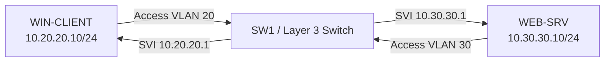

# 🧪 Networking Fundamentals Lab Guide

> Practical hands-on labs to practice Networking Fundamentals.

---

# 📋 Lab Objectives

After completing these labs, you will be able to:

- Identify your network configuration.
- Test connectivity.
- Understand IP addressing.
- Use common networking commands.
- Troubleshoot simple network problems.

---

# 💻 Lab 1 – View Your Network Information

## Objective

Display your computer's network configuration.

---

## Windows

Open **Command Prompt** and run:

```cmd
ipconfig
```

### Expected Output

- IPv4 Address
- Subnet Mask
- Default Gateway

---

For detailed information:

```cmd
ipconfig /all
```

You will also see:

- MAC Address
- DNS Servers
- DHCP Status
- Adapter Name

---

## Questions

- What is your IPv4 Address?
- What is your Default Gateway?
- Is DHCP Enabled?

---

# 🏓 Lab 2 – Test Network Connectivity

## Objective

Verify that another device is reachable.

Run:

```cmd
ping 8.8.8.8
```

Expected result:

```text
Reply from 8.8.8.8
```

---

Now test DNS:

```cmd
ping google.com
```

---

## Discussion

If the IP works but the domain name fails, the issue is probably related to **DNS**.

---

# 🌍 Lab 3 – Discover Your Public IP

Open a browser and visit:

https://whatismyipaddress.com

Compare it with your local IP address.

### Questions

- What is your Private IP?
- What is your Public IP?
- Why are they different?

---

# 🧭 Lab 4 – Trace the Route

Run:

```cmd
tracert google.com
```

Observe:

- Number of hops
- Response time
- Final destination

---

# 🔍 Lab 5 – DNS Lookup

Run:

```cmd
nslookup google.com
```

Observe:

- DNS Server
- Resolved IP Address

---

# 📡 Lab 6 – Display ARP Cache

Run:

```cmd
arp -a
```

Observe:

- IP Address
- MAC Address
- Interface

---

# 🌐 Lab 7 – Display Active Connections

Run:

```cmd
netstat -an
```

Observe:

- Local Address
- Remote Address
- Listening Ports
- Established Connections

---

# 🔥 Lab 8 – Simulate a Network Problem

Disconnect the network cable (or disable Wi-Fi).

Run:

```cmd
ping 8.8.8.8
```

Reconnect the cable.

Run the command again.

### Observe

How does the output change?

---

# 📊 Lab Checklist

| Task | Completed |
|-------|-----------|
| View IP Configuration | ☐ |
| View Detailed Configuration | ☐ |
| Ping Local Network | ☐ |
| Ping Internet | ☐ |
| Trace Route | ☐ |
| DNS Lookup | ☐ |
| View ARP Cache | ☐ |
| View Active Connections | ☐ |

---

# 💡 Best Practices

- Always verify physical connections first.
- Check the IP configuration before troubleshooting.
- Test connectivity using both IP addresses and domain names.
- Record command outputs while troubleshooting.
- Start with simple checks before assuming complex failures.

---

# 🎯 Challenge

Answer the following:

1. What is your IPv4 Address?
2. What is your Default Gateway?
3. What DNS Server are you using?
4. What is your MAC Address?
5. Can you successfully ping 8.8.8.8?
6. How many hops does `tracert google.com` show?

---

🎉 Congratulations!

You have completed the Networking Fundamentals Lab.

---

# Enterprise Labs | مختبرات Enterprise العملية

> نفّذ المختبرات في Packet Tracer أو EVE-NG/GNS3 وWindows 10/11 أو Windows Server. لا تطبقها مباشرة على شبكة الإنتاج.

## Lab 1 — بناء شبكة مستخدمين وخوادم (Cisco + Windows)

### الهدف

بناء VLAN للمستخدمين `20` وVLAN للخوادم `30`، وتكوين gateway على Layer 3 Switch ثم التحقق من اتصال Windows بخادم ويب.

### المخطط



### جدول العناوين

| الجهاز | الواجهة/VLAN | IP address | Default gateway |
|---|---|---|---|
| WIN-CLIENT | VLAN 20 | `10.20.20.10/24` | `10.20.20.1` |
| SW1 | SVI VLAN 20 | `10.20.20.1/24` | — |
| SW1 | SVI VLAN 30 | `10.30.30.1/24` | — |
| WEB-SRV | VLAN 30 | `10.30.30.10/24` | `10.30.30.1` |

### خطوات Cisco

```cisco
enable
configure terminal
vlan 20
 name USERS
vlan 30
 name SERVERS
interface gigabitEthernet1/0/10
 switchport mode access
 switchport access vlan 20
 spanning-tree portfast
interface gigabitEthernet1/0/20
 switchport mode access
 switchport access vlan 30
 spanning-tree portfast
interface vlan 20
 ip address 10.20.20.1 255.255.255.0
 no shutdown
interface vlan 30
 ip address 10.30.30.1 255.255.255.0
 no shutdown
ip routing
end
write memory
```

### خطوات Windows والتحقق

```powershell
New-NetIPAddress -InterfaceAlias 'Ethernet' -IPAddress 10.20.20.10 -PrefixLength 24 -DefaultGateway 10.20.20.1
Test-NetConnection 10.30.30.10
tracert -d 10.30.30.10
```

**معيار النجاح:** يصل `Test-NetConnection` إلى الخادم، ويظهر `show ip route` شبكتي VLAN كـ connected routes. وثّق output قبل الانتقال للمختبر التالي.

## Lab 2 — عزل عطل DHCP وDNS على Windows

### السيناريو

المستخدم يحصل على `169.254.x.x` ولا يستطيع فتح `intranet.corp.example`. بعد تصحيح DHCP، يعمل `ping 10.30.30.10` لكن الاسم ما زال يفشل.

### الخطوات

1. سجّل baseline: `ipconfig /all` و`Get-NetIPConfiguration`.
2. تأكد من access VLAN ووجود DHCP scope/relay المناسبين؛ لا تعيّن IP ثابتاً كحل نهائي.
3. جدّد lease: `ipconfig /release` ثم `ipconfig /renew` في بيئة المختبر فقط.
4. اختبر `Resolve-DnsName intranet.corp.example` و`nslookup intranet.corp.example`.
5. أصلح A record أو DNS server assignment في المختبر ثم أعد الاختبار.

### أسئلة مراجعة

- ما الدليل الذي يثبت أن مشكلة APIPA مرتبطة بـ DHCP؟
- لماذا لا يحل نجاح ping إلى IP مشكلة DNS؟
- ما الفرق بين DNS record خاطئ وTCP/443 محجوب؟

## Lab 3 — تحليل Packet Flow في Wireshark

### الهدف

التقاط DNS وTCP handshake ثم ربط كل packet بطبقة OSI المناسبة.

1. افتح Wireshark على واجهة المختبر وابدأ capture.
2. نفّذ `Resolve-DnsName example.com` ثم افتح موقع HTTPS مسموحاً.
3. استخدم filters: `dns`، ثم `tcp.flags.syn == 1`، ثم `tcp.port == 443`.
4. حدّد source/destination IP، source/destination port، وTCP flags.

| Evidence | الطبقة | التفسير |
|---|---|---|
| DNS query | L7 / L4 | اسم خدمة فوق UDP/TCP 53 |
| SYN, SYN-ACK, ACK | L4 | إنشاء TCP session |
| IPv4 header | L3 | عنوان منطقي وقابل للتوجيه |
| Ethernet header | L2 | MAC محلي يتغير عبر router |

## Lab 4 — تحدي تشخيص Cisco (Troubleshooting Challenge)

**العطل المقصود:** منفذ PC في VLAN 30 بدلاً من VLAN 20، والخادم متاح فقط من VLAN 20 وفق ACL.

استخدم هذه الأوامر فقط أولاً:

```cisco
show interfaces status
show interfaces gigabitEthernet1/0/10 switchport
show vlan brief
show mac address-table interface gigabitEthernet1/0/10
```

**معيار النجاح:** اشرح لماذا كانت المشكلة Layer 2، نفّذ التعديل ضمن المختبر، ثم أثبت النتيجة باختبار IP وFQDN وTCP port.

## Cleanup | التنظيف

- احذف عناوين Windows الثابتة أو أعد الواجهة إلى DHCP بعد المختبر.
- احذف VLANs وSVIs التجريبية فقط بعد التأكد من أنها ليست مستخدمة في بيئة مشتركة.
- احفظ outputs وملف `.pkt`/topology مع اسم المختبر وتاريخه.
