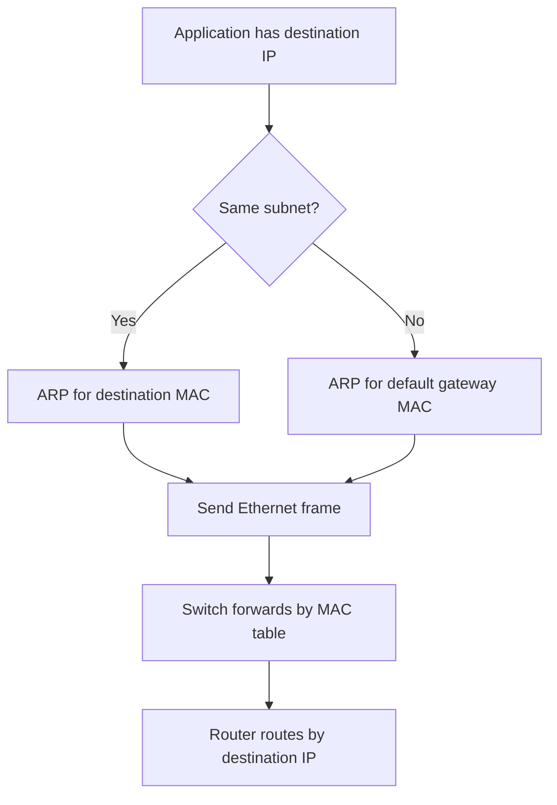

# 📘 Networking Fundamentals Notes

> Comprehensive study notes for Networking Fundamentals.
>
> This document explains the core networking concepts with English definitions, Arabic explanations, practical examples, and real-world scenarios.

---

# 📖 Table of Contents

- What is a Network?
- Why Do We Need Networks?
- Types of Networks
- Network Topologies
- Client-Server vs Peer-to-Peer
- Basic Networking Components
- (Continue...)

---

# 🌐 What is a Network?

## 🇺🇸 English

A **Computer Network** is a group of two or more devices connected together to exchange data and share resources.

These devices may include:

- Computers
- Servers
- Printers
- Mobile Phones
- IP Cameras
- Network Storage (NAS)

Networks allow devices to communicate using standard communication protocols such as TCP/IP.

---

## 🇪🇬 الشرح بالعربي

الشبكة (Network) هي مجموعة من الأجهزة المتصلة ببعضها بهدف تبادل البيانات أو مشاركة الموارد.

قد تكون هذه الأجهزة:

- أجهزة كمبيوتر
- سيرفرات
- طابعات
- موبايلات
- كاميرات مراقبة
- وحدات تخزين

كل جهاز داخل الشبكة يستطيع التواصل مع الأجهزة الأخرى باستخدام بروتوكولات مثل TCP/IP.

---

## 📝 Example

في شركة يوجد:

- 20 جهاز كمبيوتر
- سيرفر ملفات
- طابعة
- راوتر
- سويتش

جميع هذه الأجهزة متصلة معًا وتشكل **Local Area Network (LAN)**.

---

## 💼 Real World Example

في شركتك، الموظف يستطيع:

- فتح ملفات من السيرفر.
- الطباعة على طابعة مشتركة.
- استخدام الإنترنت.
- الدخول إلى Microsoft 365 أو أي نظام داخلي.

كل ذلك يتم من خلال الشبكة.

---

## 🎯 Interview Tip

**Question:**
What is a Computer Network?

**Answer:**

> A computer network is a collection of interconnected devices that communicate and share resources using communication protocols.

---

# 🎯 Why Do We Need Networks?

## 🇺🇸 English

Networks make communication easier and allow users to share resources efficiently.

Common purposes include:

- File Sharing
- Printer Sharing
- Internet Access
- Email Communication
- Centralized Management
- Remote Access
- Data Backup

---

## 🇪🇬 بالعربي

وجود الشبكات يوفر:

- مشاركة الملفات
- مشاركة الطابعات
- الوصول إلى الإنترنت
- إرسال واستقبال البريد الإلكتروني
- إدارة الأجهزة من مكان واحد
- النسخ الاحتياطي
- العمل عن بعد

بدون الشبكات، سيكون كل جهاز معزولًا عن الآخر.

---

# 🌍 Types of Networks

## 1️⃣ PAN (Personal Area Network)

### 🇺🇸 English

A Personal Area Network (PAN) connects devices around a single person within a very short distance.

### 🇪🇬 بالعربي

شبكة شخصية تربط أجهزة شخص واحد فقط، ويكون مداها عدة أمتار.

### 📝 Examples

- Bluetooth Headset
- Smart Watch
- Wireless Mouse
- Mobile Hotspot

---

## 2️⃣ LAN (Local Area Network)

### 🇺🇸 English

A Local Area Network connects devices within a limited geographical area such as a home, office, or school.

### 🇪🇬 بالعربي

أكثر أنواع الشبكات استخدامًا.

تستخدم داخل:

- المنازل
- الشركات
- المدارس
- الجامعات

وتتميز بسرعة عالية وتكلفة منخفضة.

### 📝 Example

Office Network

```
PC1
   \
PC2 ---- Switch ---- Router ---- Internet
   /
Printer
```

---

## 3️⃣ MAN (Metropolitan Area Network)

### 🇺🇸 English

A Metropolitan Area Network connects multiple LANs across a city.

### 🇪🇬 بالعربي

شبكة تغطي مدينة كاملة، وتستخدم غالبًا بواسطة شركات الاتصالات أو المؤسسات الكبيرة.

### Example

ربط جميع فروع بنك داخل نفس المدينة.

---

## 4️⃣ WAN (Wide Area Network)

### 🇺🇸 English

A Wide Area Network connects networks over large geographical areas such as countries or continents.

### 🇪🇬 بالعربي

شبكة واسعة تربط مدنًا أو دولًا أو قارات ببعضها.

أكبر مثال عليها هو:

**The Internet**

---

## 📊 Comparison

| Type | Coverage | Speed | Example |
|------|----------|-------|---------|
| PAN | Person | Very High | Bluetooth |
| LAN | Building | High | Office |
| MAN | City | Medium | ISP |
| WAN | Country / World | Lower | Internet |

---

## 🎯 Interview Questions

### Q1: Which network type is used inside a company?

**Answer:**
LAN (Local Area Network)

---

### Q2: What is the largest network in the world?

**Answer:**
The Internet (WAN)

---

### Q3: Which network has the shortest coverage?

**Answer:**
PAN

---

> 📌 **End of Part 1**
>
> ---

# 🏗️ Network Topologies

## 🇺🇸 English

A **Network Topology** describes how devices are physically or logically connected in a network.

Choosing the correct topology affects:

- Performance
- Reliability
- Cost
- Scalability
- Troubleshooting

---

## 🇪🇬 بالعربي

الـ **Topology** هي طريقة توصيل أجهزة الشبكة ببعض.

قد يكون شكل التوصيل فعليًا (Physical) أو طريقة انتقال البيانات (Logical).

اختيار الـ Topology المناسب يؤثر على:

- سرعة الشبكة
- سهولة الصيانة
- تكلفة التنفيذ
- إمكانية التوسع مستقبلاً

---

# ⭐ Star Topology

## 🇺🇸 English

In a Star Topology, every device is connected to a central switch or hub.

If one cable fails, only that device is affected.

If the central switch fails, the whole network stops.

### Diagram

```text
        PC1
         |
PC2 --- Switch --- PC3
         |
      Printer
```

### Advantages

- Easy to troubleshoot
- Easy to expand
- High performance
- Most common topology today

### Disadvantages

- Depends on the central switch
- Requires more cables

---

## 🇪🇬 بالعربي

جميع الأجهزة تتصل بسويتش واحد في المنتصف.

لو كابل جهاز تلف، باقي الشبكة تعمل بشكل طبيعي.

أما إذا تعطل السويتش، تتوقف الشبكة بالكامل.

**هذا هو التصميم المستخدم في أغلب الشركات حالياً.**

---

# 🚌 Bus Topology

## 🇺🇸 English

All devices share one main cable called the Backbone.

### Diagram

```text
PC ---- PC ---- PC ---- PC
        Backbone Cable
```

### Advantages

- Cheap
- Easy to install

### Disadvantages

- Difficult troubleshooting
- Slow with many devices
- Backbone failure stops the network

---

## 🇪🇬 بالعربي

كل الأجهزة متصلة بكابل واحد.

كان مستخدمًا قديمًا ولم يعد شائعًا.

إذا تلف الكابل الرئيسي تتوقف الشبكة بالكامل.

---

# 🔄 Ring Topology

## 🇺🇸 English

Each device connects to exactly two neighboring devices, forming a ring.

Data travels around the ring.

### Diagram

```text
PC1 ---- PC2
 |        |
PC4 ---- PC3
```

### Advantages

- Predictable performance

### Disadvantages

- One cable failure may stop communication
- Harder to maintain

---

## 🇪🇬 بالعربي

الأجهزة متصلة على شكل دائرة.

البيانات تتحرك من جهاز إلى آخر حتى تصل للهدف.

نادراً ما تُستخدم في الشبكات الحديثة.

---

# 🕸️ Mesh Topology

## 🇺🇸 English

Each device connects directly to every other device.

### Advantages

- Very reliable
- No single point of failure
- Excellent redundancy

### Disadvantages

- Very expensive
- Requires many cables
- Difficult to manage

---

## 🇪🇬 بالعربي

كل جهاز متصل بجميع الأجهزة الأخرى.

تُستخدم في الأماكن التي تحتاج إلى اعتمادية عالية مثل:

- Data Centers
- ISP Networks
- Core Networks

---

# 🌳 Tree Topology

## 🇺🇸 English

Tree Topology combines multiple Star Networks into a hierarchical structure.

### Diagram

```text
          Core Switch
           /      \
     Switch1    Switch2
      /   \        |
    PCs   PCs     PCs
```

### Advantages

- Easy expansion
- Organized structure

### Disadvantages

- Depends on upper-level devices

---

## 🇪🇬 بالعربي

تشبه هيكل الشجرة.

غالبًا تستخدم في:

- الشركات الكبيرة
- الجامعات
- المستشفيات

---

# 🔀 Hybrid Topology

## 🇺🇸 English

Hybrid Topology combines two or more topology types.

Example:

- Star + Mesh
- Star + Bus

---

## 🇪🇬 بالعربي

هي مزيج من أكثر من نوع Topology.

معظم الشركات الكبيرة تستخدم Hybrid Topology لأنها تمنح مرونة أكبر.

---

# 📊 Topology Comparison

| Topology | Cost | Performance | Reliability | Scalability |
|-----------|------|-------------|-------------|-------------|
| Bus | ⭐ | ⭐⭐ | ⭐ | ⭐ |
| Ring | ⭐⭐ | ⭐⭐⭐ | ⭐⭐ | ⭐⭐ |
| Star | ⭐⭐⭐ | ⭐⭐⭐⭐⭐ | ⭐⭐⭐⭐ | ⭐⭐⭐⭐⭐ |
| Mesh | ⭐⭐⭐⭐⭐ | ⭐⭐⭐⭐⭐ | ⭐⭐⭐⭐⭐ | ⭐⭐⭐ |
| Tree | ⭐⭐⭐ | ⭐⭐⭐⭐ | ⭐⭐⭐⭐ | ⭐⭐⭐⭐⭐ |
| Hybrid | ⭐⭐⭐⭐ | ⭐⭐⭐⭐⭐ | ⭐⭐⭐⭐⭐ | ⭐⭐⭐⭐⭐ |

---

# 💼 Real World

معظم الشركات اليوم تستخدم:

```
Internet
     │
 Firewall
     │
 Router
     │
 Core Switch
     │
Access Switches
     │
Users & Printers
```

وهذا يعتبر **Hybrid Topology** يعتمد بشكل أساسي على **Star Topology**.

---

# 🎯 Interview Questions

### Q1: Which topology is most commonly used in modern networks?

**Answer:**
Star Topology.

---

### Q2: Which topology provides the highest redundancy?

**Answer:**
Mesh Topology.

---

### Q3: Which topology is the cheapest?

**Answer:**
Bus Topology.

---

> 📌 End of Part 2
>
> ---

# 🖥️ Network Architectures

Network architecture defines how computers communicate and share resources within a network.

The two most common architectures are:

- Client-Server
- Peer-to-Peer (P2P)

---

# 🏢 Client-Server Network

## 🇺🇸 English

A Client-Server network is a model where one or more dedicated servers provide services to multiple client computers.

Clients request resources.

Servers provide resources.

Examples of resources include:

- Files
- Printers
- Applications
- Databases
- Authentication
- Internet Access

---

## 🇪🇬 بالعربي

في هذا النوع يوجد جهاز أو أكثر يسمى **Server**.

باقي الأجهزة تسمى **Clients**.

الـ Server يقدم الخدمات.

والـ Clients تستخدم هذه الخدمات.

مثل:

- فتح ملفات من السيرفر
- تسجيل الدخول بحساب الدومين
- استخدام طابعة مشتركة
- تشغيل برامج الشركة

---

## Diagram

```text
                Server
                   │
          ┌────────┴────────┐
          │                 │
       Switch            Firewall
          │
 ┌────────┼─────────┐
 │        │         │
PC1      PC2      PC3
```

---

## Advantages

- Centralized Management
- Better Security
- Easy Backup
- Easy User Management
- High Reliability
- Better Performance

---

## Disadvantages

- Higher Cost
- Requires Server Hardware
- Needs Professional Administration

---

## 💼 Real World

Almost every company today uses the Client-Server model.

Examples include:

- Microsoft Active Directory
- Microsoft Exchange
- File Server
- SQL Server
- Web Server
- Domain Controller

---

# 🤝 Peer-to-Peer (P2P)

## 🇺🇸 English

A Peer-to-Peer network is a network where every computer has equal responsibility.

There is no dedicated server.

Each computer can share its own resources.

---

## 🇪🇬 بالعربي

في هذا النوع لا يوجد سيرفر.

كل جهاز يمكن أن يكون:

- Client
- Server

في نفس الوقت.

كل جهاز يشارك ملفاته بنفسه.

---

## Diagram

```text
 PC1 ------------- PC2
   \               /
     \           /
        PC3
```

---

## Advantages

- Easy Setup
- Low Cost
- No Dedicated Server Required
- Suitable for Small Networks

---

## Disadvantages

- Weak Security
- Difficult Management
- No Central Backup
- Poor Scalability

---

## Example

A home network with:

- Two laptops
- One printer

The printer is shared directly from one laptop.

This is Peer-to-Peer.

---

# ⚖️ Client-Server vs Peer-to-Peer

| Feature | Client-Server | Peer-to-Peer |
|----------|---------------|--------------|
| Dedicated Server | ✅ | ❌ |
| Central Management | ✅ | ❌ |
| Security | High | Low |
| Cost | Higher | Lower |
| Scalability | Excellent | Limited |
| Backup | Centralized | Manual |
| Best For | Companies | Homes |

---

# 🧩 Basic Networking Components

Every network consists of hardware devices that allow communication between computers.

---

# 💻 Network Interface Card (NIC)

## 🇺🇸 English

A Network Interface Card (NIC) connects a computer to a network.

Every NIC has a unique MAC Address.

---

## 🇪🇬 بالعربي

كارت الشبكة هو المسؤول عن توصيل الكمبيوتر بالشبكة.

سواء كان:

- Ethernet
- Wi-Fi

كل NIC يمتلك MAC Address خاص به.

---

# 🔀 Switch

## 🇺🇸 English

A Switch connects multiple devices inside the same LAN.

It forwards frames using MAC Addresses.

---

## 🇪🇬 بالعربي

السويتش هو أكثر جهاز موجود داخل الشركات.

يقوم بربط أجهزة الشبكة مع بعضها.

ويرسل البيانات للجهاز المطلوب فقط باستخدام عنوان الـ MAC.

---

# 🌍 Router

## 🇺🇸 English

A Router connects different networks together.

It routes packets using IP Addresses.

---

## 🇪🇬 بالعربي

الراوتر يربط أكثر من شبكة.

ويعتبر البوابة التي تخرج من خلالها إلى الإنترنت.

---

# 🛡️ Firewall

## 🇺🇸 English

A Firewall monitors and filters incoming and outgoing network traffic according to security rules.

---

## 🇪🇬 بالعربي

الفايروول يحمي الشبكة.

يسمح أو يمنع الاتصال حسب السياسات الأمنية.

---

# 📶 Access Point

## 🇺🇸 English

An Access Point provides wireless connectivity to devices.

---

## 🇪🇬 بالعربي

يوفر اتصال Wi-Fi للأجهزة داخل الشبكة.

---

# 🌐 Modem

## 🇺🇸 English

A Modem converts signals between the ISP and your local network.

---

## 🇪🇬 بالعربي

المودم هو الجهاز الذي يربطك بمزود خدمة الإنترنت (ISP).

---

# 🎯 Interview Questions

### Q1

What is the difference between a Switch and a Router?

**Answer**

Switch connects devices inside the same network using MAC addresses.

Router connects different networks using IP addresses.

---

### Q2

What is the main advantage of Client-Server architecture?

**Answer**

Centralized management and better security.

---

### Q3

Which architecture is suitable for home users?

**Answer**

Peer-to-Peer.

---

> 📌 End of Part 3
>
> ---

# 🏛️ OSI Reference Model

## 🇺🇸 English

The **OSI (Open Systems Interconnection) Model** is a conceptual framework developed by ISO to standardize how different networking systems communicate.

It divides network communication into **seven layers**, where each layer has a specific responsibility.

Each layer communicates only with the layer directly above and below it.

---

## 🇪🇬 بالعربي

يعتبر **OSI Model** من أهم المفاهيم في مجال الشبكات.

تم تصميمه لتقسيم عملية الاتصال داخل الشبكة إلى سبع طبقات، بحيث تكون وظيفة كل طبقة محددة بوضوح.

يساعد هذا التقسيم على:

- فهم كيفية انتقال البيانات.
- تسهيل استكشاف الأعطال.
- تصميم الشبكات بصورة صحيحة.
- ضمان توافق الأجهزة من الشركات المختلفة.

---

# 📊 OSI Layers Overview

| Layer | Name | Main Function | Examples |
|------:|------|---------------|----------|
| 7 | Application | User Services | HTTP, FTP, SMTP |
| 6 | Presentation | Encryption & Formatting | SSL/TLS |
| 5 | Session | Session Management | NetBIOS |
| 4 | Transport | Reliable Delivery | TCP, UDP |
| 3 | Network | Routing | IP, ICMP |
| 2 | Data Link | MAC Addressing | Ethernet |
| 1 | Physical | Transmission Media | Cable, Fiber |

---

# Layer 7 — Application Layer

## 🇺🇸 English

This is the layer closest to the user.

It provides network services directly to applications.

Examples:

- Web Browser
- Outlook
- Teams
- FTP Client

Protocols:

- HTTP
- HTTPS
- FTP
- SMTP
- POP3
- IMAP
- DNS

---

## 🇪🇬 بالعربي

هذه الطبقة هي التي يتعامل معها المستخدم بشكل مباشر.

أي برنامج يستخدم الإنترنت يعتمد عليها.

مثل:

- Google Chrome
- Microsoft Edge
- Outlook
- Microsoft Teams

---

# Layer 6 — Presentation Layer

## 🇺🇸 English

Responsible for:

- Encryption
- Compression
- Data Formatting

Example:

HTTPS encrypts data before sending it.

---

## 🇪🇬 بالعربي

هذه الطبقة مسؤولة عن تجهيز البيانات قبل إرسالها.

مثل:

- تشفير البيانات
- فك التشفير
- ضغط البيانات
- تحويل الترميز

---

# Layer 5 — Session Layer

## 🇺🇸 English

Creates, manages, and terminates communication sessions.

---

## 🇪🇬 بالعربي

تنشئ جلسة الاتصال بين الطرفين.

وتحافظ عليها حتى انتهاء الاتصال.

مثال:

جلسة Microsoft Teams أثناء المكالمة.

---

# Layer 4 — Transport Layer

## 🇺🇸 English

Responsible for end-to-end communication.

Uses:

- TCP
- UDP

Functions:

- Segmentation
- Reliability
- Error Recovery
- Flow Control

---

## 🇪🇬 بالعربي

هذه الطبقة مسؤولة عن نقل البيانات بين الجهازين.

إذا كانت البيانات كبيرة تقوم بتقسيمها إلى أجزاء صغيرة.

كما تضمن وصول البيانات بشكل صحيح باستخدام TCP.

---

# TCP

Reliable

- Connection-Oriented
- Error Checking
- Packet Recovery
- Ordered Delivery

Examples:

- HTTPS
- Email
- Banking
- File Transfer

---

# UDP

Fast

- Connectionless
- No Recovery
- No Ordering
- Low Latency

Examples:

- Video Streaming
- VoIP
- Online Gaming
- DNS Queries

---

# Layer 3 — Network Layer

## 🇺🇸 English

Responsible for logical addressing and routing.

Uses IP Addresses.

Main Devices:

- Router
- Layer 3 Switch

Protocols:

- IPv4
- IPv6
- ICMP

---

## 🇪🇬 بالعربي

طبقة الشبكة مسؤولة عن:

- عناوين IP
- اختيار أفضل مسار
- توجيه البيانات بين الشبكات

أهم جهاز يعمل هنا هو:

Router

---

# Layer 2 — Data Link Layer

## 🇺🇸 English

Responsible for:

- MAC Address
- Frames
- Error Detection

Main Device:

Switch

---

## 🇪🇬 بالعربي

تتعامل مع:

- MAC Address
- Frames

وتحدد الجهاز الصحيح داخل الشبكة المحلية.

---

# Layer 1 — Physical Layer

## 🇺🇸 English

Responsible for transmitting bits through physical media.

Examples:

- UTP Cable
- Fiber Optic
- Wireless Signals

---

## 🇪🇬 بالعربي

هي الطبقة التي تنقل الإشارات فعليًا.

كل ما يتعلق بالكابلات والألياف الضوئية والإشارات اللاسلكية يوجد هنا.

---

# 🎯 Easy Way to Remember

From Top to Bottom

```
Application
Presentation
Session
Transport
Network
Data Link
Physical
```

Mnemonic

**All People Seem To Need Data Processing**

---

# 📦 PDU (Protocol Data Unit)

| Layer | PDU |
|---------|-----|
| Application | Data |
| Presentation | Data |
| Session | Data |
| Transport | Segment |
| Network | Packet |
| Data Link | Frame |
| Physical | Bits |

---

# 💼 Real World Example

When you open:

```
https://www.google.com
```

The communication passes through all OSI layers.

Application

↓

Presentation

↓

Session

↓

Transport

↓

Network

↓

Data Link

↓

Physical

The receiving device processes the data in the reverse order until it reaches the browser.

---

# 🎯 Interview Questions

### Q1

How many layers are in the OSI Model?

**Answer**

Seven.

---

### Q2

Which layer is responsible for Routing?

**Answer**

Layer 3 (Network Layer)

---

### Q3

Which layer uses MAC Addresses?

**Answer**

Layer 2 (Data Link Layer)

---

### Q4

Which layer uses IP Addresses?

**Answer**

Layer 3 (Network Layer)

---

### Q5

Which protocol is reliable?

**Answer**

TCP

---

### Q6

Which protocol is faster?

**Answer**

UDP

---

> 📌 End of Part 4
>
> ---

# 🌍 TCP/IP Model

## 🇺🇸 English

The TCP/IP Model is the networking model used on the Internet today.

Unlike the OSI Model, it contains only **four layers**.

---

## 🇪🇬 بالعربي

الـ TCP/IP Model هو النموذج الحقيقي المستخدم في جميع الشبكات الحديثة والإنترنت.

وهو أبسط من OSI Model ويتكون من أربع طبقات فقط.

---

## TCP/IP Layers

| Layer | OSI Equivalent | Examples |
|---------|---------------|----------|
| Application | 7,6,5 | HTTP, HTTPS, DNS, FTP |
| Transport | 4 | TCP, UDP |
| Internet | 3 | IP, ICMP |
| Network Access | 2,1 | Ethernet, Wi-Fi |

---

# 📦 Encapsulation & Decapsulation

## 🇺🇸 English

When data is sent through a network, each layer adds its own header.

This process is called **Encapsulation**.

At the destination, every layer removes its header.

This process is called **Decapsulation**.

---

## 🇪🇬 بالعربي

عند إرسال البيانات، كل طبقة تضيف معلومات خاصة بها تسمى Header.

وتسمى هذه العملية:

**Encapsulation**

وعند وصول البيانات للطرف الآخر يتم إزالة هذه المعلومات تدريجيًا.

وتسمى:

**Decapsulation**

---

## Data Flow

```text
Application
      ↓
Transport
      ↓
Network
      ↓
Data Link
      ↓
Physical
~~~~~~~~~~~~~~ Network ~~~~~~~~~~~~~~
Physical
      ↑
Data Link
      ↑
Network
      ↑
Transport
      ↑
Application
```

---

# 🌐 IPv4 Address

## 🇺🇸 English

An IPv4 Address is a 32-bit logical address used to identify devices on a network.

Example:

```
192.168.1.10
```

---

## 🇪🇬 بالعربي

عنوان الـ IP هو العنوان المنطقي للجهاز داخل الشبكة.

بدونه لن يستطيع الجهاز التواصل مع باقي الأجهزة.

---

## IPv4 Structure

```text
192 . 168 . 1 . 10
│      │     │    │
Octet Octet Octet Octet
```

Each Octet ranges from:

```
0 - 255
```

---

# 🌍 Public vs Private IP

## Public IP

Visible on the Internet.

Assigned by ISP.

Example:

```
102.x.x.x
```

---

## Private IP

Used inside local networks.

Cannot be routed directly on the Internet.

Private ranges:

```
10.0.0.0/8

172.16.0.0/12

192.168.0.0/16
```

---

# 🖥️ MAC Address

## 🇺🇸 English

A MAC Address is the physical address of the Network Interface Card.

It is unique for every network adapter.

Example:

```
00-1A-2B-3C-4D-5E
```

---

## 🇪🇬 بالعربي

الـ MAC Address هو العنوان الفيزيائي لكارت الشبكة.

لا يتغير عادة لأنه مكتوب داخل كارت الشبكة نفسه.

---

# 🌍 DNS

## 🇺🇸 English

DNS translates domain names into IP addresses.

Example:

```
google.com
↓

142.250.xxx.xxx
```

---

## 🇪🇬 بالعربي

بدلاً من حفظ أرقام IP لكل موقع، نكتب اسم الموقع فقط.

يقوم DNS بتحويل الاسم إلى عنوان IP.

---

# 📡 DHCP

## 🇺🇸 English

DHCP automatically assigns IP addresses to devices.

Without DHCP, every device must be configured manually.

---

## 🇪🇬 بالعربي

الـ DHCP يوزع عناوين IP تلقائياً.

بدونه ستحتاج إلى كتابة IP لكل جهاز يدويًا.

---

# 🚪 Default Gateway

## 🇺🇸 English

The Default Gateway is the router that forwards traffic to other networks.

---

## 🇪🇬 بالعربي

هو عنوان الراوتر داخل الشبكة.

أي جهاز يريد الخروج إلى الإنترنت يرسل البيانات أولاً إلى الـ Gateway.

---

# 🎭 Subnet Mask

## 🇺🇸 English

A Subnet Mask determines which part of the IP address represents the network and which part represents the host.

Example:

```
255.255.255.0
```

---

## 🇪🇬 بالعربي

الـ Subnet Mask يحدد:

- جزء الشبكة
- جزء الجهاز

ويساعد الأجهزة على معرفة هل الجهاز الآخر داخل نفس الشبكة أم لا.

---

# 💡 Best Practices

- Use meaningful hostnames.
- Document your IP addressing plan.
- Keep network diagrams updated.
- Use DHCP reservations for important devices.
- Secure network equipment with strong passwords.
- Regularly update firmware.
- Monitor network performance.
- Backup network configurations.

---

# 🎯 Interview Questions

### What is the difference between MAC Address and IP Address?

**Answer**

MAC Address is a physical address.

IP Address is a logical address.

---

### What is DNS?

Converts Domain Names into IP Addresses.

---

### What is DHCP?

Automatically assigns IP Addresses.

---

### What is the Default Gateway?

The router that connects your network to other networks.

---

### Which model is actually used on the Internet?

TCP/IP Model.

---

# 📝 Summary

After completing this chapter, you should understand:

- What a network is.
- Types of networks.
- Network topologies.
- Client-Server architecture.
- Peer-to-Peer architecture.
- Network devices.
- OSI Model.
- TCP/IP Model.
- IPv4 Addressing.
- MAC Address.
- DNS.
- DHCP.
- Default Gateway.
- Subnet Mask.
- Basic troubleshooting concepts.

---

# 🎉 Congratulations!

You have completed the **Networking Fundamentals** module.

The next module is:

**02 - IP Addressing & Subnetting**

There, you will learn:

- Binary Numbers
- IPv4 Classes
- CIDR Notation
- Subnet Masks
- Subnetting
- VLSM
- Route Summarization

---

# ملاحظات احترافية لأساسيات الشبكات (Professional Notes)

## كيف تتخذ الأجهزة قرار الإرسال؟ (Local vs Remote Decision)

يقارن نظام التشغيل عنوان IP الهدف مع عنوانه وقناع الشبكة (**Subnet Mask / Prefix Length**). إذا كان الهدف محلياً، يبحث الجهاز عن MAC الهدف عبر ARP في IPv4. وإذا كان بعيداً، يبحث عن MAC البوابة الافتراضية ثم يضع **IP الهدف البعيد** داخل الحزمة و**MAC البوابة** داخل الإطار.



```text
Source: 10.20.20.25/24        Destination: 10.30.30.50/24
Default gateway: 10.20.20.1

IP packet:       10.20.20.25  ───────────────>  10.30.30.50
First L2 frame:  PC-MAC       ───────────────>  Gateway-MAC
```

## مقارنة TCP وUDP عملياً

| جانب المقارنة | TCP (Transmission Control Protocol) | UDP (User Datagram Protocol) |
|---|---|---|
| نوع الاتصال | Connection-oriented | Connectionless |
| الموثوقية | Sequence, ACK, retransmission | لا يوفرها افتراضياً |
| ترتيب البيانات | يحافظ على الترتيب | التطبيق يعالج الترتيب إن احتاجه |
| الاستخدامات | HTTPS، SMB، RDP، SQL | DNS، NTP، VoIP، streaming |
| خطأ شائع | اعتباره “بطيئاً” دائماً | اعتباره “غير موثوق” دائماً؛ التطبيق قد يضيف موثوقية |

## المثال المؤسسي: جهاز Windows لا يصل إلى ERP

يتبع المهندس طبقات الأدلة بدلاً من إعادة تشغيل كل شيء:

1. يتحقق من link وVLAN ومن أن NIC ليس Disabled.
2. يراجع IP وprefix وgateway وDNS باستخدام `Get-NetIPConfiguration`.
3. يختبر gateway ثم DNS ثم المنفذ `443` باستخدام `Test-NetConnection`.
4. يقارن جهازاً متأثراً بجهاز يعمل في VLAN نفسها.
5. يتحقق من Firewall policy، سجل DNS، وحالة خدمة ERP قبل تغيير الإعدادات.

## لماذا يتغير MAC ولا يتغير IP غالباً؟

يتحكم **Layer 2** في التسليم على الوصلة المحلية فقط. كل Router يزيل Ethernet frame القادم ويصنع frame جديداً للوصلة التالية. لذلك تتبدل MAC addresses عند كل hop؛ أما IP addresses فتمثل اتصالاً من المصدر إلى الوجهة. الاستثناءات المهمة: NAT وproxy وload balancer قد تعدّل عناوين IP أو المنافذ.

## مؤشرات الأداء (Performance Indicators)

| المؤشر | معنى عملي | مثال إنذار |
|---|---|---|
| Latency | زمن الاستجابة | ارتفاع ثابت إلى فرع محدد |
| Jitter | تذبذب latency | تقطع Microsoft Teams/VoIP |
| Packet loss | فقد الحزم | retransmissions وaudio drops |
| Errors/Discards | مشكلة كابل/NIC/duplex أو ازدحام | زيادة counters على منفذ switch |
| Utilization | نسبة استخدام الوصلة | uplink أعلى من 80% باستمرار |

## ملاحظات أمنية (Security Notes)

- لا تشغّل Telnet أو SNMPv1/v2c في الإنتاج؛ استخدم SSH وSNMPv3.
- لا تعطّل Windows Firewall أو Antivirus كحل دائم للتشخيص؛ أنشئ rule محددة ومؤقتة عند الضرورة.
- ضع شبكة الإدارة (Management VLAN) خلف ACL/MFA/jump host، ولا تستخدم VLAN 1 للمستخدمين.
- لا تنشر عناوين IP عامة أو كلمات مرور أو community strings في المستودع أو screenshots.

## أسئلة مقابلات مع الإجابات (Interview Questions and Answers)

### 1. ما الفرق بين Switch وRouter؟

**الإجابة:** يقوم Switch في Layer 2 بتوجيه frames داخل VLAN بالاعتماد على MAC table. أما Router أو Layer 3 Switch فيوجّه packets بين شبكات IP بالاعتماد على routing table. يمكن أن يجمع Layer 3 Switch الوظيفتين، لكن القرارين مختلفان.

### 2. لماذا قد يعمل `ping 8.8.8.8` بينما يفشل فتح موقع بالاسم؟

**الإجابة:** هذا يعزل المشكلة غالباً إلى DNS resolution أو proxy أو TLS/HTTPS، لأن اختبار IP يتجاوز تحويل الاسم. نتحقق بـ `Resolve-DnsName` أو `nslookup` ثم نختبر المنفذ المطلوب.

### 3. ما معنى عنوان 169.254.x.x؟

**الإجابة:** عنوان APIPA عيّنه Windows ذاتياً بعد فشل الحصول على lease من DHCP. نتحقق من VLAN، reachability إلى DHCP، scope، relay، والـ DHCP service قبل تنفيذ `ipconfig /renew` بشكل متكرر.

### 4. هل فشل Ping يعني أن الخادم متوقف؟

**الإجابة:** لا. قد يمنع ACL أو Windows Firewall رسائل ICMP. نستخدم اختبار TCP مثل `Test-NetConnection server -Port 443` ونفحص logs والخدمة الفعلية.

### 5. ما الفرق بين Bandwidth وThroughput؟

**الإجابة:** Bandwidth هي السعة النظرية، بينما Throughput هو معدل البيانات الناجحة الفعلي، ويتأثر بالترويسات والازدحام وإعادة الإرسال وقدرات التطبيق.
