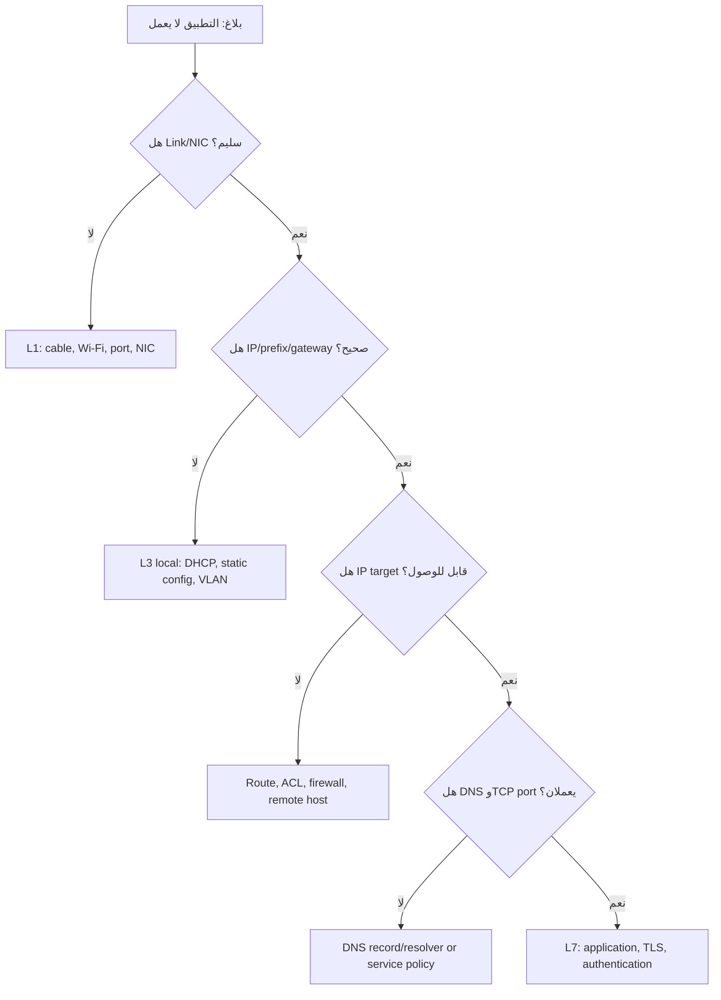

# Networking Fundamentals - Troubleshooting

This section covers common networking issues and a systematic approach to troubleshooting.

## 1. Systematic Troubleshooting Approach

A structured method helps diagnose problems efficiently and prevents overlooking simple solutions.

1.  **Identify the Problem**:
    *   Gather information: What is the exact issue? Who is affected? When did it start? What changed recently?
    *   Define the scope: Is it one user, a group, a specific application, or the entire network?

2.  **Establish a Theory of Probable Cause**:
    *   Based on the symptoms, hypothesize what might be wrong. Start with the most likely or simplest causes.
    *   Examples: Physical connection issue, IP configuration error, DNS problem, firewall blocking, service outage.

3.  **Test the Theory**:
    *   Use diagnostic tools (`ping`, `tracert`, `nslookup`, `ipconfig`/`ifconfig`) to verify your hypothesis.
    *   Check physical connections (cables, lights on devices).
    *   Verify device status (is the router/switch/server powered on and functioning?).

4.  **Establish a Plan of Action to Resolve the Problem and Identify Potential Effects**:
    *   If your theory is confirmed, plan the fix.
    *   If your theory is not confirmed, backtrack and form a new theory based on new information.

5.  **Implement the Solution**:
    *   Make the necessary changes (e.g., reconnect cable, reconfigure IP, restart service).
    *   Document the changes made.

6.  **Verify Full System Functionality**:
    *   Ensure the original problem is resolved.
    *   Check that no new problems have been introduced by the fix.

7.  **Document Findings, Actions, and Outcomes**:
    *   Record the problem, the cause, the solution, and any lessons learned. This builds a knowledge base for future issues.

## 2. Common Network Problems and Solutions

### Problem: Cannot connect to the internet / network

*   **Possible Causes & Checks**:
    *   **Physical Connection**:
        *   Is the network cable securely plugged in at both ends (computer and wall/switch)?
        *   Are there link lights on the network adapter and the switch port?
        *   Try a different cable or port.
    *   **IP Configuration**:
        *   Run `ipconfig /all` (Windows) or `ip addr show` (Linux/macOS).
        *   Do you have a valid IP address, subnet mask, and default gateway? (e.g., not `169.254.x.x`, which indicates a DHCP failure).
        *   Try releasing and renewing your IP address: `ipconfig /release` then `ipconfig /renew`.
    *   **Default Gateway**:
        *   Can you `ping` your default gateway? If not, the issue is likely between your computer and the router.
    *   **DNS Server**:
        *   Can you `ping` an IP address (e.g., `8.8.8.8`) but not a hostname (e.g., `www.google.com`)? This points to a DNS issue.
        *   Check your DNS server settings. Try `nslookup www.google.com`. If it fails, try `nslookup www.google.com 8.8.8.8` to test against a different DNS server.
    *   **Router/Modem**:
        *   Are the lights on your router and modem indicating a proper connection?
        *   Try rebooting your router and modem (unplug power, wait 30 seconds, plug back in).
    *   **Firewall/Antivirus**:
        *   Temporarily disable your firewall or antivirus software to see if it's blocking the connection. Remember to re-enable it afterward.

### Problem: Slow network performance

*   **Possible Causes & Checks**:
    *   **Bandwidth Saturation**: Too many devices or users consuming bandwidth simultaneously. Check network usage.
    *   **Network Congestion**: High traffic on the network. Identify heavy users or applications.
    *   **Faulty Hardware**: A failing switch, router, or NIC can cause slowdowns.
    *   **Interference (Wireless)**: Check for sources of Wi-Fi interference (microwaves, other networks, physical obstructions). Try changing Wi-Fi channels.
    *   **Malware**: Malware on a computer can consume network resources. Run a virus scan.
    *   **Duplex Mismatch**: An issue where network devices are configured with different communication speeds (e.g., one set to 100Mbps Full Duplex, the other to 100Mbps Half Duplex). This often causes significant performance degradation. Check switch port configurations.
    *   **Cable Issues**: Damaged or low-quality network cables can cause retransmissions and slow speeds.

### Problem: Cannot reach a specific server or device

*   **Possible Causes & Checks**:
    *   **Connectivity**: Can you `ping` the target device? If not, check physical connections and IP configuration.
    *   **IP Address/Hostname**: Ensure you are using the correct IP address or hostname.
    *   **Firewall Rules**: A firewall (on the target device or network) might be blocking access. Check firewall logs and rules.
    *   **Service Status**: Is the service you are trying to reach running on the target server? (e.g., web server, file share).
    *   **Routing**: If the device is on a different network, ensure routers have correct routes configured. Use `tracert`/`traceroute` to identify where the path breaks.

### Problem: Intermittent connectivity

*   **Possible Causes & Checks**:
    *   **Loose Cables**: Physical connections may be intermittent.
    *   **Hardware Issues**: Failing NIC, switch port, or router.
    *   **Wireless Interference**: Fluctuations in Wi-Fi signal strength or interference.
    *   **DHCP Lease Issues**: Problems with the DHCP server renewing IP addresses.
    *   **Overheating Devices**: Network devices may become unstable when overheating.

---
**Key Tools Recap**:
*   `ping`: Basic connectivity test.
*   `ipconfig`/`ifconfig`/`ip addr`: Check local configuration.
*   `tracert`/`traceroute`: Map network path.
*   `nslookup`: Test DNS resolution.

---

# Enterprise Troubleshooting Runbooks | أدلة التشخيص المؤسسية

## قاعدة العمل: اعزل ولا تخمّن

ابدأ بتحديد النطاق: مستخدم واحد أم VLAN أم فرع أم خدمة؟ اجمع evidence قبل الإصلاح، وقارن endpoint متأثراً بآخر يعمل في الشبكة نفسها. لا تستخدم restart أو reset كخطوة أولى.



## سيناريو 1: Windows يحصل على APIPA

| بند | التفاصيل |
|---|---|
| العرض | IP ضمن `169.254.0.0/16` ولا توجد gateway/DNS صحيحة |
| الاحتمالات | منفذ/VLAN خاطئ، DHCP scope ممتلئ، DHCP service متوقف، DHCP relay غائب |
| Evidence | `ipconfig /all`، `show vlan brief`، DHCP logs، scope utilization |
| الإصلاح | أصلح VLAN/relay/service/scope ثم اطلب lease جديداً |
| التحقق | IP من scope الصحيح، gateway reachable، DNS resolution ناجح |

```powershell
ipconfig /all
ipconfig /renew
Get-NetIPConfiguration
```

**ملاحظة:** لا تعتمد على static IP لتجاوز DHCP إلا كاختبار محدود ومصرح؛ فقد تخفي عطل البنية أو تسبب duplicate IP.

## سيناريو 2: يصل IP لكن لا يصل الاسم (DNS)

| الدليل | الاستنتاج |
|---|---|
| `ping 10.30.30.10` ينجح | L1–L3 إلى الخادم محتمل أن تكون سليمة |
| `Resolve-DnsName erp.corp.example` يفشل | resolver أو record أو suffix مشكلة محتملة |
| lookup ينجح لكن TCP/443 يفشل | DNS ليس السبب النهائي؛ افحص service/firewall |

```powershell
Get-DnsClientServerAddress
Resolve-DnsName erp.corp.example
Test-NetConnection erp.corp.example -Port 443 -InformationLevel Detailed
```

## سيناريو 3: بطء متقطع وCRC errors على Cisco

| خطوة | الإجراء |
|---|---|
| 1 | قارن error counters مرتين بفاصل زمني، لا تعتمد على رقم تاريخي فقط. |
| 2 | افحص الكابل/patch panel/SFP وspeed/duplex في الطرفين. |
| 3 | افحص utilization وdrops ووجود loop/STP events. |
| 4 | استبدل عنصراً واحداً واختبر ثم وثق التغيير. |

```cisco
show interfaces gigabitEthernet1/0/10
show interfaces counters errors
show logging | include STP|LINK|LINEPROTO
```

## سيناريو 4: المستخدم يصل إلى الخادم لكن التطبيق يفشل

**التمييز المهم:** نجاح ICMP لا يثبت TCP/UDP أو TLS أو حساب المستخدم.

```powershell
Test-NetConnection app01.corp.example -Port 443
Get-NetTCPConnection -RemotePort 443 -ErrorAction SilentlyContinue
```

تحقق بالترتيب: DNS record → route → firewall/ACL → listening service → certificate/TLS → application authentication. أرفق وقت الاختبار وsource IP وdestination IP والمنفذ في التذكرة.

## سيناريو 5: جهاز في VLAN خاطئة

| العرض | الدليل | الحل |
|---|---|---|
| عنوان DHCP من شبكة مختلفة | DHCP scope لا يطابق القسم | تحقق من access VLAN في المنفذ |
| لا يصل إلى gateway المتوقع | `ipconfig` و`show interface switchport` مختلفان | صحح VLAN ثم renew lease |
| يعمل بعد النقل لمنفذ آخر | المشكلة تتبع المنفذ | راجع port template وMAC table |

```cisco
show interfaces gigabitEthernet1/0/10 switchport
show mac address-table interface gigabitEthernet1/0/10
show vlan brief
```

## قالب توثيق Incident

```text
Impact: من المتأثر؟ وما الخدمة؟
Scope: جهاز / VLAN / موقع / مؤسسة.
Evidence: أوامر، timestamps، counters، logs.
Root cause: السبب المثبت، لا التخمين.
Change: ما الذي تغير ومن وافق عليه؟
Verification: IP + DNS + port + application test.
Prevention: monitoring، documentation، أو configuration hardening.
```

## أسئلة مقابلات تشخيصية

### كيف تشخّص “لا يوجد إنترنت” لمستخدم واحد؟

**الإجابة:** أحدد النطاق أولاً، ثم أتحقق من Layer 1 وNIC، ثم IP/prefix/gateway/DNS. أختبر gateway وknown IP وFQDN والمنفذ المطلوب، وأقارن بجهاز يعمل في VLAN نفسها. لا أعد تشغيل router أو أعطل firewall دون دليل.

### ما الفرق بين packet loss وlatency؟

**الإجابة:** latency هو زمن وصول الحزمة، بينما packet loss يعني أن الحزمة لم تصل. يمكن أن يكون latency منخفضاً مع loss، وكلاهما يؤثر في التطبيقات بطرق مختلفة؛ TCP يعيد الإرسال بينما VoIP قد يسبب تقطعاً مباشراً.
