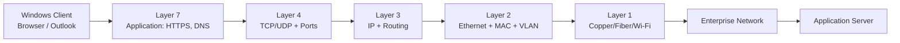

# OSI Model

> Category: 01-Networking / 02-OSI-Model

---

# 📖 Overview | نظرة عامة

## English

The OSI (Open Systems Interconnection) Model is a conceptual framework that explains how data moves between devices across a network. It divides network communication into seven layers, each responsible for a specific function.

Although modern networks primarily use the TCP/IP model, the OSI model remains the industry standard for learning, designing, and troubleshooting computer networks.

Understanding the OSI Model makes it much easier to identify where network problems occur and how different protocols interact.

## العربية

يُعد نموذج **OSI (Open Systems Interconnection)** أحد أهم النماذج المستخدمة لفهم كيفية انتقال البيانات بين الأجهزة عبر الشبكات.

يقسم النموذج عملية الاتصال إلى **سبع طبقات**، بحيث تكون كل طبقة مسؤولة عن وظيفة محددة، مما يسهل تصميم الشبكات واستكشاف الأعطال وفهم البروتوكولات المختلفة.

ورغم أن الإنترنت يعتمد عمليًا على نموذج **TCP/IP**، فإن نموذج OSI لا يزال المرجع الأساسي لتعلم الشبكات ودراسة CCNA والعمل في بيئات الشركات.

---

# 💡 Why Learn the OSI Model? | لماذا نتعلم OSI؟

## English

Although real-world networks use the TCP/IP model, the OSI Model provides a common language for understanding, designing, and troubleshooting networks.

Most networking certifications, including CCNA, Network+, and many enterprise training programs, use the OSI model to explain how network communication works.

---

## العربية

رغم أن الشبكات الحديثة تعتمد عمليًا على TCP/IP، فإن نموذج OSI يُستخدم عالميًا كمرجع لفهم الشبكات وتصميمها واستكشاف أعطالها.

يعتمد عليه معظم مهندسي الشبكات عند تحليل المشكلات لأنه يقسم عملية الاتصال إلى طبقات واضحة.

---


# 📌 Prerequisites | المتطلبات

Before studying this module, you should understand:

- Networking Fundamentals
- Basic Network Devices
- IP Address basics
- Basic Network Communication

---

بعد دراسة هذا الفصل ستكون مستعدًا لدراسة:

- TCP/IP Model
- Ethernet Switching
- Routing
- Network Troubleshooting

---

# 🎯 Objectives | الأهداف

After completing this module, you will be able to:

- Explain the purpose of the OSI Model.
- Describe the responsibilities of each OSI layer.
- Identify common protocols at every layer.
- Understand Protocol Data Units (PDUs).
- Explain Encapsulation and Decapsulation.
- Compare the OSI Model with the TCP/IP Model.
- Troubleshoot network problems using the OSI approach.

---

# 🗺️ Learning Path | مسار التعلم

```text
Networking Fundamentals
        ↓
OSI Model
        ↓
TCP/IP Model
        ↓
Ethernet Switching
        ↓
Routing
        ↓
Network Services
```

---

# 📚 Theory | نظرة عامة

The OSI Model consists of seven layers:

| Layer | Name | Primary Function |
|------:|----------------|-----------------------------|
| 7 | Application | User-facing network services |
| 6 | Presentation | Encryption, Compression |
| 5 | Session | Session establishment and management |
| 4 | Transport | Reliable communication (TCP/UDP) |
| 3 | Network | Logical addressing and Routing |
| 2 | Data Link | Frames and MAC Addresses |
| 1 | Physical | Transmission of Bits |

---

## لماذا يعتبر OSI مهمًا؟

يساعد نموذج OSI على:

- تقسيم عملية الاتصال إلى مراحل واضحة.
- تسهيل فهم البروتوكولات.
- تسهيل اكتشاف الأعطال.
- تحسين تصميم الشبكات.
- توفير لغة مشتركة بين مهندسي الشبكات.

---

## Example

If a user cannot open a website:

- Layer 1 → Cable problem?
- Layer 2 → Switch problem?
- Layer 3 → IP or Routing problem?
- Layer 4 → Port blocked?
- Layer 7 → Application problem?

Using the OSI model helps engineers isolate the exact layer where the failure occurs.

---

## 🏢 Enterprise Scenario

An employee reports that Outlook cannot connect.

Instead of guessing, an IT engineer analyzes the problem layer by layer:

- Layer 1 → Is the cable connected?
- Layer 2 → Is the switch port active?
- Layer 3 → Does the PC have a valid IP address?
- Layer 4 → Is the required port open?
- Layer 7 → Is the mail server running?

Using the OSI Model reduces troubleshooting time and helps identify the root cause efficiently.

---


## Common Protocols by Layer

| Layer | Examples | Common Devices |
|--------|----------|----------------|
| 7 | HTTP, HTTPS, FTP, SMTP, DNS | PC, Server |
| 6 | TLS, SSL, JPEG, MPEG | Gateway |
| 5 | NetBIOS, RPC | Gateway |
| 4 | TCP, UDP | Firewall |
| 3 | IP, ICMP, IPSec | Router |
| 2 | Ethernet, PPP, ARP | Switch |
| 1 | UTP, Fiber, Radio Signals | Hub, Repeater, Cable |

---


# 🖼️ Diagrams

Store diagrams inside:

```
diagrams/
```

Suggested diagrams:

- Complete OSI Model
- Encapsulation
- Decapsulation
- OSI vs TCP/IP Comparison

---

# 💻 Labs

Store practical labs inside:

```
labs/
```

See:

```
lab-guide.md
```

---

# ⚡ Commands

See:

```
commands.md
```

---

# 📝 Notes

See:

```
notes.md
```

---

# 🛠️ Troubleshooting

See:

```
troubleshooting.md
```

---

# 📚 References

## Official Documentation

- Cisco Networking Academy
- Microsoft Learn
- RFC Documentation

## Recommended Books

- CCNA 200-301 Official Cert Guide
- TCP/IP Illustrated
- Computer Networking: A Top-Down Approach

---

# ✅ Chapter Summary

After completing this module, you should understand:

- The purpose of the OSI Model.
- All seven OSI layers.
- Layer responsibilities.
- Common protocols.
- Encapsulation and Decapsulation.
- Protocol Data Units (PDUs).
- Basic troubleshooting using the OSI approach.

---

# 🚀 Next Module

# 03-TCP-IP-Model

The next chapter is:

**03-TCP-IP-Model**

Topics include:

- TCP/IP Architecture
- Layer Mapping
- Internet Protocol Suite
- TCP vs UDP
- Real-world implementation

---

# Enterprise OSI Reference | مرجع OSI المؤسسي

> استخدم نموذج OSI كمنهج عزل (Isolation Methodology): ابدأ بالدليل الأقل تعقيداً ثم انتقل إلى الطبقة التي تعتمد عليه. النموذج لا يصف كل بروتوكول حديث حرفياً، لكنه لغة مشتركة دقيقة بين فرق الشبكات والأنظمة والأمن.

## كيف تسافر بيانات تطبيق Enterprise؟



```text
Application data
  └─ TCP segment      : source/destination port
      └─ IP packet    : source/destination IP
          └─ L2 frame : source/destination MAC + VLAN tag
              └─ Bits : electrical, optical, or radio signal
```

## طبقات OSI في بيئة العمل

| الطبقة | الغرض (Purpose) | أمثلة أجهزة | أمثلة بروتوكولات | PDU | Addressing |
|---:|---|---|---|---|---|
| 7 Application | خدمة الشبكة للتطبيق | proxy، WAF، server | HTTP(S)، DNS، SMTP، SMB | Data | FQDN/URL |
| 6 Presentation | التشفير والترميز والضغط | TLS terminator | TLS، UTF-8، JSON | Data | — |
| 5 Session | إنشاء وإدارة الجلسة | session gateway | RPC، NetBIOS concepts | Data | Session ID |
| 4 Transport | نقل من طرف إلى طرف | firewall/L4 load balancer | TCP، UDP | Segment/Datagram | Port number |
| 3 Network | التوجيه بين الشبكات | router، L3 switch | IPv4، IPv6، ICMP | Packet | IP address |
| 2 Data Link | التسليم داخل LAN | switch، NIC، bridge | Ethernet، 802.1Q، STP | Frame | MAC address |
| 1 Physical | الإشارة والوسيط | cable، AP radio، hub | 1000BASE-T، fiber PHY | Bits | — |

## مقارنة OSI وTCP/IP

| OSI | TCP/IP | أمثلة عملية |
|---|---|---|
| Layers 7–5 | Application | HTTPS، DNS، SMTP، TLS |
| Layer 4 | Transport | TCP، UDP، ports |
| Layer 3 | Internet | IP، ICMP، routing |
| Layers 2–1 | Network Access | Ethernet، Wi-Fi، MAC، cable |

**قاعدة مهمة:** TCP/IP هو model implementation عملي للإنترنت؛ OSI هو reference model ممتاز للفهم والتشخيص. لا تقل إن “OSI protocol” أو إن كل بروتوكول يقع دائماً في طبقة واحدة بشكل مطلق.

## مقارنة الأجهزة: Hub وSwitch وRouter

| الجهاز | الطبقة الأساسية | قرار الإرسال | نطاق البث (Broadcast Domain) | الاستخدام الحديث |
|---|---:|---|---|---|
| Hub | 1 | يكرر الإشارة للجميع | واحد | قديم؛ لا يستخدم في Enterprise |
| Switch | 2 | MAC address table | واحد لكل VLAN | وصول المستخدمين والخوادم |
| Router / L3 Switch | 3 | routing table وIP prefix | يفصل الـ broadcast domains | توجيه VLANs والفروع |

## مقارنة TCP وUDP

| جانب | TCP | UDP |
|---|---|---|
| الاتصال | Connection-oriented | Connectionless |
| الاعتمادية | ACK، sequence، retransmission | يترك الاعتمادية للتطبيق عند الحاجة |
| أمثلة | HTTPS، SMB، RDP | DNS، NTP، VoIP |
| فائدة تشغيلية | وصول مرتب للتطبيقات الحساسة | latency أقل للتطبيقات الزمنية |

## مثال Enterprise: وصول موظف إلى بوابة HR

يحل DNS اسم `hr.corp.example` في Layer 7، ويُنشأ TCP session إلى `443` في Layer 4، ثم يختار جهاز الموظف default gateway طبقاً لعنوان IP في Layer 3. يرسل switch الإطار داخل VLAN الصحيحة في Layer 2، وتنتقل bits عبر Ethernet أو Wi-Fi في Layer 1. عند الفشل، يختبر المهندس كل دليل في ترتيبه بدلاً من تعطيل firewall أو إعادة تشغيل الخادم بلا سبب.

## CCNA Exam Notes

- يتعلم switch عنوان **source MAC** في جدول CAM/MAC، ثم يوجه بناءً على destination MAC.
- يعيد router كتابة Layer 2 header عند كل hop ويخفض TTL؛ لا يمرر broadcasts من VLAN إلى أخرى افتراضياً.
- PDU: Data (L7–L5)، Segment (TCP L4)، Datagram (UDP L4)، Packet (L3)، Frame (L2)، Bits (L1).
- لا يعني فشل `ping` بالضرورة تعطل Layer 3؛ قد يحجب ACL أو firewall ICMP.
- منفذ TCP/UDP جزء من Layer 4 وليس عنوان IP أو MAC.

## مسار التعلم والتطبيق

1. ابدأ بـ Layer 1 و2: link، cable، Wi-Fi، VLAN، MAC.
2. أثبت Layer 3: IP، prefix، gateway، routing.
3. اختبر Layer 4: TCP/UDP port، firewall، session.
4. تحقّق من Layer 7: DNS، TLS، credentials، application logs.

راجع [الملاحظات التفصيلية](notes.md)، [مرجع الأوامر](commands.md)، [الملخص السريع](cheatsheet.md)، [المختبرات](lab-guide.md)، و[أدلة التشخيص](troubleshooting.md).
