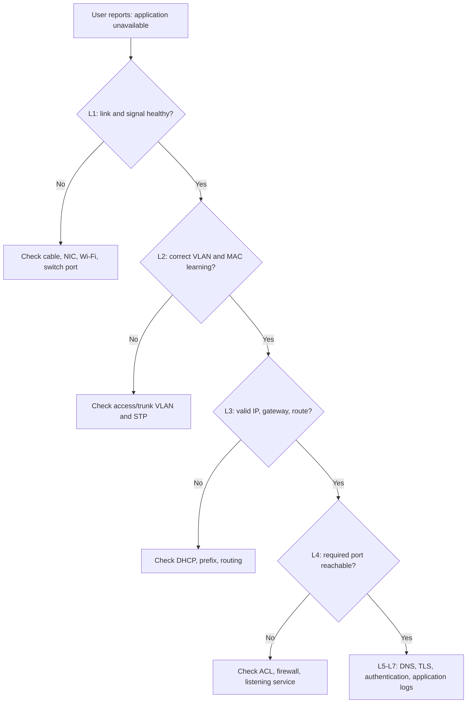

# OSI Model Diagrams | مخططات نموذج OSI

## Encapsulation and Decapsulation | التغليف وفك التغليف

```mermaid
sequenceDiagram
    participant C as Client
    participant SW as Switch
    participant R as Router
    participant S as Server
    C->>C: L7 data → L4 TCP segment → L3 IP packet → L2 frame
    C->>SW: Ethernet frame
    SW->>R: Forward by destination MAC
    R->>R: Remove old L2 frame; route by destination IP
    R->>S: New L2 frame, same end-to-end IP packet
    S->>S: Decapsulate frame → packet → segment → data
```

## Layer-by-Layer Troubleshooting | التشخيص الطبقي


