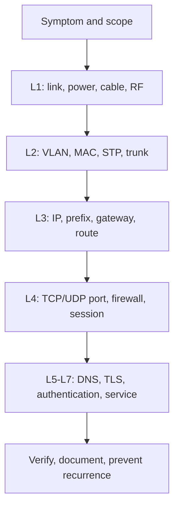

# OSI Model
# نموذج OSI

> **Module:** 02-OSI-Model  
> **Course:** CCNA 200-301  
> **Repository:** IT-Knowledge-Lab

---

# Table of Contents | فهرس المحتويات

1. Introduction | المقدمة
2. History of the OSI Model | تاريخ نموذج OSI
3. Why Was the OSI Model Created? | لماذا تم إنشاء نموذج OSI؟
4. Advantages and Disadvantages | المميزات والعيوب
5. OSI Model Overview | نظرة عامة على نموذج OSI
6. The Seven Layers | الطبقات السبع
7. Encapsulation & Decapsulation
8. Protocol Data Units (PDU)
9. OSI vs TCP/IP
10. Wireshark Analysis
11. Enterprise Scenarios
12. Best Practices
13. CCNA Notes
14. Interview Questions
15. Chapter Summary

---

# Introduction | المقدمة

## 🇪🇬 الشرح بالعربي

يُعتبر **OSI Model (Open Systems Interconnection Model)** واحدًا من أهم المفاهيم الأساسية في مجال شبكات الحاسب (Computer Networking)، ويُعد نقطة البداية لأي شخص يرغب في دراسة الشبكات أو الحصول على شهادات مثل **CCNA** أو **CCNP** أو العمل كـ Network Engineer أو System Administrator أو حتى في مجال Cyber Security.

قبل ظهور نموذج OSI، كانت كل شركة تقوم بتطوير بروتوكولات وتقنيات اتصال خاصة بها، مما أدى إلى صعوبة كبيرة في تواصل الأجهزة المختلفة مع بعضها البعض. على سبيل المثال، قد لا يتمكن جهاز من شركة معينة من التواصل مع جهاز من شركة أخرى بسبب اختلاف طريقة نقل البيانات.

للتغلب على هذه المشكلة، قامت **المنظمة الدولية للمعايير (ISO - International Organization for Standardization)** بتطوير نموذج قياسي يقسم عملية الاتصال بين الأجهزة إلى سبع طبقات مستقلة، بحيث تكون وظيفة كل طبقة واضحة ومحددة.

هذا النموذج لا يُعتبر بروتوكولًا بحد ذاته، وإنما هو **نموذج مرجعي (Reference Model)** يُستخدم لفهم كيفية انتقال البيانات داخل الشبكات، وكيفية عمل البروتوكولات المختلفة معًا.

من خلال دراسة نموذج OSI ستتمكن من:

- فهم رحلة البيانات من جهاز إلى آخر.
- معرفة وظيفة كل طبقة داخل الشبكة.
- فهم البروتوكولات المستخدمة في كل طبقة.
- تحليل مشاكل الشبكات بطريقة منهجية.
- تعلم أساسيات عمل الإنترنت والشبكات المحلية (LAN) والشبكات الواسعة (WAN).
- الاستعداد لامتحانات CCNA والمقابلات الفنية الخاصة بالشبكات.

---

## 🇺🇸 English Explanation

The **OSI (Open Systems Interconnection) Model** is one of the most important concepts in computer networking. It provides a standardized framework for understanding how data travels between devices over a network.

Before the OSI Model was introduced, networking vendors developed their own proprietary communication methods. As a result, devices from different manufacturers often could not communicate with each other effectively.

To solve this problem, the **International Organization for Standardization (ISO)** created the OSI Model, which divides the communication process into **seven independent layers**. Each layer has specific responsibilities and communicates with the layers directly above and below it.

The OSI Model is **not a communication protocol**. Instead, it is a **reference model** used to explain how networking protocols work together during data transmission.

Learning the OSI Model helps you:

- Understand how network communication works.
- Learn the responsibility of each networking layer.
- Understand common networking protocols.
- Troubleshoot network problems systematically.
- Build a strong foundation for CCNA, CCNP, and Cybersecurity.
- Understand how modern enterprise networks operate.

---

# Key Points | أهم النقاط

- OSI stands for **Open Systems Interconnection**.
- تم تطوير النموذج بواسطة **ISO**.
- يتكون من **7 Layers**.
- هو **Reference Model** وليس Protocol.
- يستخدم لفهم تصميم الشبكات واستكشاف الأعطال.
- يُعد من أهم الموضوعات في شهادة CCNA.

---

# Enterprise Example | مثال عملي

لنفترض أن موظفًا داخل شركة يريد إرسال رسالة بريد إلكتروني إلى موظف آخر.

عند الضغط على زر **Send** لا تنتقل الرسالة مباشرة إلى الجهاز الآخر، بل تمر عبر عدة مراحل:

- يقوم برنامج البريد الإلكتروني بإنشاء الرسالة.
- يتم تقسيم البيانات إلى أجزاء.
- تُضاف عناوين IP وعناوين MAC.
- تُرسل البيانات عبر كابل الشبكة أو شبكة Wi-Fi.
- يستقبل الجهاز الآخر البيانات ويعيد تجميعها حتى تظهر الرسالة للمستخدم.

نموذج OSI يشرح هذه الرحلة خطوة بخطوة، ويحدد مسؤولية كل طبقة أثناء انتقال البيانات.

---

# CCNA Notes | ملاحظات مهمة للامتحان

> **تذكر دائمًا:**

- OSI Model يحتوي على **7 Layers**.
- هو **Reference Model** وليس Protocol.
- يُستخدم لفهم الشبكات وليس لتشغيلها.
- أغلب أسئلة CCNA الخاصة بـ OSI تعتمد على فهم وظيفة كل طبقة، وليس حفظ أسماء الطبقات فقط.

---

# Common Mistakes | أخطاء شائعة

### ❌ الخطأ الأول

الاعتقاد أن OSI هو بروتوكول.

✔️ الصحيح:

OSI هو **Reference Model** فقط.

---

### ❌ الخطأ الثاني

الخلط بين OSI Model وTCP/IP Model.

✔️ الصحيح:

OSI نموذج نظري للتعليم والتصميم، بينما TCP/IP هو النموذج المستخدم فعليًا على الإنترنت.

---

### ❌ الخطأ الثالث

حفظ أسماء الطبقات دون فهم وظيفة كل طبقة.

✔️ الصحيح:

يجب فهم مسؤولية كل Layer وكيف تتفاعل مع الطبقات الأخرى.

---

# Troubleshooting | أهمية نموذج OSI في استكشاف الأعطال

يُستخدم نموذج OSI كمنهجية لحل مشاكل الشبكات.

على سبيل المثال:

إذا لم يكن هناك اتصال بالشبكة، يبدأ مهندس الشبكات بفحص:

1. الكابل أو الـ Wi-Fi (Layer 1).
2. عنوان MAC وVLAN (Layer 2).
3. عنوان IP وGateway (Layer 3).
4. المنافذ (Ports) في Layer 4.
5. التطبيق نفسه في الطبقات العليا.

هذه الطريقة تساعد على الوصول إلى سبب المشكلة بسرعة ودقة.

---

# Interview Questions | أسئلة المقابلات

### Q1: What does OSI stand for?

**Answer:**

Open Systems Interconnection.

---

### Q2: Is the OSI Model a protocol?

**Answer:**

No. It is a reference model used to describe how network communication works.

---

### Q3: How many layers are in the OSI Model?

**Answer:**

Seven layers.

---

### Q4: Who developed the OSI Model?

**Answer:**

The International Organization for Standardization (ISO).

---

### Q5: Why is the OSI Model important?

**Answer:**

It standardizes network communication concepts, simplifies troubleshooting, and provides the foundation for learning networking technologies.

# History of the OSI Model | تاريخ نموذج OSI

## 🇪🇬 الشرح بالعربي

في السنوات الأولى من تطور شبكات الحاسب، لم يكن هناك معيار (Standard) موحد يحدد كيفية تواصل الأجهزة مع بعضها البعض.

كانت كل شركة مصنعة لأجهزة الشبكات تطور بروتوكولات وتقنيات اتصال خاصة بها (Proprietary Protocols)، مما أدى إلى ظهور مشكلة كبيرة وهي **عدم التوافق (Incompatibility)** بين الأجهزة المختلفة.

فعلى سبيل المثال، إذا كانت إحدى الشركات تستخدم أجهزة من شركة IBM وأخرى تستخدم أجهزة من Digital Equipment Corporation (DEC)، فقد لا تتمكن هذه الأجهزة من تبادل البيانات بسهولة بسبب اختلاف طرق الاتصال.

مع ازدياد الاعتماد على الشبكات في الشركات والجامعات والمؤسسات الحكومية، أصبح من الضروري وجود معيار عالمي يسمح للأجهزة المختلفة بالتواصل بغض النظر عن الشركة المصنعة.

ولهذا السبب قامت **المنظمة الدولية للمعايير (International Organization for Standardization - ISO)** في أواخر السبعينيات بالبدء في تطوير نموذج مرجعي موحد.

وفي عام **1984** تم إصدار **OSI Reference Model** رسميًا ليكون إطارًا قياسيًا يوضح كيفية انتقال البيانات بين الأجهزة داخل الشبكات.

كان الهدف من هذا النموذج هو تقسيم عملية الاتصال إلى عدة مراحل مستقلة، بحيث تكون كل مرحلة مسؤولة عن وظيفة معينة، مما يسهل:

- تصميم الشبكات.
- تطوير البروتوكولات.
- تصنيع أجهزة متوافقة مع المعايير العالمية.
- اكتشاف الأعطال وإصلاحها.
- تعليم أساسيات الشبكات بطريقة منظمة.

ورغم أن الإنترنت اليوم يعتمد بشكل أساسي على نموذج **TCP/IP**، إلا أن نموذج **OSI** لا يزال يُستخدم حتى الآن في:

- دراسة الشبكات.
- شهادات Cisco مثل CCNA وCCNP.
- تصميم الشبكات.
- استكشاف الأعطال (Troubleshooting).
- شرح البروتوكولات المختلفة.

بمعنى آخر، لا يعمل الإنترنت باستخدام OSI Model، لكنه يُستخدم كمرجع لفهم كيفية عمل الإنترنت.

---

## 🇺🇸 English Explanation

In the early days of computer networking, there was no universal standard that defined how different systems should communicate.

Each hardware vendor created its own proprietary networking protocols and communication methods. As a result, devices from different manufacturers often could not communicate with one another.

As networking became more important for businesses, universities, and government organizations, the need for a standardized communication framework became obvious.

To solve this problem, the **International Organization for Standardization (ISO)** began developing a reference networking model during the late 1970s.

In **1984**, ISO officially published the **OSI Reference Model**, providing a standardized framework that describes how data moves across a network.

Instead of defining specific protocols, the OSI Model separates network communication into seven independent layers, where each layer performs a specific task.

This layered approach simplifies:

- Network design
- Protocol development
- Vendor interoperability
- Network troubleshooting
- Technical education

Although today's Internet primarily uses the **TCP/IP protocol suite**, the OSI Model remains the most widely used conceptual model for learning, designing, and troubleshooting computer networks.

---

# Historical Timeline | التسلسل الزمني

| Year | Event |
|------|-------|
| 1969 | بداية مشروع ARPANET، وهو الأساس الذي تطور منه الإنترنت لاحقًا. |
| 1970s | كل شركة تستخدم بروتوكولات خاصة بها دون وجود معيار موحد. |
| Late 1970s | بدأت ISO العمل على إنشاء نموذج مرجعي موحد للشبكات. |
| 1984 | إصدار نموذج OSI Reference Model رسميًا. |
| 1990s | انتشار بروتوكولات TCP/IP واعتمادها في الإنترنت. |
| Today | لا يزال نموذج OSI يستخدم في التعليم، التصميم، واستكشاف الأعطال. |

---

# Why Was the OSI Model Important? | لماذا كان نموذج OSI مهمًا؟

قبل ظهور OSI كانت هناك عدة مشاكل، منها:

- عدم توافق أجهزة الشركات المختلفة.
- صعوبة تطوير بروتوكولات جديدة.
- عدم وجود طريقة موحدة لشرح عمل الشبكات.
- صعوبة تحديد مكان المشكلة عند حدوث عطل.

بعد ظهور OSI أصبح من الممكن:

- تقسيم الشبكة إلى طبقات مستقلة.
- تطوير كل طبقة بشكل منفصل.
- استبدال بروتوكول دون التأثير على باقي الطبقات.
- تسهيل التعاون بين الشركات المصنعة.

---

# Key Points | أهم النقاط

- تم تطوير النموذج بواسطة **ISO**.
- بدأ تطويره في أواخر السبعينيات.
- نُشر رسميًا عام **1984**.
- لا يحدد بروتوكولات محددة، بل يحدد وظائف الطبقات.
- ما زال يستخدم حتى اليوم في الدراسة والتصميم واستكشاف الأعطال.

---

# Enterprise Example | مثال عملي

تخيل أن شركة تمتلك:

- أجهزة Cisco.
- خوادم Microsoft.
- أجهزة HP.
- طابعات Canon.
- هواتف IP من Yealink.

كل هذه الأجهزة تستطيع التواصل معًا لأنها تعتمد على معايير قياسية في الشبكات، ويمكن تفسير هذا التواصل باستخدام نموذج OSI.

بدون وجود معايير مشتركة، كان من الممكن أن تعمل كل مجموعة من الأجهزة بمعزل عن الأخرى، مما يجعل بناء شبكة متكاملة أمرًا بالغ الصعوبة.

---

# CCNA Notes | ملاحظات مهمة للامتحان

- تاريخ إصدار نموذج OSI هو **1984**.
- الجهة المطورة هي **ISO**.
- OSI هو **Reference Model** وليس Protocol Suite.
- الإنترنت يعمل باستخدام **TCP/IP**، لكن OSI يُستخدم لفهم كيفية عمله.

---

# Common Mistakes | أخطاء شائعة

### ❌ الاعتقاد أن الإنترنت يعمل باستخدام OSI.

✔️ الحقيقة:

الإنترنت يعتمد على **TCP/IP**، بينما OSI هو نموذج مرجعي.

---

### ❌ الاعتقاد أن ISO هي الشركة المصنعة لأجهزة الشبكات.

✔️ الحقيقة:

ISO هي منظمة دولية مسؤولة عن وضع المعايير (Standards)، وليست شركة تصنيع.

---

### ❌ الاعتقاد أن OSI قديم ولم يعد له استخدام.

✔️ الحقيقة:

ما زال يستخدم يوميًا في:

- شهادات Cisco.
- تصميم الشبكات.
- Troubleshooting.
- التدريب والتعليم.

---

# Troubleshooting | علاقة التاريخ باستكشاف الأعطال

قد يبدو أن تاريخ OSI ليس له علاقة بحل المشكلات، لكن فكرة تقسيم الشبكة إلى طبقات هي التي جعلت عملية Troubleshooting ممكنة.

بدلاً من البحث في جميع مكونات الشبكة دفعة واحدة، يمكن لمهندس الشبكات اختبار كل طبقة على حدة حتى يصل إلى سبب المشكلة.

---

# Interview Questions | أسئلة المقابلات

### Q1: Why was the OSI Model created?

**Answer:**

To provide a standardized framework for network communication between different vendors.

---

### Q2: Who developed the OSI Model?

**Answer:**

The International Organization for Standardization (ISO).

---

### Q3: When was the OSI Model officially published?

**Answer:**

1984.

---

### Q4: Does the Internet use the OSI Model directly?

**Answer:**

No. The Internet uses the TCP/IP protocol suite, while the OSI Model serves as a conceptual reference.

---

### Q5: Why is the OSI Model still important today?

**Answer:**

Because it is widely used for learning networking concepts, designing networks, and troubleshooting communication problems.

# Why Was the OSI Model Created? | لماذا تم إنشاء نموذج OSI؟

## 🇪🇬 الشرح بالعربي

لفهم سبب إنشاء نموذج **OSI**، يجب أولًا أن نتعرف على طبيعة شبكات الحاسب قبل ظهوره.

في بداية عصر الشبكات، كانت كل شركة تقوم بتطوير أجهزة وبرامج وبروتوكولات خاصة بها، وكانت هذه البروتوكولات تعمل فقط مع منتجات نفس الشركة.

على سبيل المثال، إذا قامت شركة بشراء أجهزة من شركة **IBM** ثم أرادت لاحقًا إضافة أجهزة من **Cisco** أو **HP**، فقد تواجه مشكلة في تواصل هذه الأجهزة مع بعضها البعض بسبب اختلاف طرق الاتصال.

كان هذا يعني أن الشركات أصبحت مرتبطة بمصنع واحد فقط (Vendor Lock-in)، وإذا أرادت تغيير الأجهزة أو تطوير الشبكة، فقد تضطر إلى استبدال أجزاء كبيرة من البنية التحتية.

إضافة إلى ذلك، عند حدوث مشكلة في الشبكة لم يكن هناك منهج واضح لتحديد مكان الخطأ، لأن عملية الاتصال كانت تُعامل كوحدة واحدة، وليس كمجموعة مراحل منفصلة.

لهذا السبب، كان لابد من وجود نموذج عالمي يحقق ما يلي:

- توحيد طريقة الاتصال بين الأجهزة.
- تسهيل تطوير بروتوكولات جديدة.
- السماح للشركات المختلفة بتصنيع أجهزة متوافقة.
- تقسيم عملية الاتصال إلى مراحل مستقلة.
- تسهيل اكتشاف الأعطال وإصلاحها.
- إنشاء لغة مشتركة بين مهندسي الشبكات حول العالم.

ومن هنا ظهر نموذج **OSI**.

بدلًا من اعتبار عملية الاتصال خطوة واحدة، قام OSI بتقسيمها إلى **سبع طبقات**، بحيث تكون لكل طبقة مسؤولية محددة وواضحة.

هذا التقسيم جعل تصميم الشبكات أكثر مرونة، وسهّل تطوير التقنيات الجديدة دون الحاجة إلى إعادة تصميم النظام بالكامل.

---

## 🇺🇸 English Explanation

To understand why the OSI Model was created, we first need to understand how networking worked before standardized models existed.

During the early years of computer networking, every vendor developed its own networking hardware, software, and communication protocols.

These proprietary technologies usually worked only with products from the same manufacturer.

As organizations expanded their networks, integrating devices from multiple vendors became extremely difficult.

There was also no standardized methodology for troubleshooting communication problems or designing interoperable networks.

To solve these challenges, the ISO introduced the OSI Model.

Instead of treating communication as a single process, the OSI Model divides network communication into seven independent layers.

Each layer performs a specific function while communicating with the layers directly above and below it.

This layered architecture makes networking systems more flexible, easier to maintain, and easier to troubleshoot.

---

# Problems Before the OSI Model | المشكلات قبل ظهور OSI

قبل ظهور نموذج OSI كانت هناك عدة تحديات رئيسية:

### 1. عدم توافق الأجهزة (Incompatibility)

كل شركة كانت تستخدم بروتوكولات خاصة بها.

أجهزة شركة معينة قد لا تعمل مع أجهزة شركة أخرى.

---

### 2. صعوبة استكشاف الأعطال

عند حدوث مشكلة في الاتصال، لم يكن هناك أسلوب منظم لمعرفة مكان الخطأ.

---

### 3. صعوبة تطوير الشبكات

أي تغيير بسيط في النظام قد يؤثر على جميع مكونات الشبكة.

---

### 4. الاعتماد على شركة واحدة (Vendor Lock-in)

كانت الشركات تضطر إلى شراء جميع أجهزتها من نفس المصنع لضمان التوافق.

---

### 5. عدم وجود معايير موحدة

لم تكن هناك لغة أو مواصفات مشتركة بين الشركات المصنعة.

---

# How Did the OSI Model Solve These Problems? | كيف حل نموذج OSI هذه المشكلات؟

قدم نموذج OSI عدة حلول مهمة، منها:

- تقسيم الاتصال إلى سبع طبقات مستقلة.
- تحديد مسؤولية واضحة لكل طبقة.
- السماح بتطوير كل طبقة بشكل منفصل.
- تسهيل التوافق بين أجهزة الشركات المختلفة.
- توفير منهج موحد لتحليل المشكلات.
- تبسيط تصميم الشبكات وصيانتها.

---

# Real-World Example | مثال من الواقع

تخيل أن شركة تستخدم:

- Cisco Switches
- HP Computers
- Dell Servers
- Canon Printers
- Microsoft Windows
- Linux Servers

رغم اختلاف الشركات المصنعة، تستطيع جميع هذه الأجهزة التواصل معًا باستخدام بروتوكولات ومعايير موحدة.

هذه المعايير يمكن فهمها وشرحها باستخدام نموذج OSI.

---

# Enterprise Example | مثال داخل شركة

لنفترض أن موظفًا لا يستطيع الوصول إلى خادم الملفات (File Server).

بدلًا من تجربة حلول عشوائية، يستخدم مهندس الشبكات نموذج OSI كخطة عمل:

### Layer 1

هل كابل الشبكة متصل؟

↓

### Layer 2

هل الجهاز موجود في الـ VLAN الصحيحة؟

↓

### Layer 3

هل عنوان IP صحيح؟

هل الـ Default Gateway صحيح؟

↓

### Layer 4

هل منفذ الخدمة (مثل Port 445 الخاص بـ SMB) مفتوح؟

↓

### Layer 5–7

هل خدمة File Sharing تعمل؟

هل المستخدم لديه صلاحيات؟

بهذه الطريقة يتم الوصول إلى سبب المشكلة بسرعة وبشكل منطقي.

---

# Key Points | أهم النقاط

- تم إنشاء OSI لحل مشكلة اختلاف معايير الاتصال بين الشركات.
- يقسم الاتصال إلى سبع طبقات مستقلة.
- يساعد في تصميم الشبكات.
- يسهل تطوير البروتوكولات.
- يوفر منهجًا واضحًا لاستكشاف الأعطال.
- يحقق التوافق بين الأجهزة المختلفة.

---

# CCNA Notes | ملاحظات مهمة للامتحان

> احفظ دائمًا أن الهدف الأساسي من OSI هو:

- Standardization (التوحيد القياسي)
- Interoperability (التوافق بين الأنظمة)
- Layered Architecture (التقسيم إلى طبقات)
- Easier Troubleshooting (سهولة استكشاف الأعطال)

هذه الكلمات المفتاحية تتكرر كثيرًا في امتحانات CCNA.

---

# Common Mistakes | أخطاء شائعة

### ❌ الاعتقاد أن OSI تم إنشاؤه ليحل محل TCP/IP.

✔️ الصحيح:

OSI تم إنشاؤه كنموذج مرجعي لشرح وتنظيم عملية الاتصال، وليس لاستبدال TCP/IP.

---

### ❌ الاعتقاد أن كل طبقة تعمل بمفردها.

✔️ الصحيح:

كل طبقة تعتمد على الطبقات الأخرى، لكنها تمتلك مسؤوليات مستقلة.

---

### ❌ الاعتقاد أن جميع البروتوكولات تعمل في طبقة واحدة.

✔️ الصحيح:

كل بروتوكول يعمل في طبقة محددة حسب وظيفته.

---

# Troubleshooting | استخدام OSI في حل المشكلات

من أهم فوائد OSI أنه يقدم طريقة منظمة لتشخيص الأعطال.

بدلاً من تجربة حلول عشوائية، يتم اختبار كل طبقة بالترتيب حتى يتم تحديد مكان المشكلة.

ولهذا السبب، يستخدم مهندسو الشبكات نموذج OSI يوميًا حتى في البيئات التي تعتمد على TCP/IP.

---

# Interview Questions | أسئلة المقابلات

### Q1: Why was the OSI Model created?

**Answer:**

To standardize network communication and allow devices from different vendors to communicate with each other.

---

### Q2: What problem did the OSI Model solve?

**Answer:**

It solved interoperability issues between different networking vendors and introduced a structured communication model.

---

### Q3: What is the biggest advantage of the layered architecture?

**Answer:**

Each layer has a specific responsibility, making network design, maintenance, and troubleshooting much easier.

---

### Q4: Does the OSI Model define networking protocols?

**Answer:**

No. It defines the functions of each layer, not specific protocols.

---

### Q5: Why do network engineers still use the OSI Model?

**Answer:**

Because it provides a universal framework for understanding, designing, and troubleshooting networks.

# Advantages and Disadvantages of the OSI Model
# مميزات وعيوب نموذج OSI

---

# 🇪🇬 الشرح بالعربي

على الرغم من أن الإنترنت اليوم يعتمد بشكل أساسي على **TCP/IP Model**، إلا أن نموذج **OSI** ما زال يُعتبر أحد أهم النماذج المرجعية في عالم الشبكات.

ويرجع ذلك إلى المميزات الكبيرة التي يقدمها، خاصة في تصميم الشبكات، واستكشاف الأعطال، والتعليم.

وفي المقابل، توجد بعض العيوب التي جعلت تطبيقه العملي أقل انتشارًا مقارنةً بنموذج TCP/IP.

لذلك يجب على أي مهندس شبكات أن يعرف متى يستخدم OSI كنموذج مرجعي، ومتى يعتمد على TCP/IP كنموذج عملي.

---

## 🇺🇸 English Explanation

Although today's Internet is built primarily on the TCP/IP protocol suite, the OSI Model remains one of the most important conceptual frameworks in networking.

Its layered architecture simplifies network design, protocol development, and troubleshooting.

However, the OSI Model also has several limitations that prevented it from becoming the dominant networking implementation.

Understanding both its strengths and weaknesses is important for every network engineer.

---

# Advantages of the OSI Model
# مميزات نموذج OSI

---

## 1. Layered Architecture
### التصميم المعتمد على الطبقات

### 🇪🇬

يقسم نموذج OSI عملية الاتصال إلى سبع طبقات مستقلة.

كل طبقة مسؤولة عن وظيفة محددة، مما يجعل فهم الشبكة أسهل.

إذا حدثت مشكلة في إحدى الطبقات، يمكن إصلاحها دون التأثير على بقية الطبقات.

### 🇺🇸

The OSI Model separates network communication into seven independent layers.

Each layer has a specific responsibility, making the network easier to understand, maintain, and troubleshoot.

---

## 2. Easier Troubleshooting
### سهولة استكشاف الأعطال

### 🇪🇬

يساعد OSI مهندس الشبكات على تحديد مكان المشكلة بسرعة.

بدلاً من فحص الشبكة بالكامل، يتم اختبار كل طبقة على حدة.

### 🇺🇸

Engineers can isolate problems layer by layer instead of troubleshooting the entire network at once.

---

## 3. Vendor Interoperability
### التوافق بين الشركات المختلفة

### 🇪🇬

يسمح للأجهزة المصنعة من شركات مختلفة بالعمل معًا.

مثل:

- Cisco
- HP
- Dell
- Microsoft
- Linux

### 🇺🇸

The OSI Model encourages interoperability between networking products from different vendors.

---

## 4. Standardization
### التوحيد القياسي

### 🇪🇬

يوفر معيارًا عالميًا لفهم تصميم الشبكات.

ولهذا السبب تعتمد معظم الكتب والشهادات على نموذج OSI.

### 🇺🇸

It provides a universal networking framework used worldwide for education and network design.

---

## 5. Modular Design
### سهولة التطوير

### 🇪🇬

يمكن تطوير بروتوكول داخل طبقة معينة دون الحاجة إلى إعادة تصميم جميع الطبقات.

### 🇺🇸

Changes made to one layer generally do not affect the functionality of other layers.

---

## 6. Better Learning

### 🇪🇬

يسهل على الطلاب والمهندسين تعلم الشبكات خطوة بخطوة.

### 🇺🇸

The layered approach makes networking concepts much easier to understand.

---

# Summary of Advantages

| Advantage | Description |
|------------|-------------|
| Layered Architecture | تقسيم الشبكة إلى طبقات |
| Easy Troubleshooting | سهولة اكتشاف الأعطال |
| Standardization | معيار عالمي |
| Vendor Independence | توافق بين الشركات |
| Easy Development | سهولة تطوير البروتوكولات |
| Better Learning | مناسب للتعليم |

---

# Disadvantages of the OSI Model
# عيوب نموذج OSI

---

## 1. Rarely Implemented

### 🇪🇬

لا يوجد نظام تشغيل يستخدم نموذج OSI بالكامل كما هو.

معظم الأنظمة تعتمد على TCP/IP.

### 🇺🇸

Very few real-world networks implement the complete OSI protocol stack.

---

## 2. More Complex

### 🇪🇬

يحتوي على سبع طبقات، مما يجعله أكثر تعقيدًا من TCP/IP.

### 🇺🇸

The seven-layer architecture is more complex than the TCP/IP model.

---

## 3. Theoretical Model

### 🇪🇬

هو نموذج مرجعي للتعليم والفهم، وليس مجموعة بروتوكولات جاهزة للاستخدام.

### 🇺🇸

OSI is a conceptual reference model rather than a protocol suite.

---

## 4. Layer Boundaries Are Not Always Clear

### 🇪🇬

بعض البروتوكولات الحديثة تعمل بين أكثر من طبقة، لذلك لا يكون الفصل بينها واضحًا دائمًا.

### 🇺🇸

Modern networking protocols sometimes span multiple OSI layers.

---

## 5. TCP/IP Became More Popular

### 🇪🇬

مع انتشار الإنترنت أصبح TCP/IP هو النموذج العملي المستخدم عالميًا.

### 🇺🇸

TCP/IP became the practical networking standard used across the Internet.

---

# Summary of Disadvantages

| Disadvantage | Description |
|--------------|-------------|
| Mostly Theoretical | يستخدم كمرجع |
| Complex | أكثر تعقيدًا |
| Rarely Implemented | لا يستخدم بالكامل عمليًا |
| Layer Overlap | بعض البروتوكولات تعمل بين أكثر من طبقة |
| TCP/IP Dominance | الإنترنت يعتمد على TCP/IP |

---

# Enterprise Example
# مثال عملي

في شركة كبيرة يستخدم مهندس الشبكات نموذج OSI لتحديد مكان المشكلة.

إذا اشتكى أحد الموظفين من عدم القدرة على فتح موقع معين، يبدأ المهندس بالتحقق من:

- هل الكابل متصل؟ (Layer 1)
- هل عنوان MAC صحيح؟ (Layer 2)
- هل عنوان IP صحيح؟ (Layer 3)
- هل المنفذ 443 مفتوح؟ (Layer 4)
- هل خدمة HTTPS تعمل؟ (Layer 7)

ورغم أن الشبكة تعمل فعليًا باستخدام TCP/IP، فإن مهندس الشبكات يعتمد على OSI في عملية التشخيص.

---

# Key Points | أهم النقاط

- OSI يوفر طريقة منظمة لفهم الشبكات.
- أهم ميزة هي تقسيم الاتصال إلى طبقات مستقلة.
- يستخدم بشكل أساسي في التعليم وTroubleshooting.
- الإنترنت يعتمد على TCP/IP وليس OSI.
- كل مهندس شبكات يجب أن يفهم كلا النموذجين.

---

# CCNA Notes | ملاحظات الامتحان

احفظ المميزات التالية لأنها تتكرر في أسئلة CCNA:

- Layered Architecture
- Standardization
- Interoperability
- Easier Troubleshooting
- Vendor Independence

واحفظ أيضًا العيوب:

- Theoretical Model
- Rarely Implemented
- More Complex than TCP/IP

---

# Common Mistakes | أخطاء شائعة

### ❌ الاعتقاد أن OSI أفضل من TCP/IP.

✔️ الصحيح:

OSI أفضل كنموذج تعليمي ومرجعي، بينما TCP/IP هو النموذج العملي المستخدم في الشبكات الحديثة.

---

### ❌ الاعتقاد أن وجود سبع طبقات يعني أداء أفضل.

✔️ الصحيح:

عدد الطبقات لا يحدد كفاءة الشبكة، بل يحدد طريقة تنظيمها وفهمها.

---

### ❌ الاعتقاد أن OSI قديم ولم يعد مفيدًا.

✔️ الصحيح:

ما زال يستخدم يوميًا في:

- Cisco CCNA
- CCNP
- CompTIA Network+
- Microsoft
- Troubleshooting
- تصميم الشبكات

---

# Troubleshooting

عند حل مشكلة في الشبكة، استخدم منهجية OSI:

1. Physical Layer
2. Data Link Layer
3. Network Layer
4. Transport Layer
5. Upper Layers

لا تنتقل إلى الطبقة التالية حتى تتأكد أن الطبقة الحالية تعمل بشكل صحيح.

---

# Interview Questions

### Q1: What is the biggest advantage of the OSI Model?

**Answer:**

Its layered architecture simplifies network design and troubleshooting.

---

### Q2: Why is the OSI Model still taught today?

**Answer:**

Because it provides a standardized framework for understanding and troubleshooting networks.

---

### Q3: What is the biggest disadvantage of the OSI Model?

**Answer:**

It is mainly a conceptual model and is not fully implemented in modern networks.

---

### Q4: Which model is actually used on the Internet?

**Answer:**

TCP/IP Model.

---

### Q5: Should network engineers learn the OSI Model?

**Answer:**

Yes. It is essential for understanding networking concepts, troubleshooting, and preparing for certifications such as CCNA.

# OSI Model Overview
# نظرة عامة على نموذج OSI

---

# 🇪🇬 الشرح بالعربي

بعد أن تعرفنا على تاريخ نموذج OSI وأسباب إنشائه ومميزاته وعيوبه، حان الوقت لفهم كيفية عمل هذا النموذج بصورة عامة.

يعتمد نموذج **OSI (Open Systems Interconnection)** على فكرة بسيطة جدًا، وهي أن عملية الاتصال بين جهازين لا تتم في خطوة واحدة، بل تمر بعدة مراحل متتالية، وكل مرحلة مسؤولة عن مهمة محددة.

بدلاً من أن يقوم برنامج واحد بكل العمليات، يتم تقسيم عملية الاتصال إلى **سبع طبقات (Seven Layers)**، بحيث تتولى كل طبقة وظيفة معينة، ثم تسلم البيانات إلى الطبقة التالية.

يمكن تشبيه الأمر بخط إنتاج داخل مصنع.

فكل قسم داخل المصنع مسؤول عن جزء معين من عملية التصنيع، وبعد انتهاء عمله يقوم بتسليم المنتج إلى القسم التالي حتى يخرج المنتج النهائي.

نفس الفكرة تنطبق على نموذج OSI.

كل طبقة تقوم بوظيفتها فقط، ثم تمرر البيانات إلى الطبقة التالية.

---

## 🇺🇸 English Explanation

The OSI Model divides the network communication process into seven independent layers.

Instead of handling all networking tasks in a single process, each layer performs a specific function and passes the data to the next layer.

This modular approach simplifies network design, implementation, troubleshooting, and protocol development.

Each layer communicates with the layer directly above and below it while providing services to higher layers and using services from lower layers.

---

# The Seven Layers
# الطبقات السبع

يحتوي نموذج OSI على سبع طبقات مرتبة من الأعلى إلى الأسفل كما يلي:

| Layer | Name | الوظيفة الأساسية |
|--------|------|------------------|
| Layer 7 | Application | تفاعل المستخدم مع التطبيقات |
| Layer 6 | Presentation | التشفير والضغط وتحويل البيانات |
| Layer 5 | Session | إنشاء وإدارة وإنهاء جلسات الاتصال |
| Layer 4 | Transport | نقل البيانات وضمان وصولها |
| Layer 3 | Network | التوجيه باستخدام عناوين IP |
| Layer 2 | Data Link | نقل البيانات داخل الشبكة المحلية باستخدام MAC Address |
| Layer 1 | Physical | إرسال البيانات كإشارات كهربائية أو ضوئية أو لاسلكية |

---

# Mnemonic
# طريقة سهلة لحفظ الطبقات

من الأعلى إلى الأسفل

```
Application

Presentation

Session

Transport

Network

Data Link

Physical
```

يمكن حفظها بالجملة الشهيرة:

```
All People Seem To Need Data Processing
```

---

ومن الأسفل إلى الأعلى

```
Physical

Data Link

Network

Transport

Session

Presentation

Application
```

ويمكن حفظها بالجملة:

```
Please Do Not Throw Sausage Pizza Away
```

> **ملاحظة:** هذه الجمل مجرد وسائل مساعدة للحفظ، وليست جزءًا من المنهج.

---

# How Data Moves Through the OSI Model
# كيف تنتقل البيانات؟

عند إرسال بيانات من جهاز إلى آخر، فإنها تتحرك كالتالي:

```
Sender

Application

↓

Presentation

↓

Session

↓

Transport

↓

Network

↓

Data Link

↓

Physical

==================

Network Media

==================

Physical

↓

Data Link

↓

Network

↓

Transport

↓

Session

↓

Presentation

↓

Application

Receiver
```

---

# Layer Communication
# كيف تتواصل الطبقات؟

كل طبقة لا تتواصل مباشرة مع جميع الطبقات.

بل تتعامل فقط مع:

- الطبقة التي فوقها.
- الطبقة التي تحتها.

أما من الناحية المنطقية (Logical Communication)، فإن كل طبقة تعتبر أنها تتواصل مع الطبقة المناظرة لها في الجهاز الآخر.

على سبيل المثال:

- Layer 4 في الجهاز المرسل تتواصل منطقيًا مع Layer 4 في الجهاز المستقبل.
- Layer 3 مع Layer 3.
- Layer 2 مع Layer 2.

وهكذا.

---

# Service and Protocol

كل طبقة تقدم **Service** للطبقة الأعلى منها.

وفي المقابل تستخدم **Protocol** للتواصل مع الطبقة المناظرة لها في الجهاز الآخر.

مثال:

- HTTP يعمل في Layer 7.
- TCP يعمل في Layer 4.
- IP يعمل في Layer 3.
- Ethernet يعمل في Layer 2.

---

# Why Are Layers Independent?
# لماذا الطبقات مستقلة؟

استقلالية الطبقات توفر العديد من المزايا:

- سهولة التطوير.
- سهولة استبدال البروتوكولات.
- سهولة اكتشاف الأعطال.
- سهولة تحديث الشبكات.
- تقليل تأثير التغييرات على بقية النظام.

على سبيل المثال، يمكن استبدال كابل الشبكة من Cat5e إلى Cat6 دون الحاجة إلى تعديل بروتوكول TCP أو IP.

---

# Enterprise Example
# مثال عملي

لنفترض أن أحد الموظفين يريد الدخول إلى موقع الشركة الداخلي.

عند كتابة عنوان الموقع والضغط على Enter:

1. يقوم المتصفح بإنشاء الطلب.
2. يتم تجهيز البيانات.
3. يتم إنشاء جلسة اتصال.
4. يتم تقسيم البيانات إلى Segments.
5. يتم إضافة عنوان IP.
6. يتم إضافة عنوان MAC.
7. تتحول البيانات إلى Bits وترسل عبر الشبكة.

وعند وصولها إلى الخادم تتم العملية بالعكس حتى تظهر الصفحة للمستخدم.

---

# Key Points | أهم النقاط

- يتكون نموذج OSI من سبع طبقات.
- لكل طبقة وظيفة محددة.
- الطبقات تعمل معًا لتوصيل البيانات.
- كل طبقة تعتمد على خدمات الطبقة التي أسفلها.
- كل طبقة تقدم خدمات للطبقة التي أعلى منها.
- يتم استخدام النموذج لفهم الشبكات وليس لتشغيلها.

---

# CCNA Notes

احفظ ترتيب الطبقات جيدًا، لأنه من أكثر الموضوعات التي تتكرر في امتحان CCNA.

كما يجب أن تعرف الوظيفة الأساسية لكل طبقة، وليس اسمها فقط.

---

# Common Mistakes

### ❌ الاعتقاد أن البيانات تنتقل مباشرة من Layer 7 إلى Layer 7.

✔️ الصحيح:

البيانات تنزل عبر جميع الطبقات في الجهاز المرسل، ثم تنتقل عبر الشبكة، ثم تصعد عبر جميع الطبقات في الجهاز المستقبل.

---

### ❌ الاعتقاد أن جميع الطبقات تتعامل مع المستخدم.

✔️ الصحيح:

المستخدم يتعامل مباشرة مع **Application Layer** فقط، بينما بقية الطبقات تعمل في الخلفية.

---

# Troubleshooting

عند حدوث مشكلة في الشبكة، يُفضل دائمًا اتباع ترتيب الطبقات من الأسفل إلى الأعلى:

1. Physical
2. Data Link
3. Network
4. Transport
5. Session
6. Presentation
7. Application

هذه الطريقة تقلل وقت استكشاف الأعطال وتساعد في تحديد السبب الحقيقي للمشكلة.

---

# Interview Questions

### Q1: How many layers are in the OSI Model?

**Answer:**

Seven layers.

---

### Q2: Which layer interacts directly with the user?

**Answer:**

Application Layer.

---

### Q3: Which layer is responsible for routing?

**Answer:**

Network Layer (Layer 3).

---

### Q4: Which layer is responsible for physical transmission?

**Answer:**

Physical Layer (Layer 1).

---

### Q5: Why is the layered architecture important?

**Answer:**

Because it separates responsibilities, making networks easier to design, maintain, and troubleshoot.

# The Seven Layers at a Glance
# نظرة سريعة على الطبقات السبع

---

# 🇪🇬 الشرح بالعربي

يتكون نموذج **OSI** من سبع طبقات، وكل طبقة مسؤولة عن جزء معين من عملية الاتصال بين الأجهزة.

تبدأ البيانات رحلتها من **Application Layer** في الجهاز المرسل، ثم تمر بجميع الطبقات حتى تصل إلى **Physical Layer** حيث تتحول إلى إشارات يتم إرسالها عبر الشبكة.

وعندما تصل إلى الجهاز المستقبل، تمر بنفس الطبقات ولكن بالعكس، حتى تصل إلى التطبيق الذي يستخدمه المستخدم.

يمكن اعتبار كل طبقة موظفًا داخل فريق عمل، حيث يؤدي كل موظف مهمة محددة، ثم يسلم العمل إلى الموظف التالي.

إذا فشل أحد الموظفين في أداء مهمته، فلن تكتمل العملية بالكامل.

---

## 🇺🇸 English Explanation

The OSI Model consists of seven layers, each responsible for a specific part of the communication process.

Data starts at the **Application Layer** on the sender's device and travels down through each layer until it reaches the **Physical Layer**, where it is transmitted over the network.

On the receiving device, the process is reversed until the original data reaches the destination application.

Each layer has a specific responsibility and works together with the other layers to ensure successful communication.

---

# The Seven Layers

| Layer | Name | Main Responsibility | Examples |
|--------|------|---------------------|----------|
| 7 | Application | Provides network services to applications | HTTP, HTTPS, FTP, DNS, SMTP |
| 6 | Presentation | Data formatting, encryption, compression | SSL/TLS, JPEG, ASCII, Unicode |
| 5 | Session | Creates and manages communication sessions | NetBIOS, RPC |
| 4 | Transport | End-to-end communication and reliability | TCP, UDP |
| 3 | Network | Logical addressing and routing | IPv4, IPv6, ICMP, OSPF |
| 2 | Data Link | Physical addressing and frame delivery | Ethernet, PPP, MAC, VLAN |
| 1 | Physical | Sends electrical, optical, or wireless signals | UTP, Fiber, Wi-Fi |

---

# OSI Layers Diagram

```text
+--------------------------------+
| Layer 7 | Application          |
+--------------------------------+
| Layer 6 | Presentation         |
+--------------------------------+
| Layer 5 | Session              |
+--------------------------------+
| Layer 4 | Transport            |
+--------------------------------+
| Layer 3 | Network              |
+--------------------------------+
| Layer 2 | Data Link            |
+--------------------------------+
| Layer 1 | Physical             |
+--------------------------------+
```

---

# Memory Trick

## From Top to Bottom

```
Application

Presentation

Session

Transport

Network

Data Link

Physical
```

Mnemonic:

```
All People Seem To Need Data Processing
```

---

## From Bottom to Top

```
Physical

Data Link

Network

Transport

Session

Presentation

Application
```

Mnemonic:

```
Please Do Not Throw Sausage Pizza Away
```

---

# Data Flow

```text
Application

↓

Presentation

↓

Session

↓

Transport

↓

Network

↓

Data Link

↓

Physical

=====================

Network

=====================

Physical

↓

Data Link

↓

Network

↓

Transport

↓

Session

↓

Presentation

↓

Application
```

---

# Layer Categories

يمكن تقسيم الطبقات إلى ثلاث مجموعات رئيسية:

## Upper Layers (Layers 5–7)

تتعامل مع التطبيقات والمستخدم.

- Application
- Presentation
- Session

---

## Middle Layer (Layer 4)

تتعامل مع نقل البيانات.

- Transport

---

## Lower Layers (Layers 1–3)

تتعامل مع نقل البيانات عبر الشبكة.

- Network
- Data Link
- Physical

---

# Devices Working at Each Layer

| Device | Layer |
|---------|-------|
| Hub | Layer 1 |
| Repeater | Layer 1 |
| Switch | Layer 2 |
| Layer 3 Switch | Layer 3 |
| Router | Layer 3 |
| Firewall | Layer 3–7 (حسب النوع) |
| PC | All Layers |
| Server | All Layers |

---

# Enterprise Example

في شركة تضم 500 موظف:

- الموظف يفتح Outlook.
- Outlook يستخدم Application Layer.
- يتم تشفير البيانات في Presentation Layer.
- يتم إنشاء Session.
- يتم تقسيم البيانات في Transport Layer.
- يحدد IP الوجهة في Network Layer.
- يحدد MAC Address في Data Link Layer.
- تُرسل البيانات عبر كابل الشبكة في Physical Layer.

كل هذه العمليات تحدث خلال أجزاء من الثانية.

---

# Key Points

- يتكون نموذج OSI من سبع طبقات.
- كل طبقة لها وظيفة محددة.
- الطبقات العليا تتعامل مع التطبيقات.
- الطبقات الوسطى تتعامل مع نقل البيانات.
- الطبقات السفلى تتعامل مع الشبكة الفعلية.
- البيانات تمر بجميع الطبقات أثناء الإرسال والاستقبال.

---

# CCNA Notes

احفظ ترتيب الطبقات ووظيفة كل طبقة.

في امتحان CCNA قد يُسأل عن:

- اسم الطبقة.
- رقم الطبقة.
- البروتوكولات المستخدمة.
- الأجهزة التي تعمل فيها.
- نوع الـ PDU.

---

# Common Mistakes

### ❌ الاعتقاد أن السويتش يعمل في كل الطبقات.

✔️ الصحيح:

السويتش التقليدي يعمل في **Layer 2**، بينما **Layer 3 Switch** يعمل في الطبقتين الثانية والثالثة.

---

### ❌ الاعتقاد أن الراوتر يستخدم MAC Address لاتخاذ القرار.

✔️ الصحيح:

الراوتر يعتمد على **IP Address**، بينما السويتش يعتمد على **MAC Address**.

---

# Troubleshooting

عند حدوث مشكلة، اسأل نفسك:

- هل المشكلة في الكابل؟ (Layer 1)
- هل المشكلة في الـ VLAN أو MAC؟ (Layer 2)
- هل المشكلة في الـ IP أو Routing؟ (Layer 3)
- هل المشكلة في TCP أو UDP؟ (Layer 4)
- هل المشكلة في التطبيق؟ (Layers 5–7)

---

# Interview Questions

### Q1: Which OSI layers are called the Upper Layers?

**Answer:**

Layers 5, 6, and 7.

---

### Q2: Which layer is responsible for routing?

**Answer:**

Layer 3 (Network Layer).

---

### Q3: Which layer uses MAC addresses?

**Answer:**

Layer 2 (Data Link Layer).

---

### Q4: Which layer converts bits into electrical signals?

**Answer:**

Layer 1 (Physical Layer).

---

### Q5: Why is it important to understand all seven layers?

**Answer:**

Because each layer performs a unique function, and understanding them helps in designing, maintaining, and troubleshooting networks.

# Layer 7 – Application Layer
# الطبقة السابعة – طبقة التطبيقات

---

# 🇪🇬 الشرح بالعربي

تُعتبر **Application Layer** أعلى طبقة في نموذج **OSI**، وهي الطبقة الأقرب إلى المستخدم (End User).

يعتقد الكثير من المبتدئين أن هذه الطبقة هي البرامج نفسها مثل Google Chrome أو Outlook أو Microsoft Teams، لكن هذا غير صحيح.

في الواقع، هذه الطبقة **لا تمثل التطبيق نفسه**، وإنما تمثل **الخدمات (Services)** التي تستخدمها التطبيقات للتواصل عبر الشبكة.

فعندما تفتح متصفح الويب وتدخل إلى موقع مثل:

```
https://www.google.com
```

فإن المتصفح (Chrome أو Edge أو Firefox) هو التطبيق، أما **HTTP أو HTTPS** فهي البروتوكولات التي تعمل داخل **Application Layer** لتبادل البيانات مع خادم الويب.

بمعنى آخر، التطبيق يستخدم خدمات Layer 7 لإرسال واستقبال البيانات.

---

## 🇺🇸 English Explanation

The **Application Layer** is the highest layer of the OSI Model and is the closest layer to the end user.

Many beginners believe that this layer refers to applications such as Google Chrome, Microsoft Outlook, or Microsoft Teams. This is a common misconception.

The Application Layer does **not** represent the application itself.

Instead, it provides the **network services** that applications use to communicate across a network.

For example, when a user opens a web browser and visits a website, the browser is the application, while **HTTP** or **HTTPS** are Application Layer protocols that enable communication with the web server.

---

# Main Responsibilities
# المسؤوليات الرئيسية

تقوم Application Layer بالعديد من المهام، أهمها:

- توفير خدمات الشبكة للتطبيقات.
- بدء وإنهاء الاتصال بين التطبيق والشبكة.
- إرسال طلبات المستخدم إلى الخادم.
- استقبال استجابات الخادم.
- توفير خدمات مثل:
  - تصفح الإنترنت.
  - البريد الإلكتروني.
  - نقل الملفات.
  - الاستعلام عن أسماء النطاقات.
  - إدارة الشبكات.

---

# Common Protocols
# أشهر البروتوكولات

| Protocol | Port | Purpose |
|----------|------|----------|
| HTTP | 80 | Web Browsing |
| HTTPS | 443 | Secure Web Browsing |
| FTP | 21 | File Transfer |
| SFTP | 22 | Secure File Transfer |
| TFTP | 69 | Simple File Transfer |
| SMTP | 25 | Sending Email |
| POP3 | 110 | Receiving Email |
| IMAP | 143 | Email Synchronization |
| DNS | 53 | Name Resolution |
| DHCP | 67 / 68 | IP Address Assignment |
| SNMP | 161 | Network Management |
| NTP | 123 | Time Synchronization |
| LDAP | 389 | Directory Services |

---

# أشهر الخدمات

| Service | Example |
|----------|----------|
| Web Browsing | Google, Microsoft |
| Email | Outlook, Gmail |
| File Transfer | FTP Server |
| Name Resolution | DNS |
| Network Management | SNMP |
| Time Synchronization | NTP |

---

# Real-Life Example

تخيل أنك كتبت:

```
www.openai.com
```

داخل المتصفح.

قبل أن تظهر الصفحة تحدث الخطوات التالية:

1. يرسل المتصفح طلب DNS لمعرفة عنوان IP.
2. يعود DNS بعنوان IP.
3. يبدأ اتصال TCP.
4. يبدأ HTTPS.
5. يرسل HTTP Request.
6. يرسل الخادم HTTP Response.
7. يعرض المتصفح الصفحة.

كل هذه الخدمات تبدأ من **Application Layer**.

---

# Enterprise Example

داخل شركة كبيرة:

يقوم الموظف بفتح Outlook.

↓

يكتب رسالة.

↓

يضغط Send.

↓

يقوم Outlook باستخدام بروتوكول SMTP لإرسال الرسالة.

↓

يستقبل خادم البريد الرسالة.

↓

يستخدم المستقبل IMAP أو POP3 لقراءة الرسالة.

كل هذه البروتوكولات تعمل في **Application Layer**.

---

# Another Enterprise Example

أحد الموظفين يريد الدخول إلى:

```
https://portal.company.local
```

تبدأ العمليات التالية:

- DNS يبحث عن عنوان الخادم.
- HTTPS يؤمن الاتصال.
- HTTP يطلب الصفحة.
- الخادم يرسل الصفحة.
- المتصفح يعرضها.

---

# Data Flow

```
User

↓

Browser

↓

Application Layer

↓

Transport Layer

↓

Network Layer

↓

Data Link Layer

↓

Physical Layer
```

---

# How Application Layer Works

```
User clicks Login

↓

Browser creates HTTPS Request

↓

Application Layer

↓

TCP

↓

IP

↓

Ethernet

↓

Cable / Wi-Fi
```

---

# Devices Related to Layer 7

| Device | Function |
|---------|----------|
| PC | Client |
| Laptop | Client |
| Smartphone | Client |
| Web Server | Provides Websites |
| Mail Server | Email Services |
| DNS Server | Name Resolution |
| Proxy Server | Web Filtering |
| Application Firewall | Protects Applications |

---

# Key Points

- أعلى طبقة في نموذج OSI.
- الأقرب إلى المستخدم.
- توفر خدمات الشبكة للتطبيقات.
- لا تمثل التطبيق نفسه.
- تحتوي على أشهر بروتوكولات الإنترنت.

---

# CCNA Notes

احفظ البروتوكولات التالية جيدًا:

| Protocol | Port |
|----------|------|
| HTTP | 80 |
| HTTPS | 443 |
| FTP | 21 |
| SSH | 22 |
| DNS | 53 |
| DHCP | 67 / 68 |
| SMTP | 25 |
| POP3 | 110 |
| IMAP | 143 |
| SNMP | 161 |
| NTP | 123 |

هذه المنافذ من أكثر الأسئلة شيوعًا في CCNA والمقابلات الفنية.

---

# Common Mistakes

### ❌ الاعتقاد أن Chrome أو Edge هما Application Layer.

✔️ الصحيح:

Chrome هو Application.

أما HTTP وHTTPS فهما البروتوكولات التي تعمل في Application Layer.

---

### ❌ الاعتقاد أن DNS يعمل في Layer 3 لأنه يتعامل مع IP.

✔️ الصحيح:

DNS يعمل في Layer 7، لأنه يقدم خدمة ترجمة أسماء النطاقات إلى عناوين IP.

---

### ❌ الاعتقاد أن HTTPS هو بروتوكول تشفير فقط.

✔️ الصحيح:

HTTPS هو بروتوكول Application Layer يستخدم HTTP مع تشفير TLS.

---

# Troubleshooting

إذا كانت المشكلة في Layer 7 فقد تلاحظ:

- الموقع لا يفتح رغم نجاح Ping.
- Outlook لا يرسل أو يستقبل البريد.
- DNS لا يحول أسماء المواقع إلى IP.
- خدمة Web Server متوقفة.
- شهادة HTTPS منتهية الصلاحية.
- خطأ 404 أو 500 في مواقع الويب.

---

# Useful Commands

### Windows

```cmd
nslookup google.com
```

---

```cmd
ping google.com
```

---

```cmd
tracert google.com
```

---

```cmd
ipconfig /displaydns
```

---

### Linux

```bash
dig google.com
```

---

```bash
nslookup google.com
```

---

```bash
host google.com
```

---

# Interview Questions

### Q1: Which OSI layer is closest to the user?

**Answer:**

Application Layer.

---

### Q2: Does the Application Layer represent applications such as Chrome?

**Answer:**

No. It provides the network services used by those applications.

---

### Q3: Which protocol is used for secure web browsing?

**Answer:**

HTTPS (Port 443).

---

### Q4: Which protocol translates domain names into IP addresses?

**Answer:**

DNS.

---

### Q5: Which protocol is used to send emails?

**Answer:**

SMTP.

# Layer 6 – Presentation Layer
# الطبقة السادسة – طبقة العرض (Presentation Layer)

---

# 🇪🇬 الشرح بالعربي

تُعرف **Presentation Layer** باسم **طبقة العرض**، وهي الطبقة المسؤولة عن تجهيز البيانات بالشكل المناسب قبل إرسالها عبر الشبكة، وكذلك تجهيزها بالشكل الذي يستطيع التطبيق فهمه عند استقبالها.

يمكن اعتبارها **المترجم (Translator)** بين التطبيق والشبكة.

فقد يكون الجهاز المرسل يستخدم طريقة معينة لتخزين البيانات، بينما يستخدم الجهاز المستقبل طريقة مختلفة.

هنا يأتي دور Presentation Layer، حيث تقوم بتحويل البيانات إلى صيغة قياسية يستطيع الطرف الآخر فهمها.

كما أنها مسؤولة عن عمليات:

- تشفير البيانات (Encryption)
- فك تشفير البيانات (Decryption)
- ضغط البيانات (Compression)
- فك ضغط البيانات (Decompression)
- تحويل تنسيق البيانات (Data Translation)

وبفضل هذه الطبقة يمكن لأجهزة وأنظمة تشغيل مختلفة تبادل البيانات دون مشاكل.

---

## 🇺🇸 English Explanation

The **Presentation Layer** is responsible for preparing data before it is transmitted across the network.

It acts as a translator between the application and the lower network layers.

Different systems may store or represent data differently. The Presentation Layer converts data into a common format that both devices can understand.

It also provides important services such as:

- Data Translation
- Encryption
- Decryption
- Compression
- Decompression

Because of this layer, different operating systems and applications can exchange information successfully.

---

# Main Responsibilities
# المسؤوليات الرئيسية

تقوم طبقة Presentation بالمهام التالية:

- ترجمة البيانات بين الأنظمة المختلفة.
- تشفير البيانات لحمايتها أثناء النقل.
- فك تشفير البيانات بعد وصولها.
- ضغط البيانات لتقليل حجمها.
- فك ضغط البيانات قبل عرضها للمستخدم.
- تحويل تنسيقات الملفات المختلفة.

---

# Data Translation
# ترجمة البيانات

قد يستخدم جهاز معين ترميزًا مختلفًا للنصوص أو الأرقام.

تقوم هذه الطبقة بتحويل البيانات إلى تنسيق قياسي حتى يتمكن الطرف الآخر من قراءتها.

من أشهر الترميزات:

- ASCII
- Unicode
- UTF-8

---

# Encryption
# التشفير

التشفير هو عملية تحويل البيانات إلى صيغة غير مفهومة لمنع أي شخص غير مصرح له من قراءتها.

مثال:

```
Original Data

محمد امبابي
```

بعد التشفير تصبح:

```
8AF9D3AE9F123AC...
```

ولا يستطيع قراءتها إلا الجهاز الذي يمتلك مفتاح فك التشفير.

---

# Decryption
# فك التشفير

عند وصول البيانات إلى الجهاز المستقبل، تقوم طبقة Presentation بفك التشفير وإعادة البيانات إلى شكلها الأصلي حتى يستطيع التطبيق استخدامها.

---

# Compression
# ضغط البيانات

ضغط البيانات يقلل حجم الملفات قبل إرسالها عبر الشبكة.

الفوائد:

- تقليل استهلاك الباندويث.
- زيادة سرعة النقل.
- تقليل وقت الإرسال.

أمثلة:

- ZIP
- RAR
- GZIP

---

# Decompression
# فك الضغط

بعد وصول الملف إلى الجهاز الآخر، يتم فك الضغط ليعود إلى حجمه الأصلي.

---

# File Formats
# أمثلة على تنسيقات البيانات

| Type | Examples |
|------|----------|
| Text | ASCII, Unicode, UTF-8 |
| Images | JPEG, PNG, BMP |
| Audio | MP3, WAV |
| Video | MP4, AVI |
| Documents | PDF, DOCX |

---

# SSL/TLS
# بروتوكولات التشفير

أشهر مثال عملي على عمل طبقة Presentation هو استخدام:

- SSL (قديم)
- TLS (حديث)

عند فتح موقع مثل:

```
https://www.microsoft.com
```

يتم استخدام TLS لتشفير البيانات بين المتصفح والخادم، مما يمنع أي شخص من قراءة المعلومات أثناء انتقالها.

---

# Enterprise Example

يقوم موظف بتسجيل الدخول إلى نظام الموارد البشرية الخاص بالشركة.

عند إدخال:

- اسم المستخدم
- كلمة المرور

لا يتم إرسال كلمة المرور كنص عادي.

بدلاً من ذلك:

1. يتم تشفير البيانات باستخدام TLS.
2. تُرسل عبر الشبكة.
3. يقوم الخادم بفك التشفير.
4. يتحقق من بيانات المستخدم.
5. يرسل النتيجة مرة أخرى.

وبذلك يتم حماية البيانات من التجسس أثناء انتقالها.

---

# Another Enterprise Example

أحد الموظفين يرسل ملف PDF حجمه 50 MB عبر Microsoft Teams.

قد يقوم التطبيق بضغط البيانات قبل إرسالها لتقليل زمن النقل، ثم يقوم الجهاز المستقبل بفك الضغط تلقائيًا قبل فتح الملف.

---

# Data Flow

```
Application

↓

Presentation

Translate

↓

Encrypt

↓

Compress

↓

Transport
```

وعند الاستقبال:

```
Transport

↓

Presentation

↓

Decompress

↓

Decrypt

↓

Translate

↓

Application
```

---

# Devices Related to Layer 6

| Device | Function |
|---------|----------|
| Client Computer | يستخدم التشفير وفك التشفير |
| Web Server | يقدم خدمات HTTPS |
| Mail Server | تشفير البريد الإلكتروني |
| VPN Gateway | تشفير حركة المرور |
| SSL Offloading Device | معالجة عمليات التشفير |

---

# Key Points

- مسؤولة عن تجهيز البيانات قبل إرسالها.
- تقوم بالترجمة بين الأنظمة المختلفة.
- مسؤولة عن التشفير وفك التشفير.
- مسؤولة عن ضغط البيانات وفك الضغط.
- تعمل بين Application وSession.

---

# CCNA Focus

احفظ أن أهم وظائف Layer 6 هي:

- Translation
- Encryption
- Decryption
- Compression
- Decompression

ومن أشهر البروتوكولات المستخدمة مع التطبيقات الحديثة:

- TLS
- SSL (Legacy)

---

# Real World Notes

في أغلب الشبكات الحديثة، يستخدم HTTPS بروتوكول **TLS** لتشفير البيانات.

أما SSL فلم يعد يُستخدم في البيئات الحديثة بسبب وجود ثغرات أمنية، لكنه قد يظهر في بعض الأنظمة القديمة.

---

# Common Mistakes

### ❌ الاعتقاد أن HTTPS يعمل بالكامل في Layer 7.

✔️ الصحيح:

HTTPS هو بروتوكول Application Layer، لكنه يعتمد على **TLS** الذي يوفر خدمات التشفير المرتبطة بوظائف Presentation Layer في نموذج OSI.

---

### ❌ الاعتقاد أن الضغط دائمًا يزيد سرعة الشبكة.

✔️ الصحيح:

ضغط البيانات يقلل حجم البيانات المرسلة، لكنه يستهلك بعض قدرة المعالج (CPU) أثناء الضغط وفك الضغط.

---

# Troubleshooting

إذا كانت المشكلة في Layer 6 فقد تلاحظ:

- رسالة **SSL/TLS Handshake Failed**.
- انتهاء صلاحية شهادة (Certificate Expired).
- خطأ في التشفير.
- ملف تالف بعد فك الضغط.
- عدم توافق في ترميز الأحرف (Character Encoding).

---

# Useful Commands

### Windows (PowerShell)

```powershell
Test-NetConnection google.com -Port 443
```

للتحقق من الوصول إلى منفذ HTTPS.

---

### Linux

```bash
openssl s_client -connect google.com:443
```

لعرض معلومات شهادة TLS والاتصال الآمن.

---

# Interview Questions

### Q1: What is the main responsibility of the Presentation Layer?

**Answer:**

Preparing data through translation, encryption, and compression before transmission.

---

### Q2: Which layer is responsible for encryption?

**Answer:**

Presentation Layer (Layer 6).

---

### Q3: What is the difference between encryption and compression?

**Answer:**

Encryption protects data from unauthorized access, while compression reduces the size of the data for faster transmission.

---

### Q4: Which protocol is commonly used today for secure web communication?

**Answer:**

TLS.

---

### Q5: Why is the Presentation Layer important?

**Answer:**

It ensures that data is formatted, secured, and optimized before being transmitted across the network.

# Layer 5 – Session Layer
# الطبقة الخامسة – طبقة الجلسة (Session Layer)

---

# 🇪🇬 الشرح بالعربي

تُعرف **Session Layer** باسم **طبقة الجلسة**، وهي المسؤولة عن **إنشاء (Establish)** و**إدارة (Manage)** و**إنهاء (Terminate)** جلسات الاتصال بين الأجهزة أو التطبيقات.

المقصود بـ **Session** هو الاتصال المنطقي (Logical Connection) بين جهازين أو تطبيقين أثناء تبادل البيانات.

على سبيل المثال، عندما تقوم بتسجيل الدخول إلى موقع إلكتروني أو إلى Microsoft Teams أو Outlook، يتم إنشاء جلسة (Session) تستمر طوال فترة استخدامك للتطبيق.

بدون Session Layer، لن تستطيع التطبيقات معرفة متى يبدأ الاتصال، أو متى ينتهي، أو كيفية استكماله إذا حدث انقطاع مؤقت.

---

## 🇺🇸 English Explanation

The **Session Layer** is responsible for establishing, managing, synchronizing, and terminating communication sessions between applications.

A **session** is a logical conversation between two communicating devices or applications.

This layer ensures that communication remains organized and synchronized throughout the data exchange process.

When the communication is complete, the Session Layer closes the session properly.

---

# Main Responsibilities
# المسؤوليات الرئيسية

تقوم Session Layer بالمهام التالية:

- إنشاء جلسة الاتصال (Session Establishment).
- المحافظة على استمرار الجلسة (Session Maintenance).
- إنهاء الجلسة عند انتهاء الاتصال (Session Termination).
- إعادة الاتصال عند حدوث انقطاع مؤقت.
- مزامنة البيانات أثناء عمليات النقل الطويلة.

---

# Session Lifecycle
# دورة حياة الجلسة

تمر أي Session بثلاث مراحل رئيسية:

```
Establish Session

↓

Maintain Session

↓

Terminate Session
```

---

## 1. Establish Session
### إنشاء الجلسة

يتم إنشاء اتصال منطقي بين التطبيقين.

مثال:

يقوم المستخدم بفتح Microsoft Teams.

↓

يسجل الدخول.

↓

يتم إنشاء Session بين جهاز المستخدم وخادم Microsoft.

---

## 2. Maintain Session
### إدارة الجلسة

طالما أن المستخدم ما زال يعمل، تستمر الجلسة.

أثناء ذلك تقوم الطبقة بـ:

- متابعة حالة الاتصال.
- المحافظة على الجلسة.
- إعادة الاتصال عند الحاجة.

---

## 3. Terminate Session
### إنهاء الجلسة

عند خروج المستخدم من التطبيق أو إغلاق الاتصال، يتم إنهاء الجلسة بطريقة صحيحة.

---

# Synchronization
# المزامنة

من أهم وظائف Session Layer إنشاء **Synchronization Points** أو نقاط استعادة.

تخيل أنك تنقل ملفًا حجمه **20 GB**.

إذا انقطع الاتصال بعد نقل 18 GB، فمن الأفضل أن يكمل النقل من آخر نقطة، بدلاً من إعادة إرسال الملف بالكامل.

هذه الفكرة تُعرف باسم **Synchronization**.

---

# Session vs Connection

| Session | Connection |
|----------|------------|
| Logical Communication | Physical or Network Communication |
| Managed by Applications | Managed by Lower Layers |
| Can survive temporary interruptions | Depends on network connectivity |

---

# Common Protocols

من أشهر البروتوكولات والخدمات المرتبطة بوظائف Session Layer:

| Protocol | Purpose |
|----------|----------|
| NetBIOS | Session Management |
| RPC | Remote Procedure Calls |
| SMB Session | File Sharing Sessions |
| PPTP | VPN Sessions (Legacy) |

> **ملاحظة:** في الشبكات الحديثة، كثير من البروتوكولات تعمل عبر أكثر من طبقة، لذلك قد تختلف المراجع في تصنيف بعضها.

---

# Real-Life Example

أنت تشاهد فيلمًا على Netflix.

عند تشغيل الفيلم:

- يتم إنشاء Session.
- تستمر الجلسة طوال فترة المشاهدة.
- إذا حدث انقطاع بسيط في الإنترنت، يحاول التطبيق استكمال الجلسة.
- عند إغلاق التطبيق يتم إنهاء الجلسة.

---

# Enterprise Example

يقوم موظف بالاتصال بخادم الملفات داخل الشركة.

```
Employee PC

↓

File Server

↓

Session Created
```

أثناء نسخ الملفات:

- تتم المحافظة على الجلسة.
- إذا حدث بطء مؤقت في الشبكة، يحاول التطبيق استكمال النقل.
- بعد انتهاء النسخ يتم إنهاء الجلسة.

---

# Another Enterprise Example

موظف يعمل باستخدام **Remote Desktop (RDP)**.

عند الاتصال:

- يتم إنشاء Session.
- تستمر الجلسة أثناء العمل.
- عند تسجيل الخروج يتم إنهاؤها.
- إذا انقطع الاتصال لثوانٍ، قد يتم استئناف نفس الجلسة بدلاً من إنشاء جلسة جديدة (حسب إعدادات النظام).

---

# Session Flow

```
Client

↓

Create Session

↓

Exchange Data

↓

Maintain Session

↓

Close Session
```

---

# Devices Related to Layer 5

| Device | Function |
|---------|----------|
| Client Computer | Starts Sessions |
| Application Server | Maintains Sessions |
| Terminal Server | Remote Sessions |
| Database Server | Database Sessions |

---

# Key Points

- مسؤولة عن إنشاء وإدارة وإنهاء الجلسات.
- تحافظ على استمرارية الاتصال.
- تدعم المزامنة أثناء نقل البيانات.
- تعمل بين Presentation وTransport.

---

# CCNA Focus

احفظ الوظائف التالية:

- Session Establishment
- Session Maintenance
- Session Synchronization
- Session Termination

لا يركز امتحان CCNA كثيرًا على بروتوكولات Layer 5، لكنه يركز على فهم وظيفة الطبقة.

---

# Real World Notes

في الشبكات الحديثة، لا توجد بروتوكولات كثيرة تعمل حصريًا في Layer 5.

غالبًا ما يتم دمج وظائف Session Layer داخل بروتوكولات أو تطبيقات أخرى، لكن مفهوم إدارة الجلسات ما زال موجودًا ويُستخدم يوميًا في تطبيقات الويب، وخدمات Remote Desktop، وقواعد البيانات.

---

# Common Mistakes

### ❌ الاعتقاد أن Session تعني تسجيل الدخول فقط.

✔️ الصحيح:

تسجيل الدخول قد يكون بداية الجلسة، لكن Session تشمل إدارة الاتصال بالكامل حتى انتهائه.

---

### ❌ الاعتقاد أن Layer 5 تنقل البيانات.

✔️ الصحيح:

نقل البيانات يتم بواسطة Transport Layer، بينما Session Layer تدير الاتصال المنطقي بين التطبيقات.

---

# Troubleshooting

إذا كانت المشكلة في Layer 5 فقد تلاحظ:

- انقطاع جلسات Remote Desktop باستمرار.
- انتهاء الجلسة (Session Timeout) بشكل متكرر.
- فشل إعادة الاتصال بعد انقطاع مؤقت.
- انقطاع جلسات قواعد البيانات.
- فقدان جلسات تسجيل الدخول في تطبيقات الويب.

---

# Useful Commands

### Windows

```cmd
query session
```

يعرض جلسات المستخدمين على Windows Server.

---

```cmd
qwinsta
```

يعرض جلسات Remote Desktop الحالية.

---

### Linux

```bash
who
```

يعرض المستخدمين المتصلين حاليًا.

---

```bash
w
```

يعرض الجلسات النشطة والمستخدمين الحاليين.

---

# Interview Questions

### Q1: What is the primary responsibility of the Session Layer?

**Answer:**

To establish, manage, synchronize, and terminate communication sessions.

---

### Q2: What is a session?

**Answer:**

A logical communication between two applications during data exchange.

---

### Q3: What happens when a session ends?

**Answer:**

The Session Layer properly terminates the communication between both devices.

---

### Q4: What is synchronization in the Session Layer?

**Answer:**

It allows long data transfers to resume from a checkpoint instead of starting over.

---

### Q5: Does the Session Layer transport data?

**Answer:**

No. It manages communication sessions, while data transport is handled by the Transport Layer.

# Layer 4 – Transport Layer
# الطبقة الرابعة – طبقة النقل (Transport Layer)

---

# 🇪🇬 الشرح بالعربي

تُعتبر **Transport Layer** القلب الحقيقي لعملية نقل البيانات داخل نموذج OSI.

فبعد أن تقوم الطبقات العليا بإعداد البيانات، تأتي مهمة طبقة النقل لتوصيل هذه البيانات من التطبيق الموجود على الجهاز المرسل إلى التطبيق الصحيح على الجهاز المستقبل.

لا تهتم هذه الطبقة فقط بإرسال البيانات، بل تهتم أيضًا بالتأكد من وصولها بالطريقة المطلوبة.

ففي بعض التطبيقات، مثل تصفح الإنترنت أو إرسال البريد الإلكتروني، يجب أن تصل جميع البيانات كاملة وبالترتيب الصحيح.

أما في تطبيقات أخرى، مثل بث الفيديو أو المكالمات الصوتية، فإن السرعة أهم من الدقة، لذلك قد يكون فقدان بعض البيانات مقبولًا.

لهذا السبب توفر طبقة النقل بروتوكولين رئيسيين:

- **TCP (Transmission Control Protocol)**
- **UDP (User Datagram Protocol)**

ويختار التطبيق البروتوكول المناسب حسب طبيعة الخدمة التي يقدمها.

---

## 🇺🇸 English Explanation

The **Transport Layer** is responsible for end-to-end communication between applications running on different devices.

Its main purpose is to ensure that data reaches the correct application on the destination device.

Depending on the application's requirements, the Transport Layer can provide:

- Reliable communication using TCP.
- Fast communication using UDP.

This layer is also responsible for segmentation, port addressing, flow control, error recovery, and connection management.

---

# Main Responsibilities
# المسؤوليات الرئيسية

تقوم طبقة النقل بالمهام التالية:

- تقسيم البيانات إلى أجزاء صغيرة (Segmentation).
- إعادة تجميع البيانات عند الاستقبال.
- تحديد التطبيق الصحيح باستخدام أرقام المنافذ (Port Numbers).
- ضمان وصول البيانات عند استخدام TCP.
- التحكم في سرعة الإرسال (Flow Control).
- إعادة إرسال البيانات المفقودة.
- ترتيب البيانات بالترتيب الصحيح.
- إنشاء وإنهاء الاتصالات باستخدام TCP.

---

# Position in the OSI Model

```
Application

↓

Presentation

↓

Session

↓

Transport   ← نحن هنا

↓

Network

↓

Data Link

↓

Physical
```

---

# Protocol Data Unit (PDU)

في طبقة النقل تسمى وحدة البيانات:

```
Segment
```

عند استخدام TCP.

أما عند استخدام UDP فتسمى:

```
Datagram
```

---

# Transport Layer Protocols

يوجد بروتوكولان رئيسيان:

| Protocol | Full Name | Connection | Reliable |
|----------|-----------|------------|----------|
| TCP | Transmission Control Protocol | Yes | Yes |
| UDP | User Datagram Protocol | No | No |

---

# TCP
# بروتوكول TCP

## 🇪🇬

TCP هو بروتوكول يعتمد على إنشاء اتصال أولًا قبل إرسال البيانات.

يقوم بالتأكد من أن جميع البيانات وصلت كاملة، وإذا فقد جزء من البيانات فإنه يعيد إرساله.

ولهذا السبب يُستخدم في التطبيقات التي تتطلب دقة عالية.

---

## 🇺🇸

TCP is a connection-oriented protocol.

It establishes a connection before transmitting data and guarantees reliable delivery through acknowledgments, sequencing, and retransmissions.

---

# Applications Using TCP

- HTTP
- HTTPS
- FTP
- SSH
- SMTP
- POP3
- IMAP

---

# UDP
# بروتوكول UDP

## 🇪🇬

UDP لا ينشئ اتصالًا قبل الإرسال.

يقوم بإرسال البيانات مباشرة دون انتظار تأكيد الاستلام.

لذلك فهو أسرع من TCP ولكنه لا يضمن وصول جميع البيانات.

---

## 🇺🇸

UDP is a connectionless protocol.

It sends data immediately without establishing a connection or waiting for acknowledgments.

This makes UDP faster but less reliable than TCP.

---

# Applications Using UDP

- DNS
- DHCP
- VoIP
- Online Gaming
- Live Streaming
- Video Conferencing
- TFTP

---

# TCP vs UDP

| Feature | TCP | UDP |
|----------|-----|-----|
| Connection | Yes | No |
| Reliable | Yes | No |
| Ordered Delivery | Yes | No |
| Error Recovery | Yes | No |
| Speed | Slower | Faster |
| Acknowledgment | Yes | No |
| Streaming | Not Ideal | Excellent |
| Web Browsing | Yes | No |

---

# Segmentation
# تقسيم البيانات

إذا كان التطبيق يريد إرسال ملف حجمه 50 MB، فإن طبقة النقل لا ترسله دفعة واحدة.

بل تقوم بتقسيمه إلى أجزاء صغيرة (Segments) ليسهل إرسالها عبر الشبكة.

وعند وصولها إلى الجهاز المستقبل، تقوم بإعادة تجميعها بالترتيب الصحيح.

---

# Port Numbers
# أرقام المنافذ

كل تطبيق يستخدم رقم منفذ (Port Number) لتمييزه عن التطبيقات الأخرى.

على سبيل المثال:

| Service | Port |
|----------|------|
| HTTP | 80 |
| HTTPS | 443 |
| FTP | 21 |
| SSH | 22 |
| DNS | 53 |
| SMTP | 25 |
| POP3 | 110 |
| IMAP | 143 |
| RDP | 3389 |
| SMB | 445 |

بدون أرقام المنافذ، لن يعرف نظام التشغيل إلى أي تطبيق يجب تسليم البيانات.

---

# Real-Life Example

عندما تفتح موقعًا باستخدام المتصفح:

1. يستخدم المتصفح المنفذ المؤقت (Ephemeral Port).
2. يتصل بالخادم على المنفذ 443.
3. يتم إنشاء اتصال TCP.
4. يتم إرسال البيانات.
5. يتم إغلاق الاتصال بعد انتهاء العملية.

---

# Enterprise Example

موظف داخل الشركة يريد الوصول إلى File Server.

```
PC

↓

TCP

↓

Port 445

↓

File Server
```

يقوم TCP بالتأكد من وصول جميع أجزاء الملف بالترتيب الصحيح قبل عرضه للمستخدم.

---

# Key Points

- مسؤولة عن الاتصال بين التطبيقات.
- تستخدم Port Numbers.
- تدعم TCP وUDP.
- تقوم بتقسيم البيانات وإعادة تجميعها.
- توفر الاعتمادية والتحكم في النقل.

---

# CCNA Focus

احفظ النقاط التالية جيدًا:

- Layer Number = 4
- PDU = Segment (TCP) / Datagram (UDP)
- Protocols = TCP & UDP
- تستخدم Port Numbers.
- مسؤولة عن End-to-End Communication.

---

# Real World Notes

في بيئات الشركات:

- خدمات الويب تعتمد غالبًا على TCP.
- مكالمات VoIP تعتمد غالبًا على UDP لتقليل التأخير.
- قد يؤدي اختيار البروتوكول الخاطئ إلى بطء التطبيق أو انخفاض جودة الخدمة.

---

# Common Mistakes

### ❌ الاعتقاد أن TCP دائمًا أفضل من UDP.

✔️ الصحيح:

TCP يوفر اعتمادية أعلى، لكن UDP يكون الخيار الأفضل عندما تكون السرعة وانخفاض زمن التأخير أهم من ضمان وصول كل حزمة.

---

### ❌ الاعتقاد أن Port Number يحدد عنوان الجهاز.

✔️ الصحيح:

عنوان **IP** يحدد الجهاز، بينما **Port Number** يحدد التطبيق داخل ذلك الجهاز.

---

# Troubleshooting

إذا كانت المشكلة في Layer 4 فقد تلاحظ:

- المنفذ المطلوب مغلق.
- الجدار الناري (Firewall) يمنع الاتصال.
- فشل إنشاء اتصال TCP.
- بطء في نقل البيانات بسبب إعادة الإرسال.
- انقطاع جلسات التطبيقات بسبب فقدان الحزم.

---

# Useful Commands

### Windows

```cmd
netstat -ano
```

يعرض الاتصالات الحالية وأرقام المنافذ.

---

```cmd
netstat -ab
```

يعرض التطبيق المرتبط بكل اتصال (يتطلب صلاحيات المسؤول).

---

### Linux

```bash
ss -tuln
```

يعرض المنافذ المفتوحة والاتصالات النشطة.

---

```bash
netstat -tuln
```

يعرض معلومات مشابهة إذا كان Netstat مثبتًا.

---

# Interview Questions

### Q1: What is the main responsibility of the Transport Layer?

**Answer:**

Providing end-to-end communication between applications.

---

### Q2: What are the two main Transport Layer protocols?

**Answer:**

TCP and UDP.

---

### Q3: Which protocol guarantees reliable delivery?

**Answer:**

TCP.

---

### Q4: Which protocol is preferred for streaming and VoIP?

**Answer:**

UDP.

---

### Q5: What is the purpose of Port Numbers?

**Answer:**

To identify the destination application on a device.

# TCP Three-Way Handshake
# المصافحة الثلاثية في TCP

---

# 🇪🇬 الشرح بالعربي

قبل أن يبدأ بروتوكول **TCP** في إرسال أي بيانات، يجب أولًا إنشاء اتصال (Connection) بين الجهاز المرسل والجهاز المستقبل.

يسمى هذا الاتصال:

```
TCP Three-Way Handshake
```

ويتكون من **ثلاث خطوات فقط**.

الهدف من هذه العملية هو التأكد من أن:

- الجهازين متصلان.
- كلا الجهازين جاهز لاستقبال البيانات.
- يمكن للطرفين إرسال واستقبال البيانات.
- سيتم استخدام أرقام الترتيب (Sequence Numbers) بشكل صحيح.

بدون هذه العملية لن يبدأ TCP في إرسال البيانات.

---

## 🇺🇸 English Explanation

Before TCP transmits any data, it establishes a reliable connection between the client and the server.

This process is called the **TCP Three-Way Handshake**.

Its purpose is to ensure that both devices are online, ready to communicate, and synchronized before data transfer begins.

---

# Overview

يتكون الـ Handshake من ثلاث رسائل فقط.

```
Client

↓

SYN

↓

Server

↓

SYN + ACK

↓

Client

↓

ACK

↓

Connection Established
```

---

# Step 1
# SYN

يقوم العميل (Client) بإرسال رسالة إلى الخادم.

هذه الرسالة تعني:

> "هل أنت جاهز للاتصال؟"

كما تحتوي على:

- Initial Sequence Number (ISN)

مثال:

```
SYN

SEQ = 1000
```

---

# Step 2
# SYN-ACK

يرد الخادم برسالة:

```
SYN + ACK
```

ومعناها:

> "نعم، أنا جاهز، وقد استلمت طلبك."

كما يرسل:

```
SEQ = 5000

ACK = 1001
```

لاحظ أن:

```
ACK = Client SEQ + 1
```

---

# Step 3
# ACK

يرسل العميل رسالة أخيرة:

```
ACK

SEQ = 1001

ACK = 5001
```

وهنا تصبح حالة الاتصال:

```
Established
```

ويبدأ إرسال البيانات.

---

# Complete Diagram

```text
Client                               Server

   SYN (SEQ=1000)
------------------------------->

                SYN + ACK
      (SEQ=5000 ACK=1001)
<-------------------------------

 ACK
(SEQ=1001 ACK=5001)
------------------------------->

========= Connection Established =========
```

---

# Why Three Steps?

قد يسأل أحدهم:

لماذا لا يرسل العميل رسالة واحدة فقط؟

الإجابة:

لأن TCP يريد التأكد من:

- وجود الطرف الآخر.
- أن الطرف الآخر مستعد.
- أن كلا الجهازين يعرف أرقام البداية (Sequence Numbers).

---

# Sequence Number

كل بايت يتم إرساله في TCP يمتلك رقمًا يسمى:

```
Sequence Number
```

يساعد في:

- ترتيب البيانات.
- اكتشاف البيانات المفقودة.
- إعادة الإرسال.
- منع التكرار.

---

# Acknowledgment Number

بعد استلام البيانات يرسل المستقبل:

```
ACK
```

أي:

> "لقد استلمت البيانات."

مثال:

```
SEQ = 1000

Length = 500
```

سيكون الرد:

```
ACK = 1500
```

أي أنه ينتظر البايت رقم 1500.

---

# Data Transfer

بعد انتهاء الـ Handshake:

```
Client

↓

Segment

↓

Server

↓

ACK

↓

Next Segment

↓

ACK
```

وهكذا تستمر العملية.

---

# Real-Life Example

تخيل أنك تريد إجراء مكالمة هاتفية.

بدلاً من أن تبدأ بالكلام مباشرة، يحدث الآتي:

أنت:

```
Hello?
```

↓

الطرف الآخر:

```
Hello, I can hear you.
```

↓

أنت:

```
Great, let's talk.
```

بعدها يبدأ الحوار.

هذا يشبه تمامًا TCP Three-Way Handshake.

---

# Enterprise Example

موظف يفتح موقع الشركة:

```
https://portal.company.local
```

الخطوات:

1.

DNS يحصل على IP.

↓

2.

TCP يبدأ Three-Way Handshake.

↓

3.

TLS يبدأ التشفير.

↓

4.

HTTP يرسل الطلب.

↓

5.

الخادم يرسل الصفحة.

---

# TCP States

أثناء إنشاء الاتصال يمر TCP بعدة حالات.

| Client | Server |
|---------|---------|
| CLOSED | LISTEN |
| SYN_SENT | SYN_RECEIVED |
| ESTABLISHED | ESTABLISHED |

---

# Why TCP Is Reliable

TCP يحقق الاعتمادية باستخدام:

- Three-Way Handshake
- Sequence Numbers
- ACK
- Retransmission
- Flow Control
- Window Size

---

# CCNA Focus

احفظ جيدًا:

```
SYN

↓

SYN ACK

↓

ACK
```

ويجب أن تعرف أن:

- SYN يستهلك رقم Sequence واحد.
- ACK وحده لا يستهلك Sequence Number.

---

# Real World Notes

إذا فشل الـ Three-Way Handshake فلن يتم إنشاء الاتصال.

قد يحدث ذلك بسبب:

- Firewall
- ACL
- Port Closed
- Server Down
- Routing Problem

---

# Common Mistakes

### ❌ الاعتقاد أن TCP يبدأ بإرسال البيانات مباشرة.

✔️ الصحيح:

TCP يجب أن ينشئ الاتصال أولًا.

---

### ❌ الاعتقاد أن SYN ينقل بيانات التطبيق.

✔️ الصحيح:

SYN يستخدم لإنشاء الاتصال فقط.

---

### ❌ الاعتقاد أن ACK يعني "تم استلام كل شيء".

✔️ الصحيح:

ACK يشير إلى **رقم البايت التالي المتوقع**، وليس مجرد رسالة "تم الاستلام".

---

# Troubleshooting

إذا رأيت في Wireshark:

```
SYN

↓

No Response
```

فقد يكون:

- الخادم متوقف.
- المنفذ مغلق.
- Firewall يمنع الاتصال.

---

إذا رأيت:

```
SYN

↓

SYN ACK

↓

No ACK
```

فقد تكون المشكلة:

- فقدان الحزم.
- انقطاع الشبكة.
- ACL.
- مشكلة في جهاز العميل.

---

# Useful Commands

### Windows

```cmd
netstat -an
```

يعرض الاتصالات الحالية وحالات TCP.

---

```cmd
Test-NetConnection google.com -Port 443
```

للتحقق من إمكانية إنشاء اتصال TCP مع منفذ معين.

---

### Linux

```bash
ss -ant
```

يعرض حالات اتصالات TCP.

---

```bash
tcpdump -i eth0 tcp
```

لالتقاط حزم TCP وتحليل المصافحة.

---

# Interview Questions

### Q1: What are the three steps of the TCP Three-Way Handshake?

**Answer:**

SYN → SYN-ACK → ACK.

---

### Q2: Why does TCP use a handshake?

**Answer:**

To establish a reliable connection and synchronize both devices before data transfer.

---

### Q3: What is the purpose of the Sequence Number?

**Answer:**

To keep data in order, detect missing segments, and support retransmission.

---

### Q4: What does the Acknowledgment Number represent?

**Answer:**

The next byte the receiver expects to receive.

---

### Q5: What happens if the handshake fails?

**Answer:**

The TCP connection is not established, and no application data is exchanged.

# Flow Control and Sliding Window
# التحكم في تدفق البيانات ونافذة الانزلاق

---

# 🇪🇬 الشرح بالعربي

بعد إنشاء الاتصال باستخدام **TCP Three-Way Handshake**، يبدأ إرسال البيانات.

لكن تظهر مشكلة مهمة جدًا:

**ماذا لو كان الجهاز المرسل أسرع من الجهاز المستقبل؟**

إذا استمر المرسل في إرسال البيانات بأقصى سرعة، فقد يمتلئ **Buffer** لدى المستقبل، مما يؤدي إلى فقدان البيانات.

لهذا السبب يستخدم TCP آلية تسمى:

**Flow Control**

وهي مسؤولة عن التحكم في سرعة الإرسال بحيث لا يستقبل الطرف الآخر بيانات أكثر مما يستطيع معالجته.

---

## 🇺🇸 English Explanation

After a TCP connection is established, data transmission begins.

However, if the sender transmits data faster than the receiver can process it, the receiver's buffer may overflow.

To prevent this problem, TCP implements **Flow Control**, allowing the receiver to regulate how much data the sender can transmit.

---

# Receiver Buffer

كل جهاز يحتفظ بمنطقة في الذاكرة تسمى:

```
Receive Buffer
```

تُخزن فيها البيانات مؤقتًا حتى يستطيع التطبيق قراءتها.

مثال:

```
Network

↓

Receive Buffer

↓

Application
```

إذا امتلأ الـ Buffer فلن يستطيع استقبال بيانات إضافية.

---

# Window Size

يقوم المستقبل بإبلاغ المرسل بحجم البيانات الذي يستطيع استقباله.

يسمى هذا الرقم:

```
Window Size
```

مثال:

```
Window = 4096 Bytes
```

أي:

يمكنك إرسال 4096 بايت قبل انتظار ACK.

---

# Sliding Window

بدلاً من إرسال Segment واحد ثم الانتظار، يسمح TCP بإرسال عدة Segments داخل حدود الـ Window.

مثال:

```text
Sender

Segment 1

Segment 2

Segment 3

Segment 4

↓

Receiver

↓

ACK
```

بعد وصول ACK تتحرك النافذة للأمام.

ولهذا تسمى:

```
Sliding Window
```

---

# Window Sliding Example

```text
Window = 4 Segments

[1][2][3][4]

ACK Received

↓

[5][6][7][8]
```

كلما استلم المستقبل البيانات وأرسل ACK تتحرك النافذة تلقائيًا.

---

# Advantages

- زيادة سرعة النقل.
- تقليل وقت الانتظار.
- استخدام أفضل للشبكة.
- منع امتلاء الـ Buffer.
- تحسين الأداء في الشبكات السريعة.

---

# Real-Life Example

تخيل أنك تنقل صناديق إلى مخزن.

إذا كان العامل يستطيع حمل أربعة صناديق فقط في كل مرة، فلن ترسل إليه عشرة صناديق دفعة واحدة.

بل تنتظر حتى يفرغ الأربعة ثم ترسل الأربعة التالية.

هذه هي فكرة **Sliding Window**.

---

# Enterprise Example

يقوم موظف بنسخ ملف حجمه 20 GB إلى File Server.

بدلاً من انتظار تأكيد بعد كل Segment، يسمح TCP بإرسال عدد كبير من Segments داخل نافذة الإرسال، مما يزيد من سرعة النقل ويحافظ على استقرار الاتصال.

---

# Key Points

- Flow Control يمنع امتلاء Buffer.
- Window Size يحدد كمية البيانات المسموح بإرسالها.
- Sliding Window يزيد من كفاءة TCP.
- يتحكم المستقبل في حجم النافذة.

---

# CCNA Focus

احفظ المصطلحات التالية:

- Flow Control
- Receive Window
- Sliding Window
- Buffer
- ACK

---

# Real World Notes

في الشبكات ذات زمن التأخير العالي (High Latency)، قد يؤثر حجم النافذة بشكل كبير على الأداء.

تستخدم الأنظمة الحديثة **TCP Window Scaling** لدعم أحجام نوافذ أكبر وتحقيق سرعات نقل أعلى.

---

# Common Mistakes

### ❌ الاعتقاد أن Window Size ثابت دائمًا.

✔️ الصحيح:

يمكن أن يتغير أثناء الاتصال حسب حالة الجهاز المستقبل.

---

### ❌ الاعتقاد أن Flow Control يمنع ازدحام الشبكة.

✔️ الصحيح:

Flow Control يحمي **الجهاز المستقبل** من استقبال بيانات أكثر من قدرته.

أما التحكم في ازدحام الشبكة (Congestion Control) فهو آلية مختلفة داخل TCP.

---

# Troubleshooting

إذا كان Window Size صغيرًا جدًا فقد تلاحظ:

- بطء شديد في نقل الملفات.
- انخفاض سرعة النسخ عبر الشبكة.
- كثرة رسائل ACK مقارنة بحجم البيانات.
- أداء ضعيف رغم أن سرعة الشبكة مرتفعة.

---

# Interview Questions

### Q1: What is Flow Control?

**Answer:**

A TCP mechanism that prevents the sender from overwhelming the receiver.

---

### Q2: What is the Receive Window?

**Answer:**

The amount of data the receiver can accept before sending another acknowledgment.

---

### Q3: Why does TCP use a Sliding Window?

**Answer:**

To improve efficiency by allowing multiple segments to be transmitted before waiting for an ACK.

---

### Q4: Who controls the Window Size?

**Answer:**

The receiving device.

---

### Q5: Does Flow Control prevent network congestion?

**Answer:**

No. It protects the receiver. Network congestion is handled by separate TCP congestion control mechanisms.

# Error Detection and Retransmission
# اكتشاف الأخطاء وإعادة الإرسال

---

# 🇪🇬 الشرح بالعربي

من أهم أسباب الاعتماد على TCP أنه يستطيع اكتشاف فقدان البيانات وإعادة إرسالها.

إذا لم يستلم المرسل رسالة **ACK** خلال فترة زمنية محددة (**Timeout**)، فإنه يفترض أن البيانات قد فُقدت أو لم تصل، ويعيد إرسالها.

هذه الآلية تجعل TCP بروتوكولًا موثوقًا.

---

## 🇺🇸 English Explanation

TCP ensures reliable communication by detecting missing segments.

If the sender does not receive an acknowledgment before the retransmission timer expires, it retransmits the missing segment.

---

# Retransmission Process

```text
Sender

Segment 1

────────────►

Receiver

ACK

◄────────────

Segment 2

────────────►

Lost

❌

Timeout

↓

Retransmit Segment 2

────────────►

Receiver

ACK

◄────────────
```

---

# Checksum

كل Segment يحتوي على قيمة تسمى:

```
Checksum
```

تستخدم للتحقق من سلامة البيانات أثناء النقل.

إذا اكتشف المستقبل أن البيانات تالفة (Corrupted)، فإنه يرفضها، ويقوم TCP بإعادة إرسالها.

---

# Causes of Retransmission

قد تتم إعادة الإرسال بسبب:

- فقدان الحزم (Packet Loss).
- ازدحام الشبكة.
- تلف البيانات.
- انقطاع الاتصال.
- أخطاء في الكابلات أو الأجهزة.

---

# Enterprise Example

أثناء نسخ قاعدة بيانات بين فرعين للشركة، فقدت بعض الحزم بسبب مشكلة في أحد المبدلات (Switch).

يقوم TCP بإعادة إرسال الأجزاء المفقودة فقط، دون إعادة إرسال الملف بالكامل.

---

# Key Points

- TCP يستخدم ACK للتأكد من وصول البيانات.
- Timeout يؤدي إلى إعادة الإرسال.
- Checksum يساعد في اكتشاف البيانات التالفة.
- يتم إعادة إرسال الجزء المفقود فقط.

---

# CCNA Focus

احفظ:

- ACK
- Timeout
- Retransmission
- Checksum

---

# Common Mistakes

### ❌ الاعتقاد أن TCP يعيد إرسال الملف بالكامل عند فقدان جزء صغير.

✔️ الصحيح:

يعيد إرسال الـ Segment المفقود فقط.

---

# Troubleshooting

إذا لاحظت كثرة عمليات Retransmission في Wireshark فقد يكون السبب:

- ازدحام الشبكة.
- Packet Loss.
- ضعف جودة الاتصال.
- مشاكل في الكابلات أو منافذ الشبكة.
- إعدادات MTU غير مناسبة.

---

# Interview Questions

### Q1: What triggers TCP retransmission?

**Answer:**

Failure to receive an ACK before the retransmission timeout expires.

---

### Q2: What is the purpose of the Checksum?

**Answer:**

To verify the integrity of transmitted data.

---

### Q3: Does TCP retransmit all data after packet loss?

**Answer:**

No. It retransmits only the missing segment.

# TCP Connection Termination (Four-Way Handshake)
# إنهاء اتصال TCP (المصافحة الرباعية)

---

# 🇪🇬 الشرح بالعربي

بعد انتهاء تبادل البيانات بين العميل (Client) والخادم (Server)، يجب إغلاق الاتصال بطريقة صحيحة.

في TCP، لا يتم قطع الاتصال فجأة، بل يتم من خلال عملية منظمة تسمى:

```
TCP Four-Way Handshake
```

تتكون هذه العملية من **أربع رسائل**، وهدفها التأكد من أن جميع البيانات قد أُرسلت واستُلمت قبل إنهاء الاتصال.

---

## 🇺🇸 English Explanation

When data transmission is complete, TCP closes the connection using a graceful shutdown process called the **Four-Way Handshake**.

Unlike connection establishment, connection termination requires four messages because each direction of communication is closed independently.

---

# Why Four Steps?

# لماذا أربع خطوات؟

أثناء الاتصال يستطيع كل جهاز:

- إرسال البيانات.
- استقبال البيانات.

لذلك يجب إغلاق كل اتجاه (Direction) بشكل مستقل.

ولهذا السبب يحتاج TCP إلى أربع رسائل.

---

# Step 1

## FIN

يقوم العميل بإرسال:

```
FIN
```

أي:

> "لقد انتهيت من إرسال البيانات."

---

# Step 2

## ACK

يرد الخادم:

```
ACK
```

أي:

> "استلمت طلب إنهاء الاتصال."

ولكن الخادم قد يكون ما زال لديه بيانات لإرسالها.

---

# Step 3

## FIN

بعد انتهاء الخادم من إرسال بياناته، يرسل:

```
FIN
```

أي:

> "أنا أيضًا انتهيت."

---

# Step 4

## ACK

يرسل العميل آخر رسالة:

```
ACK
```

ثم يصبح الاتصال مغلقًا.

---

# Complete Diagram

```text
Client                           Server

FIN
------------------------------->

                    ACK
<-------------------------------

                    FIN
<-------------------------------

ACK
------------------------------->

========== Connection Closed ==========
```

---

# TCP States During Termination

| Client | Server |
|---------|---------|
| ESTABLISHED | ESTABLISHED |
| FIN_WAIT_1 | CLOSE_WAIT |
| FIN_WAIT_2 | LAST_ACK |
| TIME_WAIT | CLOSED |
| CLOSED | CLOSED |

---

# TIME_WAIT

بعد إرسال آخر ACK، لا يغلق العميل الاتصال مباشرة.

بل يدخل في حالة:

```
TIME_WAIT
```

والهدف منها:

- التأكد من وصول آخر ACK.
- استقبال أي حزم متأخرة.
- منع اختلاط الاتصالات القديمة بالجديدة.

---

# Enterprise Example

موظف يقوم بتنزيل تقرير من File Server.

بعد اكتمال التنزيل:

- يرسل العميل FIN.
- يؤكد الخادم بالـ ACK.
- ينهي الخادم الاتصال بإرسال FIN.
- يرسل العميل ACK الأخير.
- يتم إغلاق الاتصال بأمان.

---

# Key Points

- TCP يستخدم أربع رسائل لإنهاء الاتصال.
- كل اتجاه من الاتصال يُغلق بشكل مستقل.
- حالة TIME_WAIT جزء طبيعي من عمل TCP.

---

# CCNA Focus

احفظ الترتيب:

```
FIN

↓

ACK

↓

FIN

↓

ACK
```

ولا تخلطه مع:

```
SYN

↓

SYN ACK

↓

ACK
```

---

# Real World Notes

وجود عدد كبير من اتصالات **TIME_WAIT** على الخادم قد يكون طبيعيًا في خوادم الويب المزدحمة، لكنه قد يشير أيضًا إلى عدد كبير من الاتصالات قصيرة العمر.

---

# Common Mistakes

### ❌ الاعتقاد أن TCP يغلق الاتصال بنفس طريقة إنشائه.

✔️ الصحيح:

إنشاء الاتصال يتم بثلاث خطوات، بينما إنهاؤه يتم بأربع خطوات.

---

### ❌ الاعتقاد أن TIME_WAIT يعني وجود مشكلة.

✔️ الصحيح:

TIME_WAIT حالة طبيعية في TCP.

---

# Troubleshooting

إذا وجدت عددًا كبيرًا جدًا من اتصالات TIME_WAIT فقد يكون السبب:

- تطبيق ينشئ آلاف الاتصالات القصيرة.
- حمل مرتفع على الخادم.
- تصميم غير مناسب للتطبيق.

---

# Interview Questions

### Q1: How many messages are used to terminate a TCP connection?

**Answer:**

Four messages (FIN → ACK → FIN → ACK).

---

### Q2: Why does TCP use four messages instead of three?

**Answer:**

Because each communication direction is closed independently.

---

### Q3: What is the purpose of the TIME_WAIT state?

**Answer:**

To ensure the final ACK is received and to prevent delayed packets from affecting future connections.


# Port Numbers
# أرقام المنافذ (Ports)

---

# 🇪🇬 الشرح بالعربي

عندما تصل البيانات إلى جهاز معين، يعرف نظام التشغيل الجهاز المقصود من خلال عنوان **IP**.

لكن داخل الجهاز قد تكون هناك عشرات التطبيقات التي تستخدم الشبكة في الوقت نفسه.

هنا يأتي دور **Port Number**.

رقم المنفذ يحدد **أي تطبيق** يجب أن يستقبل البيانات.

---

## 🇺🇸 English Explanation

An IP address identifies the destination device.

A **Port Number** identifies the destination application running on that device.

This allows multiple network applications to operate simultaneously without interfering with one another.

---

# IP vs Port

| IP Address | Port Number |
|------------|-------------|
| Identifies the device | Identifies the application |
| Layer 3 | Layer 4 |

---

# Port Range

أرقام المنافذ تتراوح من:

```
0

↓

65535
```

وتُقسم إلى ثلاث فئات رئيسية.

---

# Well-Known Ports (0–1023)

هذه المنافذ محجوزة للخدمات القياسية.

| Service | Port |
|----------|-----:|
| FTP | 21 |
| SSH | 22 |
| Telnet | 23 |
| SMTP | 25 |
| DNS | 53 |
| DHCP Server | 67 |
| DHCP Client | 68 |
| HTTP | 80 |
| POP3 | 110 |
| NTP | 123 |
| IMAP | 143 |
| SNMP | 161 |
| HTTPS | 443 |
| SMB | 445 |

---

# Registered Ports (1024–49151)

تستخدمها التطبيقات والخدمات المسجلة لدى IANA.

أمثلة:

- Microsoft SQL Server (1433)
- Oracle Database (1521)
- MySQL (3306)
- PostgreSQL (5432)
- Remote Desktop (3389)

---

# Dynamic / Ephemeral Ports (49152–65535)

تستخدمها أنظمة التشغيل مؤقتًا عند إنشاء اتصالات جديدة.

مثال:

```
Client

192.168.1.20:52344

↓

Server

172.217.x.x:443
```

المنفذ **52344** هو منفذ مؤقت اختاره نظام التشغيل تلقائيًا.

---

# Socket

الاتصال الكامل يُعرف باسم:

```
Socket
```

ويتكون من:

```
IP Address

+

Port Number
```

مثال:

```
192.168.1.10:443
```

---

# Enterprise Example

موظف يفتح Outlook.

يستخدم جهازه منفذًا مؤقتًا مثل:

```
53120
```

ويتصل بخادم البريد على:

```
Port 443
```

أو

```
Port 993
```

حسب نوع الخدمة المستخدمة.

---

# Useful Commands

### Windows

```cmd
netstat -ano
```

لعرض جميع المنافذ والاتصالات.

---

```cmd
netstat -ab
```

لعرض التطبيق المرتبط بكل منفذ.

---

### Linux

```bash
ss -tulnp
```

يعرض المنافذ المفتوحة والبرامج التي تستخدمها.

---

```bash
lsof -i
```

لعرض العمليات المرتبطة بالمنافذ.

---

# Key Points

- IP يحدد الجهاز.
- Port يحدد التطبيق.
- توجد ثلاثة أنواع رئيسية من المنافذ.
- تستخدم الأنظمة منافذ مؤقتة عند إنشاء الاتصالات.

---

# CCNA Focus

احفظ جيدًا:

- Well-Known Ports: 0–1023
- Registered Ports: 1024–49151
- Dynamic Ports: 49152–65535

واحفظ أشهر المنافذ مثل:

80، 443، 22، 21، 25، 53، 110، 143، 161، 3389، 445.

---

# Common Mistakes

### ❌ الاعتقاد أن المنفذ يحدد الجهاز.

✔️ الصحيح:

الـ IP يحدد الجهاز، بينما المنفذ يحدد الخدمة أو التطبيق داخل ذلك الجهاز.

---

### ❌ الاعتقاد أن جميع التطبيقات تستخدم منافذ ثابتة.

✔️ الصحيح:

العملاء يستخدمون غالبًا منافذ مؤقتة (Ephemeral Ports)، بينما الخوادم تستمع على منافذ معروفة.

---

# Interview Questions

### Q1: What is the purpose of a Port Number?

**Answer:**

To identify the destination application on a device.

---

### Q2: What are the three Port Number ranges?

**Answer:**

Well-Known, Registered, and Dynamic (Ephemeral) Ports.

---

### Q3: Which port does HTTPS use?

**Answer:**

Port 443.

---

### Q4: What is an Ephemeral Port?

**Answer:**

A temporary client-side port automatically assigned by the operating system.

---

### Q5: What is a Socket?

**Answer:**

A combination of an IP address and a Port Number that uniquely identifies a network connection.

# Layer 3 – Network Layer
# الطبقة الثالثة – طبقة الشبكة (Network Layer)

---

# 🇪🇬 الشرح بالعربي

تعتبر **Network Layer** هي العقل الذي يحدد **إلى أين يجب أن تذهب البيانات** داخل الشبكات.

إذا كانت **Transport Layer** مسؤولة عن إيصال البيانات من تطبيق إلى تطبيق، فإن **Network Layer** مسؤولة عن إيصال البيانات من جهاز إلى جهاز حتى لو كانا في شبكتين مختلفتين.

أهم وظيفة لهذه الطبقة هي **اختيار أفضل مسار (Best Path)** لنقل البيانات من المصدر (Source) إلى الوجهة (Destination).

كما أنها تعتمد على **عنوان IP** للتعرف على الأجهزة وتوجيه البيانات بينها.

---

## 🇺🇸 English Explanation

The **Network Layer** is responsible for delivering packets from one device to another across multiple interconnected networks.

Its primary function is **routing**, which means selecting the best available path between the source and the destination.

This layer uses **IP addresses** to identify devices and routers across a network.

---

# Position in the OSI Model

```text
Application

↓

Presentation

↓

Session

↓

Transport

↓

Network ← You Are Here

↓

Data Link

↓

Physical
```

---

# Main Responsibilities
# المسؤوليات الرئيسية

طبقة Network مسؤولة عن:

- Logical Addressing (IP Addressing)
- Routing
- Path Selection
- Packet Forwarding
- Fragmentation (IPv4)
- TTL Processing
- Inter-network Communication

---

# Protocol Data Unit (PDU)

في هذه الطبقة تسمى وحدة البيانات:

```
Packet
```

---

# Devices Working at Layer 3

| Device | Function |
|---------|----------|
| Router | Routes packets between networks |
| Layer 3 Switch | Performs routing inside LANs |
| Firewall | Can inspect and route traffic |
| Multilayer Switch | Routing + Switching |

---

# Network Layer Address

تستخدم هذه الطبقة:

```
IP Address
```

مثال:

```
192.168.1.10
```

أو

```
2001:db8::10
```

على عكس Layer 2 التي تعتمد على:

```
MAC Address
```

---

# Why Do We Need Layer 3?

تخيل أن لديك شركتين:

```
Company A

192.168.1.0/24
```

و

```
Company B

10.0.0.0/24
```

لا يستطيع السويتش وحده نقل البيانات بين الشبكتين.

هنا يأتي دور الراوتر.

يقوم الراوتر بقراءة عنوان الـ IP واختيار أفضل طريق لإيصال البيانات.

---

# Enterprise Example

لدينا:

```
HR Department

192.168.10.0/24
```

و

```
Finance Department

192.168.20.0/24
```

كل قسم في شبكة مختلفة.

إذا أراد موظف في HR الوصول إلى خادم موجود في Finance، فإن الراوتر يقوم بتوجيه الحزم بين الشبكتين.

---

# How Routing Works

```text
PC

↓

Switch

↓

Router

↓

Internet

↓

Router

↓

Server
```

كل Router على الطريق يقرأ عنوان الـ Destination IP ثم يحدد أفضل منفذ لإرسال الحزمة.

---

# Logical Addressing

كل جهاز في الشبكة يحتاج إلى عنوان منطقي يسمى:

```
IP Address
```

يستخدم هذا العنوان لتحديد:

- المصدر (Source)
- الوجهة (Destination)

بدون IP لن يعرف الراوتر إلى أين يرسل الحزمة.

---

# Packet Structure

تتكون الحزمة (Packet) بشكل مبسط من:

```text
+---------------------------+
| IP Header                 |
+---------------------------+
| Transport Header          |
+---------------------------+
| Application Data          |
+---------------------------+
```

ويحتوي **IP Header** على معلومات مثل:

- Source IP
- Destination IP
- TTL
- Protocol
- Header Checksum (IPv4)
- Fragment Offset (IPv4)

---

# Key Points

- Layer Number = 3
- PDU = Packet
- Address = IP Address
- Device = Router
- Main Function = Routing

---

# CCNA Focus

احفظ:

- Layer 3 = Network
- PDU = Packet
- Device = Router
- Address = IP
- Protocol = IPv4 / IPv6 / ICMP

---

# Real World Notes

في بيئات الشركات، معظم عمليات الاتصال بين الأقسام المختلفة تمر عبر أجهزة Layer 3 مثل:

- Core Router
- Distribution Switch
- Layer 3 Switch

ولهذا فإن فهم Layer 3 ضروري لتصميم الشبكات الكبيرة واستكشاف أعطالها.

---

# Common Mistakes

### ❌ الاعتقاد أن الراوتر يعتمد على MAC Address لاتخاذ القرار.

✔️ الصحيح:

الراوتر يعتمد على **IP Address** الموجود في ترويسة الحزمة (IP Header).

---

### ❌ الاعتقاد أن السويتش يستطيع الربط بين أي شبكتين.

✔️ الصحيح:

السويتش التقليدي (Layer 2 Switch) يعمل داخل نفس الشبكة المحلية (LAN)، أما الربط بين شبكات مختلفة فيتطلب جهاز Layer 3 مثل Router أو Layer 3 Switch.

---

# Troubleshooting

إذا كانت المشكلة في Layer 3 فقد تلاحظ:

- عدم القدرة على الوصول إلى شبكة أخرى.
- رسالة **Destination Host Unreachable**.
- خطأ في إعدادات Default Gateway.
- خطأ في جدول التوجيه (Routing Table).
- عدم وجود Route إلى الشبكة المطلوبة.

---

# Useful Commands

### Windows

```cmd
ipconfig
```

لعرض عنوان IP والإعدادات الأساسية.

---

```cmd
route print
```

لعرض جدول التوجيه.

---

```cmd
tracert 8.8.8.8
```

لتتبع مسار الحزم عبر الشبكة.

---

### Linux

```bash
ip addr
```

لعرض عناوين IP.

---

```bash
ip route
```

لعرض جدول التوجيه.

---

```bash
traceroute 8.8.8.8
```

لتتبع مسار الحزم.

---

# Interview Questions

### Q1: What is the primary function of the Network Layer?

**Answer:**

Routing packets between different networks.

---

### Q2: What addressing method does Layer 3 use?

**Answer:**

IP Addressing.

---

### Q3: What is the PDU of Layer 3?

**Answer:**

Packet.

---

### Q4: Which device primarily operates at Layer 3?

**Answer:**

Router.

---

### Q5: Can a Layer 2 Switch route packets between different IP networks?

**Answer:**

No. Routing requires a Layer 3 device such as a router or a Layer 3 switch.

# IPv4 Addressing
# عنونة IPv4

---

# 🇪🇬 الشرح بالعربي

لكي يستطيع أي جهاز التواصل مع جهاز آخر عبر الشبكة، يجب أن يمتلك عنوانًا فريدًا يسمى:

```
IP Address
```

يشبه عنوان الـ IP عنوان المنزل.

فكما يحتاج ساعي البريد إلى عنوان المنزل لإيصال الرسالة، تحتاج أجهزة الشبكة إلى عنوان IP لإرسال واستقبال البيانات.

بدون عنوان IP لن يعرف الراوتر إلى أين يجب أن يرسل الحزم (Packets).

---

## 🇺🇸 English Explanation

Every device connected to an IP network must have a unique **IP Address**.

An IP address identifies a device in the same way a postal address identifies a house.

Routers use IP addresses to determine where packets should be forwarded.

Without an IP address, communication across an IP network is impossible.

---

# What is IPv4?

IPv4 stands for:

```
Internet Protocol Version 4
```

وهو الإصدار الأكثر استخدامًا من بروتوكول الإنترنت حتى اليوم، رغم الانتقال التدريجي إلى IPv6.

يعتمد IPv4 على عنوان بطول:

```
32 Bits
```

ويُقسم إلى:

```
4 Octets
```

كل Octet:

```
8 Bits
```

أي:

```
8 + 8 + 8 + 8 = 32 Bits
```

---

# IPv4 Format

يُكتب عنوان IPv4 بالشكل التالي:

```
192.168.10.15
```

كل رقم يسمى:

```
Octet
```

مثال:

```
192

168

10

15
```

---

# Binary Representation

كل Octet عبارة عن 8 Bits.

مثال:

```
192

↓

11000000
```

إذن العنوان:

```
192.168.10.15
```

بالصيغة الثنائية:

```
11000000

10101000

00001010

00001111
```

---

# IPv4 Structure

يتكون عنوان IPv4 من جزأين:

```
Network Portion

+

Host Portion
```

أو

```
Network ID

+

Host ID
```

---

# Example

```
192.168.1.25/24
```

في هذه الحالة:

```
Network ID

192.168.1
```

أما:

```
Host ID

25
```

أي أن جميع الأجهزة داخل نفس الشبكة سيكون لديها:

```
192.168.1.X
```

ويختلف فقط رقم الـ Host.

---

# Why Divide the Address?

يساعد تقسيم العنوان إلى:

- Network
- Host

على معرفة:

- هل الجهاز داخل نفس الشبكة؟
- أم يحتاج إلى Router؟

---

# Same Network Example

```
PC1

192.168.1.10
```

↓

```
PC2

192.168.1.20
```

كلا الجهازين في نفس الشبكة.

يمكنهما التواصل مباشرة عبر السويتش.

---

# Different Networks Example

```
PC1

192.168.1.10
```

↓

```
PC2

192.168.2.10
```

الشبكتان مختلفتان.

لذلك يجب استخدام Router.

---

# IPv4 Header

كل Packet تحتوي على:

```
Source IP
```

و

```
Destination IP
```

مثال:

```
Source

192.168.1.20
```

↓

```
Destination

8.8.8.8
```

كل Router يقرأ عنوان الوجهة فقط ليحدد أفضل طريق.

---

# IP Address Rules

كل Octet:

```
0

↓

255
```

أمثلة صحيحة:

```
192.168.1.5

10.0.0.1

172.16.20.50
```

أمثلة غير صحيحة:

```
192.168.300.1

❌
```

لأن:

```
300

>

255
```

---

# Public vs Private Address

تنقسم عناوين IPv4 إلى نوعين رئيسيين.

## Public IP

عنوان يمكن الوصول إليه من الإنترنت.

مثال:

```
8.8.8.8
```

---

## Private IP

عنوان يستخدم داخل الشبكات المحلية فقط.

ولا يمكن الوصول إليه مباشرة عبر الإنترنت.

---

# Private Address Ranges

| Network | Range |
|---------|-------|
| Class A | 10.0.0.0 – 10.255.255.255 |
| Class B | 172.16.0.0 – 172.31.255.255 |
| Class C | 192.168.0.0 – 192.168.255.255 |

---

# Enterprise Example

داخل الشركة:

```
HR

192.168.10.0/24
```

```
Finance

192.168.20.0/24
```

```
IT

192.168.30.0/24
```

جميعها تستخدم Private IP.

أما عند الاتصال بالإنترنت، يقوم الراوتر باستخدام NAT لتحويلها إلى Public IP.

---

# IPv4 Address Capacity

عدد العناوين الممكنة في IPv4 هو:

```
2^32
```

أي حوالي:

```
4.29 Billion Addresses
```

ولهذا السبب تم تطوير IPv6 بسبب نفاد عناوين IPv4 العامة.

---

# Key Points

- IPv4 يتكون من 32 Bit.
- يتكون من أربعة Octets.
- كل Octet = 8 Bits.
- يحتوي على Network ID وHost ID.
- يستخدمه الراوتر لتوجيه الحزم.
- يوجد Public وPrivate IP.

---

# CCNA Focus

احفظ جيدًا:

- IPv4 = 32 Bits
- 4 Octets
- Range = 0–255
- Network + Host
- Public vs Private

---

# Real World Notes

في معظم الشركات، ستعمل غالبًا بعناوين **Private IPv4** داخل الشبكة، بينما يتولى الراوتر أو جدار الحماية (Firewall) تنفيذ **NAT** للخروج إلى الإنترنت باستخدام عنوان **Public IP** أو عدة عناوين عامة.

---

# Common Mistakes

### ❌ الاعتقاد أن كل جهازين يحملان عنوان IPv4 يمكنهما التواصل مباشرة.

✔️ الصحيح:

إذا كانا في شبكتين مختلفتين، فيجب أن يمر الاتصال عبر جهاز توجيه (Router) أو Layer 3 Switch.

---

### ❌ الاعتقاد أن جميع عناوين IPv4 صالحة للاستخدام كعناوين أجهزة.

✔️ الصحيح:

بعض العناوين محجوزة لأغراض خاصة مثل:

- Network Address
- Broadcast Address
- Loopback (127.0.0.0/8)
- APIPA (169.254.0.0/16)

وسيتم شرحها بالتفصيل لاحقًا.

---

# Troubleshooting

إذا كانت إعدادات IPv4 غير صحيحة، فقد تلاحظ:

- عدم القدرة على الوصول إلى الشبكة.
- رسالة "Destination Host Unreachable".
- عدم الوصول إلى الإنترنت.
- تعارض في عناوين IP (IP Address Conflict).
- إعداد Default Gateway غير صحيح.

---

# Useful Commands

### Windows

```cmd
ipconfig /all
```

لعرض جميع إعدادات IPv4 وIPv6.

---

```cmd
ping 8.8.8.8
```

لاختبار الاتصال بعنوان IP مباشر.

---

```cmd
arp -a
```

لعرض جدول ARP (الربط بين IP وMAC).

---

### Linux

```bash
ip addr show
```

لعرض عناوين الشبكة.

---

```bash
ip route
```

لعرض جدول التوجيه.

---

```bash
ping 8.8.8.8
```

لاختبار الاتصال.

---

# Interview Questions

### Q1: What is the length of an IPv4 address?

**Answer:**

32 bits.

---

### Q2: How many octets are in an IPv4 address?

**Answer:**

Four octets.

---

### Q3: What are the two main parts of an IPv4 address?

**Answer:**

Network ID and Host ID.

---

### Q4: What is the difference between a Public IP and a Private IP?

**Answer:**

A Public IP is routable on the Internet, while a Private IP is used only within private networks and typically requires NAT to access the Internet.

---

### Q5: Why does IPv4 have a limited lifespan?

**Answer:**

Because the 32-bit address space provides about 4.29 billion addresses, which became insufficient as the Internet grew.

# IPv4 Classes
# فئات عناوين IPv4 (Classful Addressing)

---

# 🇪🇬 الشرح بالعربي

في بداية تصميم IPv4، تم تقسيم عناوين IP إلى خمس فئات رئيسية (Classes).

كان الهدف من هذا التقسيم هو توزيع عناوين IP حسب حجم الشبكة.

فالشركات الصغيرة تحتاج عددًا قليلاً من العناوين، بينما تحتاج الجامعات ومزودو خدمة الإنترنت (ISP) إلى ملايين العناوين.

ولهذا تم إنشاء:

- Class A
- Class B
- Class C
- Class D
- Class E

يسمى هذا النظام:

```
Classful Addressing
```

---

## 🇺🇸 English Explanation

Originally, IPv4 addresses were divided into five different classes.

This method is known as **Classful Addressing**.

Each class was designed for networks of different sizes.

Large organizations received Class A networks, medium organizations received Class B, and smaller organizations received Class C.

Today, classful addressing has largely been replaced by CIDR, but understanding it is still important for networking fundamentals and CCNA.

---

# IPv4 Classes Overview

| Class | First Octet | Default Mask | Typical Use |
|--------|------------:|--------------|-------------|
| A | 1 – 126 | /8 | Very Large Networks |
| B | 128 – 191 | /16 | Medium Networks |
| C | 192 – 223 | /24 | Small Networks |
| D | 224 – 239 | N/A | Multicast |
| E | 240 – 255 | N/A | Experimental |

---

# Class A

## Range

```
1.0.0.0

↓

126.255.255.255
```

Default Mask

```
255.0.0.0

(/8)
```

Structure

```
Network.Host.Host.Host
```

أي:

- أول Octet للشبكة.
- الثلاثة Octets الأخرى للأجهزة.

---

## Example

```
10.20.30.40
```

Network

```
10
```

Host

```
20.30.40
```

---

## Characteristics

- عدد قليل من الشبكات.
- عدد ضخم جدًا من الأجهزة داخل كل شبكة.

---

# Class B

## Range

```
128.0.0.0

↓

191.255.255.255
```

Default Mask

```
255.255.0.0

(/16)
```

Structure

```
Network.Network.Host.Host
```

---

## Example

```
172.16.50.10
```

Network

```
172.16
```

Host

```
50.10
```

---

## Characteristics

- عدد متوسط من الشبكات.
- عدد متوسط من الأجهزة.

---

# Class C

## Range

```
192.0.0.0

↓

223.255.255.255
```

Default Mask

```
255.255.255.0

(/24)
```

Structure

```
Network.Network.Network.Host
```

---

## Example

```
192.168.1.25
```

Network

```
192.168.1
```

Host

```
25
```

---

## Characteristics

- عدد كبير من الشبكات.
- عدد قليل من الأجهزة داخل كل شبكة.

---

# Class D

## Range

```
224.0.0.0

↓

239.255.255.255
```

لا تستخدم كعناوين أجهزة.

تستخدم فقط:

```
Multicast
```

---

## Example

```
239.1.1.1
```

---

## Uses

- IPTV
- Video Streaming
- Routing Protocols
- Live Broadcast

---

# Class E

## Range

```
240.0.0.0

↓

255.255.255.255
```

محجوزة للأبحاث والتجارب.

ولا تُستخدم في الشبكات العادية.

---

# How to Identify the Class

يعتمد تحديد الفئة على **أول Octet** فقط.

| First Octet | Class |
|-------------|-------|
| 1–126 | A |
| 128–191 | B |
| 192–223 | C |
| 224–239 | D |
| 240–255 | E |

---

# Reserved Addresses

هناك بعض العناوين الخاصة التي لا تتبع الاستخدام العادي.

| Address | Purpose |
|----------|----------|
| 0.0.0.0 | Unknown / Default Route |
| 127.0.0.0/8 | Loopback |
| 169.254.0.0/16 | APIPA |
| 255.255.255.255 | Limited Broadcast |

سيتم شرح كل عنوان بالتفصيل في الفصول القادمة.

---

# Enterprise Example

شركة صغيرة تضم 150 موظفًا.

يمكن استخدام:

```
192.168.10.0/24
```

لأنها توفر حتى 254 عنوانًا قابلًا للاستخدام.

أما مؤسسة كبيرة بها آلاف الأجهزة، فقد تستخدم تقسيمات أكبر مع CIDR بدلاً من الاعتماد على الفئات التقليدية.

---

# Why Did Classful Addressing Disappear?

كان نظام الفئات يسبب هدرًا كبيرًا في عناوين IP.

مثال:

شركة تحتاج 500 جهاز.

- Class C لا تكفي (254 جهازًا فقط).
- Class B توفر أكثر من 65 ألف عنوان، وهو عدد أكبر بكثير من الحاجة.

لهذا السبب ظهر:

```
CIDR

(Classless Inter-Domain Routing)
```

الذي يسمح بإنشاء شبكات بأي حجم تقريبًا دون التقيد بالفئات.

---

# Comparison

| Feature | Classful | CIDR |
|----------|-----------|------|
| Fixed Network Sizes | Yes | No |
| Efficient Address Usage | No | Yes |
| Used Today | Rarely | Yes |
| Flexible | No | Yes |

---

# Key Points

- توجد خمس فئات لعناوين IPv4.
- يتم تحديد الفئة من أول Octet.
- لكل فئة Default Subnet Mask.
- Class D مخصصة للـ Multicast.
- Class E مخصصة للأبحاث.
- معظم الشبكات الحديثة تعتمد على CIDR.

---

# CCNA Focus

احفظ جيدًا:

| Class | Mask |
|--------|------|
| A | /8 |
| B | /16 |
| C | /24 |

واحفظ نطاق أول Octet لكل فئة.

---

# Real World Notes

رغم أن الشبكات الحديثة تعتمد على **CIDR**، إلا أنك ستجد مصطلحات مثل "Class C Network" أو "Class B Address" مستخدمة في الشروحات القديمة وبعض الوثائق، ولذلك من المهم فهم النظامين.

---

# Common Mistakes

### ❌ الاعتقاد أن Class C تعني دائمًا شبكة /24.

✔️ الصحيح:

قد يبدأ العنوان بـ 192.x.x.x (وهو ضمن نطاق Class C تاريخيًا)، لكن باستخدام CIDR يمكن أن تكون الشبكة /25 أو /26 أو /27 أو أي Prefix آخر.

---

### ❌ الاعتقاد أن Class D وClass E يمكن تعيينهما لأجهزة المستخدمين.

✔️ الصحيح:

Class D مخصصة للـ Multicast، وClass E محجوزة للأغراض التجريبية.

---

# Troubleshooting

إذا كنت تقرأ وثائق قديمة، فقد تجد إشارات إلى "Class A" أو "Class B".

في الشبكات الحديثة، ركز على:

- Prefix Length (/24، /27، /30...)
- Subnet Mask
- Routing باستخدام CIDR

بدلاً من الاعتماد على مفهوم الفئات فقط.

---

# Interview Questions

### Q1: What determines the IPv4 class?

**Answer:**

The value of the first octet.

---

### Q2: What is the default subnet mask for a Class B network?

**Answer:**

255.255.0.0 (/16).

---

### Q3: Which IPv4 class is used for multicast traffic?

**Answer:**

Class D.

---

### Q4: Why was Classful Addressing replaced?

**Answer:**

Because it wasted IP addresses and lacked flexibility. CIDR provides more efficient address allocation.

---

### Q5: Is Classful Addressing still used in modern networks?

**Answer:**

Not for address allocation. Modern networks use CIDR, but understanding classful addressing remains important for networking fundamentals.

# Subnet Mask & CIDR
# قناع الشبكة (Subnet Mask) و CIDR

---

# 🇪🇬 الشرح بالعربي

بعد أن تعرفنا على عنوان IPv4 وأنه يتكون من جزأين:

- Network ID
- Host ID

يبقى السؤال:

**كيف يعرف الكمبيوتر أين ينتهي جزء الشبكة وأين يبدأ جزء الأجهزة؟**

الإجابة هي:

```
Subnet Mask
```

قناع الشبكة هو القيمة التي تحدد أي جزء من عنوان IP يمثل الشبكة، وأي جزء يمثل الجهاز (Host).

بدون Subnet Mask لن يستطيع الجهاز معرفة ما إذا كانت الوجهة داخل نفس الشبكة أم يجب إرسال البيانات إلى الراوتر.

---

## 🇺🇸 English Explanation

An IP address alone is not enough to determine the network and host portions.

The **Subnet Mask** identifies which bits belong to the network and which belong to the host.

Every IPv4 device must know both its IP address and subnet mask to communicate correctly.

---

# What is a Subnet Mask?

Subnet Mask هو رقم مكون أيضًا من:

```
32 Bits
```

ويكتب بنفس شكل IPv4.

مثال:

```
255.255.255.0
```

أو

```
255.255.0.0
```

أو

```
255.255.255.192
```

---

# Binary Representation

مثال:

```
255.255.255.0
```

بالصيغة الثنائية:

```
11111111

11111111

11111111

00000000
```

كل:

```
1
```

يمثل جزء الشبكة.

وكل:

```
0
```

يمثل جزء الأجهزة.

---

# Example

IP Address

```
192.168.1.25
```

Subnet Mask

```
255.255.255.0
```

إذن:

```
Network

192.168.1
```

```
Host

25
```

---

# Another Example

IP

```
172.16.40.80
```

Mask

```
255.255.0.0
```

Network

```
172.16
```

Host

```
40.80
```

---

# Why Do We Need a Subnet Mask?

بدون Subnet Mask لا يستطيع الجهاز معرفة:

- هل الجهاز الآخر داخل نفس الشبكة؟
- هل يحتاج إلى Router؟
- ما هو عنوان الشبكة؟
- ما هو عنوان الـ Broadcast؟

---

# Same Network Example

PC1

```
192.168.1.10

255.255.255.0
```

↓

PC2

```
192.168.1.20

255.255.255.0
```

كلا الجهازين في نفس الشبكة.

لذلك يرسلان البيانات مباشرة عبر السويتش باستخدام ARP للحصول على عنوان MAC.

---

# Different Network Example

PC1

```
192.168.1.10

255.255.255.0
```

↓

PC2

```
192.168.2.20

255.255.255.0
```

الشبكتان مختلفتان.

لذلك يرسل PC1 البيانات إلى:

```
Default Gateway
```

ثم يقوم الراوتر بإيصالها.

---

# CIDR Notation

بدلاً من كتابة:

```
255.255.255.0
```

يمكن كتابة:

```
/24
```

وهذا يسمى:

```
CIDR

(Classless Inter-Domain Routing)
```

---

# Common CIDR Values

| CIDR | Subnet Mask |
|------|--------------|
| /8 | 255.0.0.0 |
| /16 | 255.255.0.0 |
| /24 | 255.255.255.0 |
| /25 | 255.255.255.128 |
| /26 | 255.255.255.192 |
| /27 | 255.255.255.224 |
| /28 | 255.255.255.240 |
| /29 | 255.255.255.248 |
| /30 | 255.255.255.252 |
| /31 | 255.255.255.254 |
| /32 | 255.255.255.255 |

---

# CIDR Meaning

```
/24
```

تعني:

```
24 Bits

Network
```

ويبقى:

```
8 Bits

Host
```

---

مثال:

```
192.168.10.20/24
```

يعني:

```
Network

24 Bits
```

```
Host

8 Bits
```

---

# CIDR Visualization

```text
192.168.10.20/24

11111111.11111111.11111111.00000000
^^^^^^^^^^^^^^^^^^^^^^^^
     Network Bits

                         ^^^^^^^^
                          Host Bits
```

---

# Network Address

كل شبكة تمتلك عنوانًا يسمى:

```
Network Address
```

ويمثل الشبكة نفسها.

مثال:

```
IP

192.168.10.50
```

```
Mask

255.255.255.0
```

Network Address

```
192.168.10.0
```

لا يمكن تعيين هذا العنوان لأي جهاز.

---

# Broadcast Address

كل شبكة تمتلك أيضًا:

```
Broadcast Address
```

ويستخدم لإرسال البيانات إلى جميع الأجهزة داخل الشبكة.

مثال:

```
192.168.10.255
```

ولا يمكن استخدامه كعنوان جهاز.

---

# Host Addresses

الأجهزة تستخدم العناوين الواقعة بين:

```
Network Address
```

و

```
Broadcast Address
```

مثال:

```
Network

192.168.10.0
```

↓

```
Hosts

192.168.10.1

↓

192.168.10.254
```

↓

```
Broadcast

192.168.10.255
```

---

# Default Gateway

إذا كانت الوجهة خارج الشبكة الحالية، فإن الجهاز يرسل البيانات إلى:

```
Default Gateway
```

وهو غالبًا عنوان واجهة الراوتر داخل نفس الشبكة.

مثال:

```
PC

192.168.10.15
```

↓

```
Gateway

192.168.10.1
```

↓

```
Internet
```

---

# Enterprise Example

في قسم الـ HR:

```
Network

192.168.10.0/24
```

Gateway

```
192.168.10.1
```

أجهزة الموظفين:

```
192.168.10.10

192.168.10.11

192.168.10.12
```

جميعها تستخدم نفس الـ Gateway للوصول إلى الشبكات الأخرى والإنترنت.

---

# Key Points

- Subnet Mask يحدد Network وHost.
- CIDR هو الطريقة الحديثة لكتابة Subnet Mask.
- كل شبكة تحتوي على Network Address وBroadcast Address.
- الأجهزة تستخدم العناوين الواقعة بينهما.
- Default Gateway يستخدم للوصول إلى الشبكات الأخرى.

---

# CCNA Focus

احفظ جيدًا:

| CIDR | Mask |
|------|------|
| /8 | 255.0.0.0 |
| /16 | 255.255.0.0 |
| /24 | 255.255.255.0 |
| /30 | 255.255.255.252 |
| /32 | 255.255.255.255 |

وافهم أن:

- عدد الـ **1s** في الـ Mask = Prefix Length.
- عدد الـ **0s** = Host Bits.

---

# Real World Notes

في بيئات الشركات الحديثة، ستجد أن أغلب الشبكات تُعرّف باستخدام صيغة CIDR، مثل:

- 10.10.0.0/16
- 172.20.50.0/24
- 192.168.100.64/26

أما كتابة القناع بالشكل الكامل (255.255.255.0) فما زالت مستخدمة، لكنها أقل شيوعًا في وثائق التصميم وأوامر أجهزة Cisco.

---

# Common Mistakes

### ❌ الاعتقاد أن `/24` يعني وجود 24 جهازًا في الشبكة.

✔️ الصحيح:

`/24` يعني أن **24 بت مخصصة للشبكة**، وليس عدد الأجهزة. في شبكة `/24` يوجد **256 عنوانًا إجماليًا**، منها **254 عنوانًا قابلًا للاستخدام للأجهزة**.

---

### ❌ الاعتقاد أن Network Address وBroadcast Address يمكن تعيينهما لأجهزة.

✔️ الصحيح:

لا يمكن استخدامهما كعناوين Hosts في الشبكات التقليدية.

---

# Troubleshooting

إذا كان Subnet Mask غير صحيح فقد تلاحظ:

- عدم قدرة الأجهزة في نفس القسم على التواصل.
- إرسال البيانات إلى الـ Gateway رغم أن الوجهة داخل نفس الشبكة.
- عدم الوصول إلى بعض الأجهزة فقط.
- أخطاء في حساب الـ Network أو الـ Broadcast.

---

# Useful Commands

### Windows

```cmd
ipconfig
```

لعرض عنوان IP وSubnet Mask وDefault Gateway.

---

```cmd
route print
```

لعرض جدول التوجيه المحلي.

---

### Linux

```bash
ip addr
```

لعرض عنوان IP والـ Prefix (/24، /26...).

---

```bash
ip route
```

لعرض المسارات الافتراضية وجدول التوجيه.

---

# Interview Questions

### Q1: What is the purpose of a Subnet Mask?

**Answer:**

To identify the network portion and the host portion of an IPv4 address.

---

### Q2: What does `/24` mean?

**Answer:**

The first 24 bits represent the network, and the remaining 8 bits represent hosts.

---

### Q3: Can the Network Address be assigned to a host?

**Answer:**

No. It identifies the network itself.

---

### Q4: What is the purpose of the Broadcast Address?

**Answer:**

To send traffic to all hosts within the same subnet.

---

### Q5: What is the role of the Default Gateway?

**Answer:**

It forwards traffic destined for other networks.

# IPv4 Subnetting
# تقسيم الشبكات (Subnetting)

---

# 🇪🇬 الشرح بالعربي

بعد أن تعرفنا على:

- IPv4 Address
- Network ID
- Host ID
- Subnet Mask
- CIDR

يبقى سؤال مهم جدًا:

**لماذا نحتاج إلى تقسيم الشبكات أصلاً؟**

لنفترض أن لديك شركة بها 900 جهاز.

وقمت بوضع جميع الأجهزة داخل شبكة واحدة:

```
192.168.1.0/22
```

ستظهر عدة مشاكل:

- كثرة Broadcast Traffic.
- بطء الشبكة.
- صعوبة الإدارة.
- انخفاض مستوى الأمان.
- صعوبة تطبيق السياسات الأمنية.

ولهذا السبب نقوم بتقسيم الشبكة الكبيرة إلى عدة شبكات أصغر.

وهذا يسمى:

```
Subnetting
```

---

## 🇺🇸 English Explanation

Subnetting is the process of dividing one large IP network into multiple smaller logical networks called **subnets**.

Subnetting improves:

- Performance
- Security
- Scalability
- Network Management
- Broadcast Control

It is one of the most important networking concepts and a core CCNA topic.

---

# What is a Subnet?

Subnet تعني:

```
Sub Network

↓

شبكة فرعية
```

أي جزء أصغر من شبكة أكبر.

مثال:

```
Original Network

192.168.1.0/24
```

يمكن تقسيمها إلى:

```
192.168.1.0/26

192.168.1.64/26

192.168.1.128/26

192.168.1.192/26
```

أصبحت لدينا أربع شبكات مستقلة.

---

# Why Use Subnetting?

يساعد Subnetting على:

- تقليل Broadcast Domains.
- تحسين الأداء.
- زيادة الأمان.
- تنظيم الأقسام.
- تقليل استهلاك عناوين IPv4.
- تسهيل تطبيق ACLs وسياسات الأمان.

---

# Enterprise Example

شركة تضم:

```
HR

Finance

IT

Sales
```

بدلاً من وضع الجميع في شبكة واحدة:

```
192.168.1.0/24
```

يمكن إنشاء:

```
HR

192.168.10.0/24
```

```
Finance

192.168.20.0/24
```

```
IT

192.168.30.0/24
```

```
Sales

192.168.40.0/24
```

وبذلك يصبح لكل قسم Broadcast Domain مستقل.

---

# Broadcast Domain

كل Subnet تمثل:

```
Broadcast Domain
```

مستقلة.

أي أن Broadcast الخاص بقسم HR لن يصل إلى قسم Finance.

---

# Benefits

| Benefit | Description |
|---------|-------------|
| Performance | أقل Broadcast |
| Security | فصل الأقسام |
| Management | سهولة الإدارة |
| Scalability | إضافة أقسام جديدة |
| Address Utilization | استخدام أفضل للعناوين |

---

# Before Subnetting

```text
+--------------------------------------+

192.168.1.0/24

254 Hosts

HR

Finance

IT

Sales

Broadcast Everywhere

+--------------------------------------+
```

---

# After Subnetting

```text
HR

192.168.1.0/26

62 Hosts

-----------------------

Finance

192.168.1.64/26

62 Hosts

-----------------------

IT

192.168.1.128/26

62 Hosts

-----------------------

Sales

192.168.1.192/26

62 Hosts
```

---

# How Subnetting Works

يقوم Subnetting باستعارة (Borrowing) بعض الـ Bits من جزء الـ Host وتحويلها إلى جزء من الـ Network.

مثال:

```
Original

/24
```

↓

```
Borrow 2 Bits
```

↓

```
/26
```

أصبحت لدينا:

```
Network

26 Bits
```

بدلاً من:

```
24 Bits
```

---

# Binary View

```
/24

11111111

11111111

11111111

00000000
```

↓

```
/26

11111111

11111111

11111111

11000000
```

البتان اللذان أصبحا:

```
11
```

تم استعارتهما من الـ Host.

---

# What Changes?

قبل:

```
Network

24 Bits

Host

8 Bits
```

بعد:

```
Network

26 Bits

Host

6 Bits
```

كلما زاد عدد Network Bits:

- يزيد عدد الشبكات.

لكن:

- يقل عدد الأجهزة داخل كل شبكة.

---

# Formula

عدد الشبكات:

```
2^(Borrowed Bits)
```

عدد الأجهزة:

```
2^(Host Bits)-2
```

لماذا -2؟

لأن:

- Network Address
- Broadcast Address

محجوزان.

---

# Example

```
/24

↓

/26
```

Borrowed

```
2 Bits
```

Networks

```
2² = 4
```

Hosts

```
2⁶−2

=

62
```

---

# Result

| Network | Hosts |
|---------|------:|
| 192.168.1.0/26 | 62 |
| 192.168.1.64/26 | 62 |
| 192.168.1.128/26 | 62 |
| 192.168.1.192/26 | 62 |

---

# Key Points

- Subnetting يقسم شبكة كبيرة إلى شبكات أصغر.
- يتم استعارة Bits من جزء الـ Host.
- يزيد عدد الشبكات.
- يقل عدد الأجهزة داخل كل شبكة.
- يقل Broadcast Traffic.

---

# CCNA Focus

احفظ:

```
Networks

=

2^(Borrowed Bits)
```

و

```
Hosts

=

2^(Host Bits)-2
```

فهما أساس جميع مسائل Subnetting.

---

# Real World Notes

في بيئات الشركات، يتم تصميم الشبكات بحيث يحصل كل قسم على Subnet مستقلة.

كما يتم استخدام VLAN لكل قسم، ثم يُربط كل VLAN بشبكة IP خاصة بها، مما يسهل تطبيق سياسات الأمان وعزل حركة المرور بين الأقسام.

---

# Common Mistakes

### ❌ الاعتقاد أن Subnetting يزيد عدد عناوين IPv4.

✔️ الصحيح:

Subnetting لا ينشئ عناوين جديدة، بل يعيد توزيع العناوين الموجودة بطريقة أكثر كفاءة.

---

### ❌ الاعتقاد أن كل شبكة يمكن استخدام جميع عناوينها للأجهزة.

✔️ الصحيح:

في معظم الشبكات التقليدية، يُحجز أول عنوان للشبكة (Network Address) وآخر عنوان للبث (Broadcast Address)، لذلك لا يكونان قابلين للاستخدام كعناوين Hosts.

> **ملاحظة:** توجد استثناءات مثل الشبكات `/31` المستخدمة في بعض وصلات Point-to-Point وفقًا للمعايير الحديثة، وسيتم شرحها لاحقًا.

---

# Troubleshooting

إذا كان Subnet Mask أو Prefix Length غير صحيح فقد يؤدي ذلك إلى:

- عدم قدرة الأجهزة على التواصل رغم وجودها في نفس القسم.
- إرسال البيانات إلى Default Gateway دون داعٍ.
- فشل الوصول إلى بعض الأجهزة فقط.
- مشاكل في التوجيه بين الشبكات.

---

# Interview Questions

### Q1: What is subnetting?

**Answer:**

The process of dividing one large IP network into multiple smaller logical subnetworks.

---

### Q2: Why do organizations use subnetting?

**Answer:**

To improve performance, reduce broadcast traffic, increase security, and simplify network management.

---

### Q3: What happens when you borrow host bits?

**Answer:**

The number of available subnets increases, while the number of hosts per subnet decreases.

---

### Q4: What formula is used to calculate the number of subnets?

**Answer:**

2^(Borrowed Bits)

---

### Q5: Why is "-2" used when calculating usable hosts?

**Answer:**

Because one address is reserved for the Network Address and one for the Broadcast Address in traditional IPv4 subnets.

# Magic Number Method
# طريقة الرقم السحري (Magic Number)

---

# 🇪🇬 الشرح بالعربي

بعد فهم فكرة Subnetting، يأتي السؤال الأهم:

**كيف أحسب الشبكات بسرعة دون كتابة جميع القيم بالثنائي (Binary)؟**

هناك طريقتان:

1. الطريقة الثنائية (Binary Method)
2. طريقة الرقم السحري (Magic Number Method)

في بيئة العمل وفي امتحان CCNA، يستخدم معظم المهندسين **Magic Number Method** لأنها أسرع وأسهل.

---

## 🇺🇸 English Explanation

Although subnetting can be solved using binary calculations, network engineers usually use the **Magic Number Method** because it is much faster.

This method allows you to calculate:

- Network Address
- Broadcast Address
- First Host
- Last Host
- Number of Hosts

within seconds.

---

# What is the Magic Number?

الرقم السحري هو:

> **حجم الزيادة (Block Size) بين كل شبكة والأخرى.**

ويتم حسابه بالمعادلة التالية:

```
Magic Number = 256 − Last Subnet Mask Octet
```

---

# Example 1

Subnet Mask

```
255.255.255.192
```

آخر Octet هو:

```
192
```

إذن:

```
256 - 192 = 64
```

إذن الرقم السحري هو:

```
64
```

---

# Networks Produced

ابدأ من:

```
0
```

ثم أضف الرقم السحري:

```
0

64

128

192
```

إذن الشبكات هي:

```
192.168.1.0

192.168.1.64

192.168.1.128

192.168.1.192
```

---

# Broadcast Address

عنوان الـ Broadcast هو:

```
Next Network

-

1
```

---

مثال:

الشبكة:

```
192.168.1.64
```

الشبكة التالية:

```
192.168.1.128
```

إذن:

Broadcast

```
192.168.1.127
```

---

# First Host

أول جهاز:

```
Network + 1
```

مثال:

```
192.168.1.64
```

↓

```
192.168.1.65
```

---

# Last Host

آخر جهاز:

```
Broadcast - 1
```

Broadcast

```
192.168.1.127
```

↓

Last Host

```
192.168.1.126
```

---

# Complete Example

Network

```
192.168.1.64/26
```

Magic Number

```
64
```

Network

```
192.168.1.64
```

First Host

```
192.168.1.65
```

Last Host

```
192.168.1.126
```

Broadcast

```
192.168.1.127
```

---

# Another Example

Subnet Mask

```
255.255.255.224
```

Magic Number

```
256 - 224

=

32
```

Networks

```
0

32

64

96

128

160

192

224
```

---

# Another Example

Mask

```
255.255.255.240
```

Magic Number

```
16
```

Networks

```
0

16

32

48

64

80

96

112

128

144

160

176

192

208

224

240
```

---

# Another Example

Mask

```
255.255.255.248
```

Magic Number

```
8
```

Networks

```
0

8

16

24

32

40

48

56

...
```

---

# Quick Reference Table

| CIDR | Mask | Magic Number | Usable Hosts |
|------|------|-------------:|-------------:|
| /25 | 255.255.255.128 | 128 | 126 |
| /26 | 255.255.255.192 | 64 | 62 |
| /27 | 255.255.255.224 | 32 | 30 |
| /28 | 255.255.255.240 | 16 | 14 |
| /29 | 255.255.255.248 | 8 | 6 |
| /30 | 255.255.255.252 | 4 | 2 |

---

# Step-by-Step Algorithm

عند رؤية أي سؤال Subnetting:

### Step 1

حدد الـ Mask.

---

### Step 2

احسب:

```
256 - Last Octet
```

---

### Step 3

اكتب جميع الشبكات الناتجة.

---

### Step 4

حدد الشبكة التي يقع داخلها عنوان الـ IP المطلوب.

---

### Step 5

احسب:

- Network
- Broadcast
- First Host
- Last Host

---

# Worked Example

Given

```
IP

192.168.10.77/27
```

Mask

```
255.255.255.224
```

Magic Number

```
32
```

Networks

```
0

32

64

96

128
...
```

الرقم:

```
77
```

يقع بين:

```
64

↓

95
```

إذن:

Network

```
192.168.10.64
```

Broadcast

```
192.168.10.95
```

First Host

```
192.168.10.65
```

Last Host

```
192.168.10.94
```

---

# Enterprise Example

لدى قسم الموارد البشرية الشبكة:

```
10.20.5.130/26
```

Mask

```
255.255.255.192
```

Magic Number

```
64
```

الشبكات:

```
0

64

128

192
```

إذن العنوان:

```
130
```

يقع داخل:

```
128
```

فتكون النتائج:

Network

```
10.20.5.128
```

Broadcast

```
10.20.5.191
```

First Host

```
10.20.5.129
```

Last Host

```
10.20.5.190
```

---

# Key Points

- Magic Number = 256 − Last Mask Octet.
- Broadcast = Next Network − 1.
- First Host = Network + 1.
- Last Host = Broadcast − 1.
- لا تحتاج إلى التحويل إلى Binary في معظم المسائل.

---

# CCNA Focus

احفظ القيم التالية لأنها تتكرر باستمرار:

| Prefix | Magic Number |
|---------|-------------:|
| /25 | 128 |
| /26 | 64 |
| /27 | 32 |
| /28 | 16 |
| /29 | 8 |
| /30 | 4 |

إذا حفظتها، ستتمكن من حل أغلب أسئلة Subnetting بسرعة كبيرة.

---

# Real World Notes

رغم أن أدوات التصميم الحديثة تحسب الشبكات تلقائيًا، فإن مهندس الشبكات يحتاج إلى إجراء هذه الحسابات يدويًا أثناء:

- تصميم الشبكات.
- مراجعة إعدادات الراوترات.
- استكشاف الأعطال.
- مقابلات العمل.
- امتحانات Cisco وCompTIA.

---

# Common Mistakes

### ❌ استخدام الـ IP نفسه كبداية للشبكة.

✔️ الصحيح:

بداية الشبكة يجب أن تكون إحدى قيم الـ **Magic Number** (0، 32، 64، 96... حسب القناع).

---

### ❌ اعتبار الـ Broadcast عنوانًا صالحًا لجهاز.

✔️ الصحيح:

عنوان الـ Broadcast محجوز ولا يُخصص لأي Host.

---

# Troubleshooting

إذا حسبت الشبكة بشكل خاطئ، فقد يؤدي ذلك إلى:

- تعيين جهاز في Subnet غير صحيحة.
- فشل الاتصال بين الأجهزة.
- إعداد ACL أو Route على شبكة خاطئة.
- مشاكل في DHCP Scope.

---

# Interview Questions

### Q1: What is the Magic Number in subnetting?

**Answer:**

The block size between consecutive subnets, calculated as **256 minus the last subnet mask octet**.

---

### Q2: How do you calculate the Broadcast Address?

**Answer:**

Take the next network address and subtract one.

---

### Q3: How do you determine the correct subnet for an IP address?

**Answer:**

Find the subnet range (using the Magic Number) that contains the IP address.

---

### Q4: Why is the Magic Number Method popular?

**Answer:**

Because it is much faster than performing binary calculations while producing the same results.

---

### Q5: What is the first usable host address?

**Answer:**

The Network Address plus one.


---

# Remaining Structure (Continue in this Order)

## Complete Layer 4
- TCP Three-Way Handshake
- TCP Flow Control
- Error Detection & Retransmission
- TCP Connection Termination (Four-Way Handshake)
- Port Numbers (Well-Known, Registered, Dynamic/Ephemeral)
- Sockets
- Layer 4 Summary

## Layer 3 – Network Layer
- Introduction
- Responsibilities
- PDU (Packet)
- Logical Addressing
- Routers
- Routing Overview
- IPv4
- IPv4 Classes
- Subnet Mask
- CIDR
- Subnetting
- Magic Number
- VLSM
- FLSM
- Route Summarization
- IPv6
- ICMP
- TTL
- Fragmentation
- Default Gateway
- NAT
- Layer 3 Summary

## Layer 2 – Data Link Layer
- Introduction
- Responsibilities
- Frames
- MAC Address
- ARP
- Ethernet
- Switches
- VLAN
- STP
- MAC Address Table
- Layer 2 Summary

## Layer 1 – Physical Layer
- Introduction
- Bits
- Signals
- UTP
- Fiber
- Coaxial
- Connectors
- Hub
- Repeater
- Bandwidth
- Layer 1 Summary

## Final Chapters
- Encapsulation & Decapsulation
- Protocol Data Units (PDU)
- OSI vs TCP/IP
- Wireshark Analysis
- Enterprise Scenarios
- Best Practices
- CCNA Notes
- Interview Questions
- Chapter Summary

After completing the above, create a separate file:
lab-guide.md

---

# Enterprise Layer Reference | المرجع المؤسسي للطبقات السبع

> يكمّل هذا المرجع المادة التفصيلية السابقة بجدول تشغيلي موحّد: **الغرض، الأجهزة، البروتوكولات، PDU، العنونة، المثال، العطل، ودليل التشخيص**. في الواقع، قد يمتد منتج واحد عبر طبقات متعددة؛ استخدم التصنيف لفهم وظيفة المشكلة لا لوضع حدود مصطنعة.

## ملخص الطبقات (Seven-Layer Matrix)

| Layer | الغرض | PDU | Addressing | الدليل الأول |
|---:|---|---|---|---|
| 7 Application | خدمة تطبيق الشبكة | Data | FQDN/URL | DNS/app logs |
| 6 Presentation | التشفير والترميز | Data | — | TLS/certificate |
| 5 Session | إدارة الجلسة | Data | Session ID | session/auth logs |
| 4 Transport | النقل والمنافذ | Segment/Datagram | TCP/UDP port | port test/socket |
| 3 Network | IP والتوجيه | Packet | IPv4/IPv6 | gateway/route |
| 2 Data Link | MAC وVLAN | Frame | MAC/VLAN ID | switchport/MAC table |
| 1 Physical | الإشارة والوسيط | Bits | — | link/cable/RF |

## Layer 7 — Application Layer | طبقة التطبيقات

**الغرض (Purpose):** تقدّم خدمة الشبكة للتطبيق، مثل طلب صفحة ويب أو حل اسم أو إرسال بريد. الطبقة ليست Google Chrome أو Outlook نفسهما؛ بل الخدمات والبروتوكولات التي تستخدمها التطبيقات.

| عنصر | التفاصيل |
|---|---|
| Devices | proxy، reverse proxy، WAF، DNS server، application server |
| Protocols | HTTP/HTTPS، DNS، SMTP، IMAP، SMB، SSH، SNMP |
| PDU | Data |
| Addressing | FQDN، URL، URI، اسم service |
| Enterprise example | موظف يصل إلى `https://erp.corp.example` عبر DNS ثم HTTPS وSSO |
| Common failures | سجل DNS خاطئ، service متوقفة، proxy policy، خطأ HTTP 401/403/500 |

**Troubleshooting tips:** ابدأ بـ `Resolve-DnsName`، ثم اختبر المنفذ لا ICMP فقط، ثم راجع HTTP status/application logs. إذا نجح IP وفشل الاسم، فلا تفترض أن firewall هو السبب الأول.

## Layer 6 — Presentation Layer | طبقة العرض

**الغرض:** توحيد تمثيل البيانات بين الأنظمة عبر التشفير (**Encryption**)، فك التشفير، الضغط (**Compression**)، والترميز (**Encoding**). في الشبكات الحديثة تظهر مسؤولياتها غالباً ضمن TLS أو التطبيق نفسه.

| عنصر | التفاصيل |
|---|---|
| Devices | TLS termination load balancer، reverse proxy، application gateway |
| Protocols/Formats | TLS، X.509 certificates، UTF-8، JSON، JPEG، gzip |
| PDU | Data |
| Addressing | لا تستخدم address مستقلاً |
| Enterprise example | TLS inspection/termination أمام بوابة HR مع شهادة مؤسسية |
| Common failures | certificate expired، name mismatch، protocol/cipher mismatch، encoding issue |

**Troubleshooting tips:** تحقق من FQDN داخل الشهادة ووقت الجهاز وcertificate chain وTLS version. لا تعطّل certificate validation كإصلاح دائم.

## Layer 5 — Session Layer | طبقة الجلسة

**الغرض:** إنشاء الجلسة وإدارتها وإنهاؤها بين التطبيقات؛ مثل الحفاظ على سياق المصادقة أو استئناف جلسة. غالباً تتداخل مع Layer 7 في بروتوكولات الويب الحديثة.

| عنصر | التفاصيل |
|---|---|
| Devices | session gateway، application server، remote desktop gateway |
| Protocols/Concepts | RPC، NetBIOS session، SMB session، cookies/tokens conceptually |
| PDU | Data |
| Addressing | Session ID، token، connection context |
| Enterprise example | جلسة RDP أو تطبيق ERP تنقطع بعد inactivity timeout |
| Common failures | session timeout، load balancer غير sticky، expired token، clock skew |

**Troubleshooting tips:** قارن وقت الانقطاع مع idle timeout، تحقق من session affinity في load balancer، وافحص time synchronization (NTP) قبل اتهام الشبكة.

## Layer 4 — Transport Layer | طبقة النقل

**الغرض:** نقل البيانات end-to-end باستخدام ports. TCP يضيف connection establishment والموثوقية والترتيب؛ UDP يفضّل البساطة والـ low latency.

| عنصر | TCP | UDP |
|---|---|---|
| PDU | Segment | Datagram |
| Addressing | Source/destination port | Source/destination port |
| Examples | HTTPS 443، SMB 445، RDP 3389 | DNS 53، NTP 123، VoIP |
| Failure examples | SYN timeout، reset، retransmission | loss/jitter، blocked UDP |

**Enterprise example:** ينجح `ping app01` لكن `Test-NetConnection app01 -Port 443` يفشل. هذا دليل Layer 4/firewall/service، وليس دليلاً على فشل IP routing.

**Troubleshooting tips:** افحص port من جهة العميل، listener من جهة الخادم، ACL/firewall في الوسط، ثم packet capture عند الحاجة. لا تستخدم port scan في بيئة الإنتاج دون تفويض.

## Layer 3 — Network Layer | طبقة الشبكة

**الغرض:** العنوان المنطقي والتوجيه (**Routing**) بين الشبكات. يختار Router أو Layer 3 Switch next hop بناءً على destination IP وأطول prefix match.

| عنصر | التفاصيل |
|---|---|
| Devices | router، Layer 3 switch، firewall، cloud router |
| Protocols | IPv4، IPv6، ICMP، OSPF، BGP، IPsec concepts |
| PDU | Packet |
| Addressing | IPv4/IPv6 address، prefix، default gateway |
| Enterprise example | VLAN 20 `10.20.20.0/24` تصل إلى server VLAN 30 عبر SVIs |
| Common failures | IP/prefix خاطئ، default gateway مفقودة، route غير موجود، ACL/NAT غير صحيح |

**Troubleshooting tips:** أثبت local IP/prefix/gateway أولاً، ثم افحص routing table وtraceroute وICMP بحذر. تذكّر أن Router يكتب L2 frame جديداً في كل hop، بينما يبقى IP end-to-end عادةً قبل NAT.

## Layer 2 — Data Link Layer | طبقة ربط البيانات

**الغرض:** نقل frame داخل الشبكة المحلية باستخدام MAC address، VLAN، switching، واكتشاف أخطاء frame. تنقسم عادةً إلى LLC وMAC sublayers.

| عنصر | التفاصيل |
|---|---|
| Devices | switch، bridge، NIC، wireless access point |
| Protocols | Ethernet (802.3)، 802.1Q، STP/RSTP، LACP، ARP at L2/L3 boundary |
| PDU | Frame |
| Addressing | MAC address وVLAN ID |
| Enterprise example | منفذ مستخدم في access VLAN 20، وuplink trunk ينقل VLAN 20 و30 |
| Common failures | VLAN mismatch، native VLAN mismatch، STP block/loop، MAC flapping، duplex mismatch |

**Troubleshooting tips:** تحقق من port status وaccess VLAN وtrunk allowed VLANs وMAC table وSTP state. ARP request broadcast داخل VLAN فقط؛ Router لا يمرره إلى VLAN أخرى.

## Layer 1 — Physical Layer | الطبقة الفيزيائية

**الغرض:** إرسال bits عبر النحاس أو الألياف أو الموجات اللاسلكية. لا تفهم هذه الطبقة IP أو MAC؛ همها signal، speed، duplex، transceiver، وRF.

| عنصر | التفاصيل |
|---|---|
| Devices | cable، patch panel، SFP، hub، repeater، NIC PHY، radio/AP |
| Standards | 1000BASE-T، 10GBASE-SR، fiber SM/MM، 802.11 PHY |
| PDU | Bits |
| Addressing | لا يوجد |
| Enterprise example | uplink fiber بين طابقين يحمل VLANs عبر trunk |
| Common failures | cable damaged، wrong optic، low Wi-Fi RSSI، CRC errors، speed/duplex mismatch |

**Troubleshooting tips:** افحص LEDs وlink status وspeed/duplex وerror counters وSFP compatibility. استبدل أو اختبر عنصراً واحداً في كل مرة وسجّل counters قبل/بعد.

## تسلسل تشخيص مؤسسي (Layered Troubleshooting)



## CCNA Notes | ملاحظات CCNA

- احفظ وظيفة وPDU وaddressing لكل طبقة، لكن اشرح العلاقة بدلاً من حفظ أسماء فقط.
- Hub لا يتعلم MAC ولا يفصل collision domains؛ Switch يفصل collision domains، وRouter يفصل broadcast domains.
- Layer 2 switch لا يوجه بين VLANs دون Layer 3 SVI/router-on-a-stick.
- TCP three-way handshake: SYN → SYN-ACK → ACK. إنهاء TCP المعتاد يستخدم FIN/ACK exchange.
- IPv6 يستخدم Neighbor Discovery بدلاً من ARP، لكن المبدأ التشغيلي للـ L2 next-hop يبقى مهماً.

## Interview Questions and Answers | أسئلة مقابلات وإجابات

### ما الفرق العملي بين Layer 2 وLayer 3؟

**الإجابة:** Layer 2 تنقل frame داخل broadcast domain باستخدام MAC/VLAN، بينما Layer 3 توجّه packet بين شبكات IP باستخدام routing table. يحتاج انتقال VLAN إلى أخرى إلى جهاز Layer 3.

### لماذا قد ينجح DNS لكن يفشل HTTPS؟

**الإجابة:** DNS يثبت أن name resolution يعمل، لكنه لا يثبت TCP/443 أو firewall أو TLS certificate أو web service. أختبر `Test-NetConnection` ثم logs والشهادة.

### ما الذي يتغير عند عبور Router؟

**الإجابة:** تتغير Ethernet source/destination MAC addresses في الوصلة التالية ويقل TTL. عنوانا IP للمصدر والوجهة لا يتغيران غالباً إلا عند NAT أو proxy.

### كيف تميّز بين VLAN issue وDNS issue؟

**الإجابة:** أبدأ بعنوان العميل وgateway وswitchport VLAN وMAC table. VLAN خاطئة عادة تمنح DHCP scope أو gateway غير صحيحين؛ DNS issue يسمح غالباً بالوصول إلى IP الصحيح بينما يفشل FQDN.
