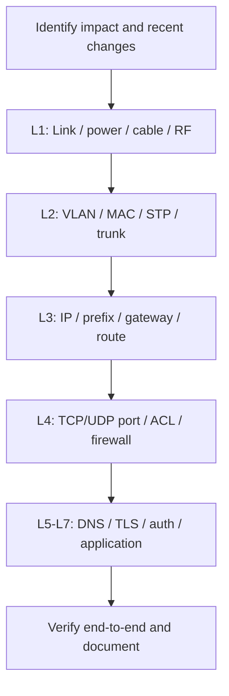

# OSI Model Troubleshooting | التشخيص بنموذج OSI

> اتبع منهجاً طبقيّاً: حدّد النطاق، اجمع evidence، اختبر فرضية واحدة، أصلح بأقل تغيير، ثم تحقق ووثّق. لا تنتقل مباشرة إلى reset أو reboot أو تعطيل firewall.

## منهجية Layer-by-Layer



## طبقة 1 — Physical

| العرض | سبب محتمل | دليل | إجراء |
|---|---|---|---|
| NIC يظهر Disconnected | cable/NIC/port معطل | `Get-NetAdapter`، LEDs | بدّل cable أو افحص switch port |
| Wi-Fi متقطع | RSSI ضعيف/interference | `netsh wlan show interfaces` | اختبر قرب AP وchannel design |
| بطء مع CRC | cable/SFP/duplex | Cisco error counters | افحص واستبدل عنصراً واحداً |

## طبقة 2 — Data Link

| العرض | سبب محتمل | دليل | إجراء |
|---|---|---|---|
| DHCP من شبكة خطأ | access VLAN خاطئة | `show vlan brief` | صحح port VLAN ثم renew lease |
| لا يظهر MAC | port/VLAN/STP أو NIC | `show mac address-table` | افحص port state وSTP |
| خدمات VLAN تتقطع | trunk/allowed VLAN mismatch | `show interfaces trunk` | طابق VLANs المسموحة والـ native VLAN |

## طبقة 3 — Network

| العرض | سبب محتمل | دليل | إجراء |
|---|---|---|---|
| `169.254.x.x` | DHCP failure | `ipconfig /all` | افحص scope، relay، VLAN، ثم renew |
| gateway غير قابل للوصول | prefix/VLAN/gateway/ACL | `Get-NetIPConfiguration` | صحح IP plan أو L2 path |
| subnet بعيد غير قابل للوصول | route مفقود/asymmetry | `route print`، `tracert -d` | افحص routing table والـ next hop |

## طبقة 4 — Transport

| العرض | سبب محتمل | دليل | إجراء |
|---|---|---|---|
| ping ينجح وHTTPS يفشل | port blocked/service down | `Test-NetConnection -Port 443` | افحص ACL/firewall/listener |
| TCP reset | service رفض الاتصال أو policy | Wireshark RST | راجع listener والتطبيق والسياسة |
| SYN timeout | firewall/route/server silent | Wireshark SYN بلا SYN-ACK | افحص المسار والسياسات من الطرفين |

## الطبقات 5–7 — Session, Presentation, Application

| العرض | سبب محتمل | دليل | إجراء |
|---|---|---|---|
| IP يعمل وFQDN يفشل | DNS resolver/record/suffix | `Resolve-DnsName` | صحح DNS record/server/suffix |
| تحذير certificate | expired/untrusted/name mismatch | browser/TLS log | أصلح certificate chain وSAN والوقت |
| login يفشل بعد الاتصال | token/Kerberos/session timeout | app/auth logs، `klist` | افحص NTP وidentity policy/session affinity |
| HTTP 500 | application/backend issue | `curl.exe -I` وapp logs | صعّد لمالك التطبيق مع evidence |

## سيناريو Enterprise كامل

**البلاغ:** موظفو Finance لا يصلون إلى `https://erp.corp.example`، بينما HR يعملون.

1. حدّد scope: Finance VLAN فقط، لذا لا تبدأ بخادم ERP.
2. Layer 1/2: قارن port VLAN وMAC learning بجهاز HR أو جهاز Finance سليم.
3. Layer 3: قارن DHCP scope وgateway وroute.
4. Layer 7: نفّذ `Resolve-DnsName`؛ قد يعمل DNS للجميع.
5. Layer 4: نفّذ `Test-NetConnection erp.corp.example -Port 443` من Finance وHR.
6. إذا اختلفت النتيجة، افحص Firewall policy/ACL source subnet. وثّق source IP وtimestamp وpolicy hit.

## أوامر Evidence الأساسية

```powershell
Get-NetAdapter
Get-NetIPConfiguration
Get-NetNeighbor -AddressFamily IPv4
Resolve-DnsName erp.corp.example
Test-NetConnection erp.corp.example -Port 443 -InformationLevel Detailed
```

```cisco
show interfaces status
show vlan brief
show mac address-table dynamic
show ip route
show logging
```

## أخطاء شائعة يجب تجنبها

- اعتبار `ping` اختباراً كاملاً للتطبيق.
- تغيير IP ثابت لإخفاء عطل DHCP بدلاً من إصلاحه.
- مسح DNS cache أو reset الشبكة قبل حفظ evidence.
- تعطيل firewall بدلاً من تحديد rule أو port أو source/destination بدقة.
- افتراض أن طبقة واحدة هي السبب دون تحديد scope والمقارنة بجهاز سليم.

## أسئلة مقابلات

### كيف تستخدم نموذج OSI لحل عطل تطبيق؟

**الإجابة:** أحدد الأثر والنطاق، وأثبت L1 ثم L2 ثم L3، وأختبر port في L4، ثم DNS/TLS/auth/application في الطبقات العليا. أوثق الأدلة والـ root cause وأتحقق end-to-end بعد الإصلاح.

### لماذا تعد مقارنة جهاز متأثر بجهاز سليم مفيدة؟

**الإجابة:** تعطي baseline من البيئة نفسها وتقلل الاحتمالات؛ يمكن مقارنة VLAN وDHCP options وDNS server وroute وpolicy behaviour بدون تخمين.
