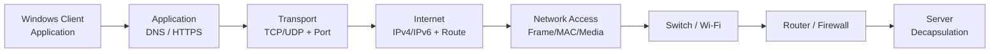

# TCP/IP Model | نموذج TCP/IP

> Category: 01-Networking / 03-TCP-IP-Model

## نظرة عامة | Overview

نموذج **TCP/IP** هو النموذج العملي الذي يصف Internet Protocol Suite المستخدمة في الشبكات الحديثة. يشرح هذا القسم كيف تتعاون طبقات Application وTransport وInternet وNetwork Access لنقل البيانات من تطبيق على جهاز إلى تطبيق على جهاز آخر.

The TCP/IP model is the practical architecture behind modern networks. It is used here as an operational model for Windows, Linux, Cisco, Wireshark, and Enterprise troubleshooting.

## أهداف التعلم | Learning Objectives

- ربط طبقات TCP/IP الأربع بطبقات OSI السبع.
- فهم encapsulation/decapsulation وPDU وports وIP addressing.
- التمييز بين TCP reliability وUDP low latency.
- تحليل ICMP وARP وDNS وDHCP وTCP في Wireshark.
- تشخيص مشكلات Windows وCisco باستخدام evidence لا التخمين.
- تطبيق CCNA concepts في سيناريو Enterprise.

## طبقات TCP/IP

| TCP/IP layer | يقابله في OSI | الوظيفة | أمثلة |
|---|---|---|---|
| Application | 7–5 | خدمات التطبيقات والجلسات وتمثيل البيانات | HTTP(S)، DNS، DHCP، SMTP، SSH |
| Transport | 4 | الاتصال end-to-end والمنافذ والاعتمادية | TCP، UDP |
| Internet | 3 | IP addressing، routing، delivery | IPv4، IPv6، ICMP |
| Network Access | 2–1 | framing وMAC والوسط الفيزيائي | Ethernet، Wi-Fi، ARP |

## Enterprise Packet Journey



```text
Data → TCP Segment / UDP Datagram → IP Packet → Ethernet/Wi-Fi Frame → Bits
Bits → Frame → Packet → Segment/Datagram → Data
```

## TCP vs UDP

| Feature | TCP (Transmission Control Protocol) | UDP (User Datagram Protocol) |
|---|---|---|
| الاتصال | Connection-oriented | Connectionless |
| الاعتمادية | ACK، sequence، retransmission | لا يوفرها افتراضياً |
| الترتيب | يحافظ على ترتيب البيانات | التطبيق يعالج الترتيب عند الحاجة |
| السرعة | overhead أعلى | overhead أقل وlatency منخفض |
| أمثلة | HTTPS، SMB، RDP، SSH | DNS، DHCP، NTP، VoIP |
| PDU | Segment | Datagram |

## IPv4 مقابل IPv6

| Feature | IPv4 | IPv6 |
|---|---|---|
| حجم العنوان | 32-bit | 128-bit |
| مثال | `192.168.10.25` | `2001:db8:10::25` |
| Neighbor discovery | ARP | NDP/ICMPv6 |
| DHCP | DHCPv4 | DHCPv6 أو SLAAC |
| Broadcast | موجود | لا يوجد broadcast؛ multicast/anycast |
| NAT | شائع لتوفير العناوين | أقل حاجة من ناحية العناوين |
| الاختبار | `ping -4` | `ping -6` |

## البروتوكولات الأساسية

| Protocol | Layer | الغرض |
|---|---|---|
| ICMP | Internet | echo، errors، diagnostics، TTL exceeded |
| ARP | Network Access/Internet boundary | IPv4-to-MAC داخل LAN |
| DNS | Application | name-to-address resolution |
| DHCP | Application over UDP | automatic IP configuration |
| TCP | Transport | reliable ordered delivery |
| UDP | Transport | lightweight datagrams |

## Enterprise Example

عند فتح المستخدم `https://portal.corp.example`، يرسل Windows DNS query إلى resolver، ويستخدم ARP لمعرفة MAC البوابة، ثم ينشئ TCP session إلى port `443`. يوجه Router الحزمة بين الشبكات، ويطبق Firewall policy، ثم يفك الخادم التغليف حتى تصل البيانات إلى web service.

## CCNA Notes

- TCP/IP هو model عملي، أما OSI فهو reference model للتعلم والتشخيص.
- لا تخلط بين protocol وlayer: DNS يعمل في Application لكنه يستخدم UDP/TCP في Transport وIP في Internet.
- ICMP ليس Transport protocol؛ هو Internet-layer control/diagnostic protocol.
- ARP ليس routing protocol، ولا يعبر Router؛ يعمل داخل local broadcast domain.
- Router يغير Layer 2 header في كل hop، بينما تبقى source/destination IP عادةً end-to-end قبل NAT.

## روابط الوحدة

- [Notes | الملاحظات](notes.md)
- [Commands | الأوامر](commands.md)
- [Cheatsheet | الملخص](cheatsheet.md)
- [Lab Guide | المختبرات](lab-guide.md)
- [Troubleshooting | التشخيص](troubleshooting.md)
- [Mermaid Diagrams | المخططات](mermaid-diagram.md)
