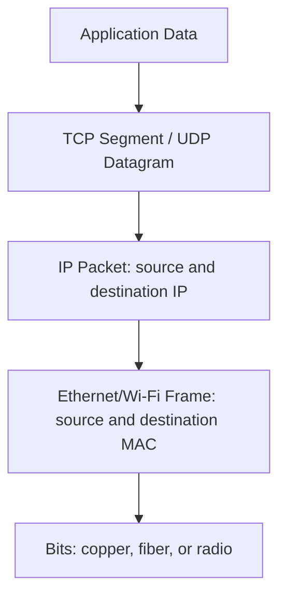
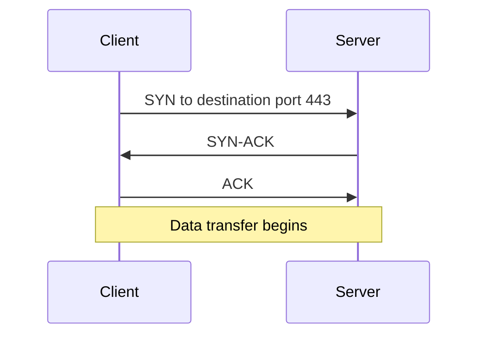
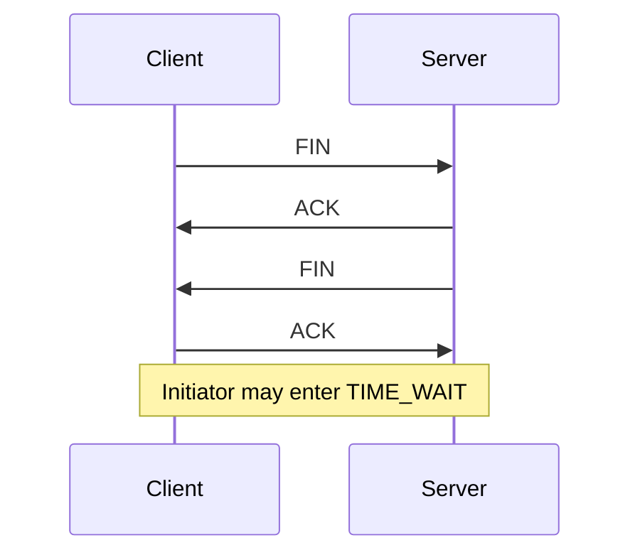
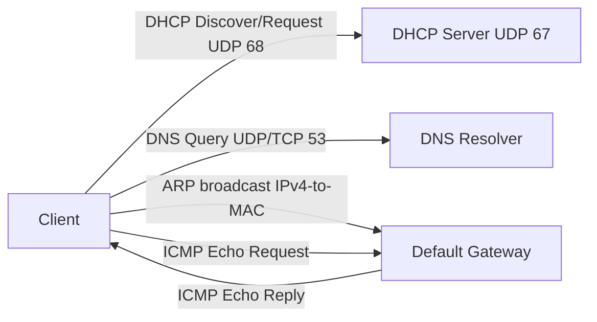
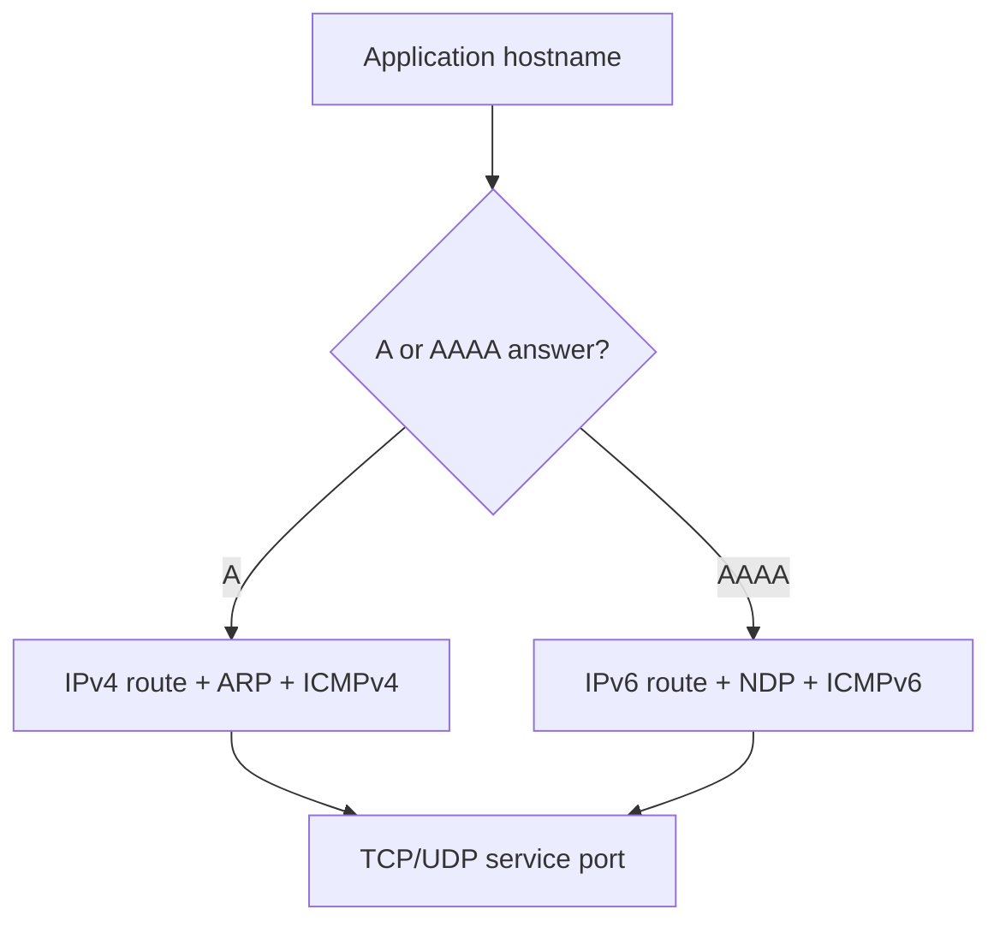

# TCP/IP Diagrams | مخططات TCP/IP

## Encapsulation

```mermaid
flowchart TD
    A[Application Data] --> B[TCP Segment / UDP Datagram]
    B --> C[IP Packet: source and destination IP]
    C --> D[Ethernet/Wi-Fi Frame: source and destination MAC]
    D --> E[Bits: copper, fiber, or radio]
```

## TCP Three-Way Handshake

```mermaid
sequenceDiagram
    participant C as Client
    participant S as Server
    C->>S: SYN to destination port 443
    S->>C: SYN-ACK
    C->>S: ACK
    Note over C,S: Data transfer begins
```

## TCP Four-Way Termination

```mermaid
sequenceDiagram
    participant C as Client
    participant S as Server
    C->>S: FIN
    S->>C: ACK
    S->>C: FIN
    C->>S: ACK
    Note over C,S: Initiator may enter TIME_WAIT
```

## DNS, DHCP, ARP, and ICMP

```mermaid
flowchart LR
    C[Client] -->|DHCP Discover/Request UDP 68| D[DHCP Server UDP 67]
    C -->|DNS Query UDP/TCP 53| R[DNS Resolver]
    C -->|ARP broadcast IPv4-to-MAC| G[Default Gateway]
    C -->|ICMP Echo Request| G
    G -->|ICMP Echo Reply| C
```

## IPv4 and IPv6

```mermaid
flowchart TD
    A[Application hostname] --> B{A or AAAA answer?}
    B -->|A| C[IPv4 route + ARP + ICMPv4]
    B -->|AAAA| D[IPv6 route + NDP + ICMPv6]
    C --> E[TCP/UDP service port]
    D --> E
```
