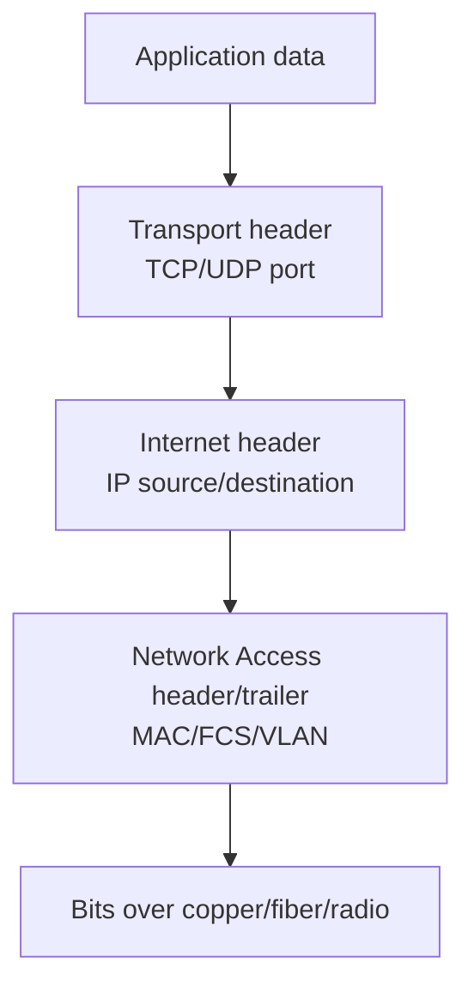
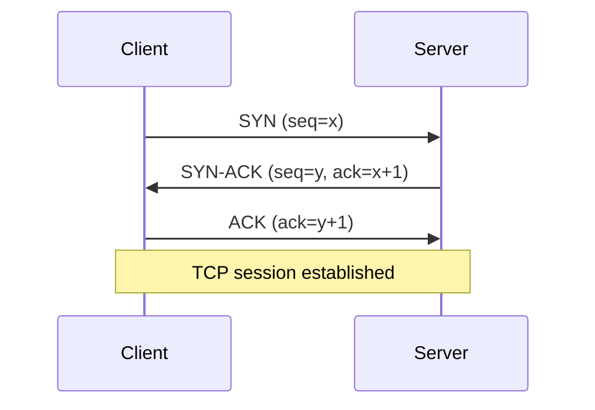

# TCP/IP Model Notes | ملاحظات نموذج TCP/IP

## 1. الفكرة الأساسية | Core Concept

TCP/IP ليس بروتوكولاً واحداً؛ هو **protocol suite** ومجموعة قواعد مترابطة. كل طبقة تقدم service للطبقة الأعلى وتستخدم service من الطبقة الأسفل. هذا الفصل بين المسؤوليات يسمح باستبدال Ethernet بـ Wi-Fi أو IPv4 بـ IPv6 دون إعادة تصميم التطبيق.



## 2. Encapsulation and Decapsulation

في المصدر تضيف كل طبقة header خاصاً بها. في الوجهة تتحقق الطبقات من المعلومات وتزيلها تدريجياً. يظل التطبيق غير مضطر لمعرفة نوع الكابل، كما لا يحتاج switch إلى فهم HTTP.

| Layer | PDU | أهم header/metadata |
|---|---|---|
| Application | Data | query، request، session data |
| Transport | TCP Segment / UDP Datagram | ports، flags، sequence |
| Internet | IP Packet | source/destination IP، TTL/hop limit |
| Network Access | Frame | source/destination MAC، VLAN، FCS |
| Physical | Bits | signal، speed، duplex، medium |

## 3. Application Layer

تضم الخدمات التي يتعامل معها المستخدم أو التطبيق: **HTTP/HTTPS** للويب، **DNS** للأسماء، **DHCP** للإعداد، **SMTP/IMAP** للبريد، و**SSH/SMB** للإدارة والملفات.

في Enterprise، قد يكون هناك DNS resolver وproxy وWAF وload balancer قبل application server. نجاح DNS لا يعني نجاح التطبيق؛ يجب فحص status code وTLS وauthentication.

### DNS Flow

1. يرسل العميل query إلى recursive resolver على UDP/53 غالباً.
2. يبحث resolver في cache أو يتواصل مع authoritative server.
3. يعود A/AAAA/CNAME record إلى العميل.
4. يستخدم العميل العنوان الناتج لبدء Transport connection.

### DHCP Flow

يستخدم DHCPv4 UDP/67 للخادم وUDP/68 للعميل، ويبدأ عادةً برسائل DORA:

```text
Client ── DHCPDISCOVER (broadcast) ──>
       <── DHCPOFFER ─────────────── Server
Client ── DHCPREQUEST ──────────────>
       <── DHCPACK ───────────────── Server
```

إذا كان DHCP server في شبكة أخرى، يحتاج المسار إلى DHCP relay مثل `ip helper-address` في Cisco.

## 4. Transport Layer

### TCP

TCP يقدم reliable, ordered, byte-stream delivery. يستخدم ports لتمييز الخدمات، sequence numbers للترتيب، ACKs للتأكيد، receive window للتحكم في التدفق، وcongestion control لحماية الشبكة.



### TCP Termination

```mermaid
sequenceDiagram
    participant C as Client
    participant S as Server
    C->>S: FIN
    S->>C: ACK
    S->>C: FIN
    C->>S: ACK
    Note over C,S: Connection closed; TIME_WAIT may remain on initiator
```

### UDP

UDP يرسل datagrams دون handshake أو retransmission أو ordering مدمج. هذا يقلل overhead ويجعله مناسباً لـ DNS وNTP وDHCP وreal-time media، لكن التطبيق قد يحتاج sequence أو recovery خاصاً به.

| TCP | UDP |
|---|---|
| handshake قبل البيانات | لا handshake |
| reliable stream | best-effort datagrams |
| retransmission/ordering | مسؤولية التطبيق أو لا توجد |
| مناسب للملفات والويب | مناسب لـ low latency وbroadcast/multicast |

## 5. Internet Layer

### IPv4

عنوان IPv4 طوله 32-bit ويقسم إلى network prefix وhost portion. يستخدم Router **longest prefix match** لاختيار أفضل route، ثم يمرر packet إلى next hop. `TTL` يقل في كل Router، وانتهاؤه قد يولد ICMP Time Exceeded.

### IPv6

IPv6 طوله 128-bit، ويعتمد على NDP/ICMPv6 بدلاً من ARP. يدعم SLAAC وDHCPv6، ولا يستخدم broadcast. يجب اختبار DNS A وAAAA وpolicy للـ dual-stack لأن نجاح IPv4 لا يثبت نجاح IPv6.

### IPv4 vs IPv6

| العنصر | IPv4 | IPv6 |
|---|---|---|
| العنوان | 32-bit dotted decimal | 128-bit hexadecimal |
| resolution المحلي | ARP | Neighbor Discovery |
| configuration | DHCPv4/static | SLAAC/DHCPv6/static |
| diagnostics | ICMP | ICMPv6 |

## 6. ICMP

ICMP يحمل control/error messages وليس application payload. من أمثلته Echo Request/Reply المستخدم في ping، Destination Unreachable، وTime Exceeded المستخدم مع traceroute/tracert.

```text
ping:       Echo Request  ─────>  Echo Reply
tracert:    TTL=1 ──> Router returns Time Exceeded
            TTL=2 ──> Next router returns Time Exceeded
```

فشل ICMP قد ينتج من firewall policy، لذلك اختبر TCP port المطلوب أيضاً.

## 7. ARP

عندما يحتاج IPv4 host إلى إرسال frame إلى IP محلي، يفحص ARP cache. إذا لم يجد MAC، يرسل ARP Request broadcast، ثم يرد صاحب العنوان بـ ARP Reply unicast. عند destination بعيد، يبحث العميل عن MAC default gateway وليس MAC الخادم البعيد.

```text
Who has 10.20.20.1?  (broadcast)
10.20.20.1 is at aa:bb:cc:dd:ee:ff  (unicast reply)
```

مشكلات ARP تشمل duplicate IP، stale cache، spoofing، وVLAN mismatch.

## 8. Network Access Layer

تضم Ethernet/Wi-Fi framing وMAC switching والوسط الفيزيائي. Switch يتعلم source MAC ويستخدم destination MAC، بينما Router لا يمرر broadcast domain افتراضياً. VLAN tag `802.1Q` يميز traffic على trunk.

## 9. الأجهزة والقرارات

| Device | Layer/role | القرار |
|---|---|---|
| NIC | Network Access | frame/signal إلى host |
| Switch | L2 | destination MAC/VLAN |
| Router/L3 switch | Internet | destination IP/route |
| Firewall | L3–L7 | source/destination/port/application policy |
| Load balancer | L4–L7 | connection أو HTTP service selection |

## 10. Enterprise Packet Flow

عند وصول موظف إلى `https://hr.corp.example`:

1. DNS يترجم الاسم إلى A/AAAA.
2. ARP/NDP يكتشف next-hop MAC.
3. TCP ينشئ session إلى 443 أو قد يستخدم QUIC/UDP حسب التطبيق.
4. IP يحدد route عبر VLAN gateway وfirewall.
5. Ethernet/Wi-Fi يحول packet إلى frame/bits.
6. الخادم يفك التغليف ويعالج TLS وHTTP.

## CCNA Notes

- DHCP DORA يبدأ Discover وقد يكون broadcast؛ relay مطلوب بين subnets.
- DNS يستخدم UDP/53 غالباً وTCP/53 في حالات مثل الردود الكبيرة أو zone transfer.
- ARP يعمل لـ IPv4 داخل LAN؛ IPv6 يستخدم NDP/ICMPv6.
- `ping` لا يختبر port؛ استخدم `Test-NetConnection -Port` أو packet capture.
- TCP port range: well-known `0–1023`، registered `1024–49151`، dynamic/ephemeral `49152–65535` في Windows عادةً.

## Interview Questions and Answers

### لماذا TCP/IP عملي أكثر من OSI؟

**الإجابة:** TCP/IP هو suite/model المستخدم فعلياً في Internet وEnterprise networks، بينما OSI reference model تعليمي وتحليلي مكوّن من سبع طبقات. يستخدم المهندس الاثنين لفهم التطبيق وتشخيصه.

### ماذا يحدث إذا لم يوجد default gateway؟

**الإجابة:** يستطيع الجهاز غالباً التواصل داخل local subnet فقط، لكنه لا يرسل traffic إلى الشبكات البعيدة لأن next hop غير معروف.

### ما الفرق بين ARP وDNS؟

**الإجابة:** DNS يحول اسماً مثل FQDN إلى IP، بينما ARP يحول IPv4 next-hop IP إلى MAC داخل local LAN. DNS Application، وARP مرتبط بـ Network Access/Internet boundary.

### لماذا تستخدم DNS UDP وTCP؟

**الإجابة:** UDP أقل overhead للاستعلامات المعتادة، بينما TCP يستخدم للرسائل الكبيرة أو zone transfers أو عندما تتطلب العملية اتصالاً موثوقاً.

### كيف تفسر TCP SYN بدون SYN-ACK؟

**الإجابة:** قد يكون الخادم لا يستمع، أو route/ACL/firewall يسقط الحزمة، أو return path غير صحيح. أتحقق من client capture، server listener، وpolicy logs.
