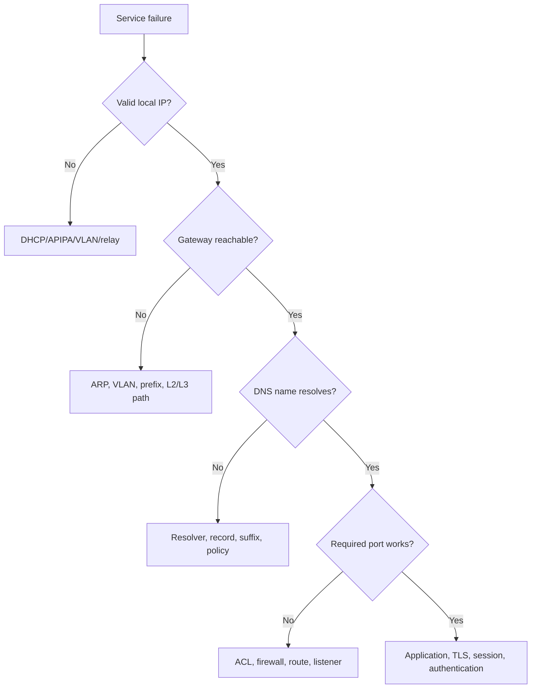

# TCP/IP Troubleshooting | تشخيص TCP/IP

> حدّد scope وimpact أولاً، ثم اجمع evidence من Network Access إلى Application. قارن جهازاً متأثراً بجهاز سليم، واختبر IPv4/IPv6 وIP/FQDN وICMP/TCP كلّاً على حدة.



## Runbook 1: APIPA / DHCP Failure

**Symptoms:** Windows has `169.254.x.x`, no gateway، ولا يصل إلى internal services.

```powershell
Get-NetIPConfiguration
ipconfig /all
Get-NetAdapter
ipconfig /renew
```

تحقق من access VLAN وDHCP scope وDHCP relay وserver service وUDP 67/68 policy. لا تستخدم static IP كحل نهائي قبل تحديد root cause.

## Runbook 2: IP Works, Name Fails

```powershell
Test-Connection 10.30.30.10 -Count 2
Resolve-DnsName portal.corp.example
Get-DnsClientServerAddress
nslookup portal.corp.example
```

إذا نجح IP وفشل FQDN، افحص DNS server assignment وA/AAAA/CNAME record وDNS suffix وsplit-horizon policy. `Clear-DnsClientCache` يعالج stale cache فقط، لا record خاطئاً.

## Runbook 3: DNS Works, TCP Fails

```powershell
Resolve-DnsName portal.corp.example
Test-NetConnection portal.corp.example -Port 443 -InformationLevel Detailed
netstat -ano | findstr :443
```

الاحتمالات: firewall/ACL، route asymmetric، service غير listening، load balancer health، أو TLS policy. اختبر من subnet يعمل ومن subnet متأثر مع تسجيل source IP.

## Runbook 4: TCP SYN بدون SYN-ACK

| Evidence | الاحتمال |
|---|---|
| SYN يغادر ولا يعود | path/firewall/server silent |
| RST يعود فوراً | service رفض أو policy reject |
| SYN-ACK يعود لكن ACK لا يصل | return path أو local firewall |

استخدم Wireshark على الطرف المصرح به، وافحص listener على الخادم وfirewall policy/logs في الوسط.

## Runbook 5: IPv4 يعمل وIPv6 يفشل

```powershell
Test-Connection portal.corp.example -IPv4 -Count 2
Test-Connection portal.corp.example -IPv6 -Count 2
Resolve-DnsName portal.corp.example -Type A
Resolve-DnsName portal.corp.example -Type AAAA
Get-NetRoute -AddressFamily IPv6
```

افحص AAAA record وIPv6 default route وICMPv6/NDP policy وfirewall وdual-stack behaviour. لا تعطل IPv6 عشوائياً.

## Runbook 6: ARP / Duplicate IP

```cmd
arp -a
ping <local-ip>
```

```cisco
show ip arp <ip-address>
show mac address-table dynamic | include <mac-address>
```

MAC يتغير بين منافذ مختلفة أو تظهر duplicate IP warnings: تحقق من DHCP reservations وIPAM وswitch logs، ثم امسح cache بعد معالجة السبب.

## Runbook 7: DNS/DHCP Capture

Wireshark filters:

```text
dhcp || bootp
dns
dns.flags.response == 0
udp.port == 67 || udp.port == 68
```

ابحث عن Discover/Offer/Request/ACK، ثم query/response وresponse code. إذا خرج Discover ولم يصل Offer فافحص VLAN وrelay وscope وserver path.

## Incident Template

```text
Impact and scope:
Client / source subnet:
Destination FQDN, IP, port:
IPv4 and IPv6 results:
Commands and timestamps:
Packet/log evidence:
Root cause:
Change and rollback:
End-to-end verification:
Prevention and monitoring:
```

## CCNA Interview Questions

### هل TCP/IP Model هو نفسه OSI Model؟

**الإجابة:** لا. TCP/IP model عملي بأربع طبقات تقريباً، بينما OSI reference model بسبع طبقات. يمكن mapping بينهما، لكنهما ليسا نفس البروتوكول.

### كيف تشخّص Internet لا يعمل؟

**الإجابة:** أتحقق من NIC/link، ثم IP/DHCP، ثم gateway، ثم public IP، ثم DNS، ثم TCP port/application. أسجل النتائج ولا أستنتج من ping واحد.

### لماذا قد يفشل DNS بسبب TCP/UDP؟

**الإجابة:** DNS query المعتاد UDP/53، لكن الردود الكبيرة أو zone transfers قد تستخدم TCP/53؛ يجب السماح بالمسارين وفق تصميم الخدمة.
