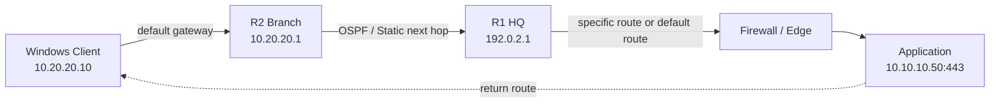
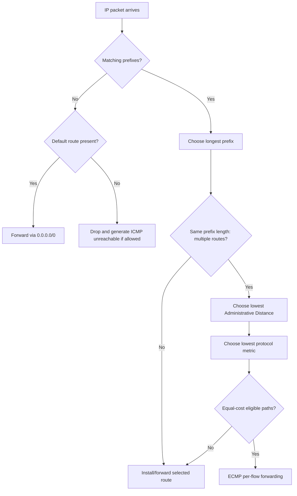
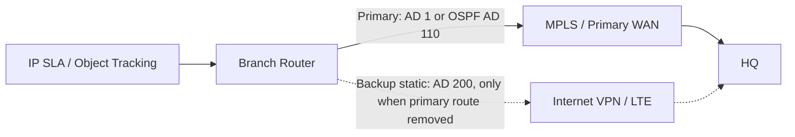
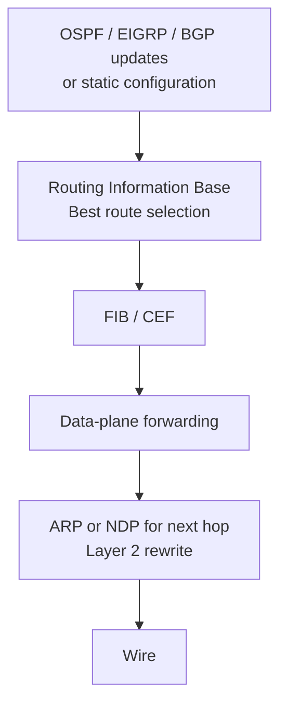
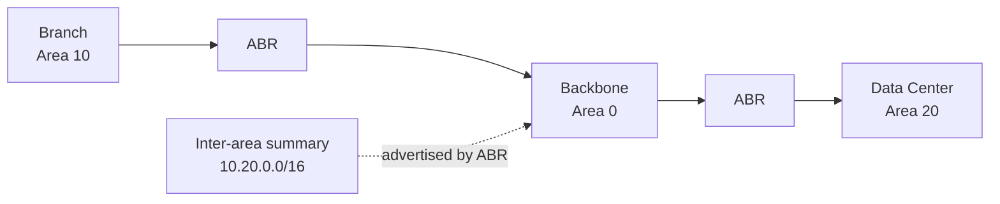

# Routing Diagrams | مخططات التوجيه

## Enterprise Forwarding Path

## Route Selection Decision

## Primary and Floating Static Failover

## Control Plane vs Data Plane

## OSPF Enterprise Area View

