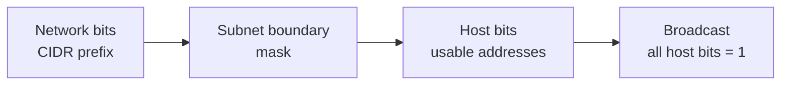
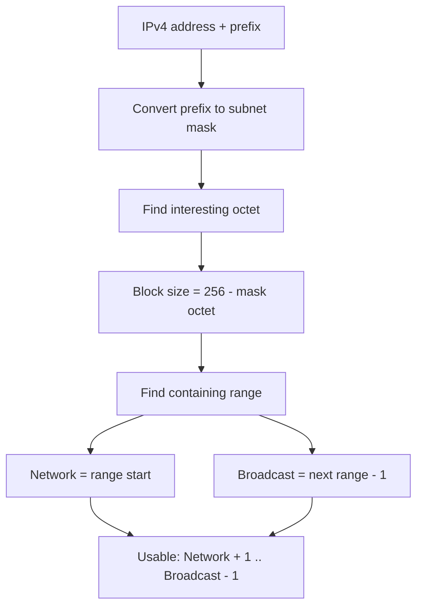
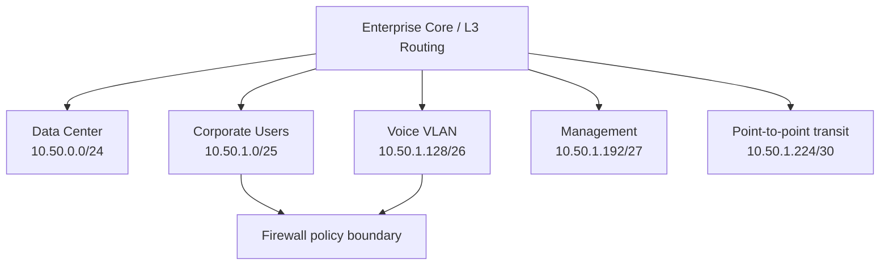
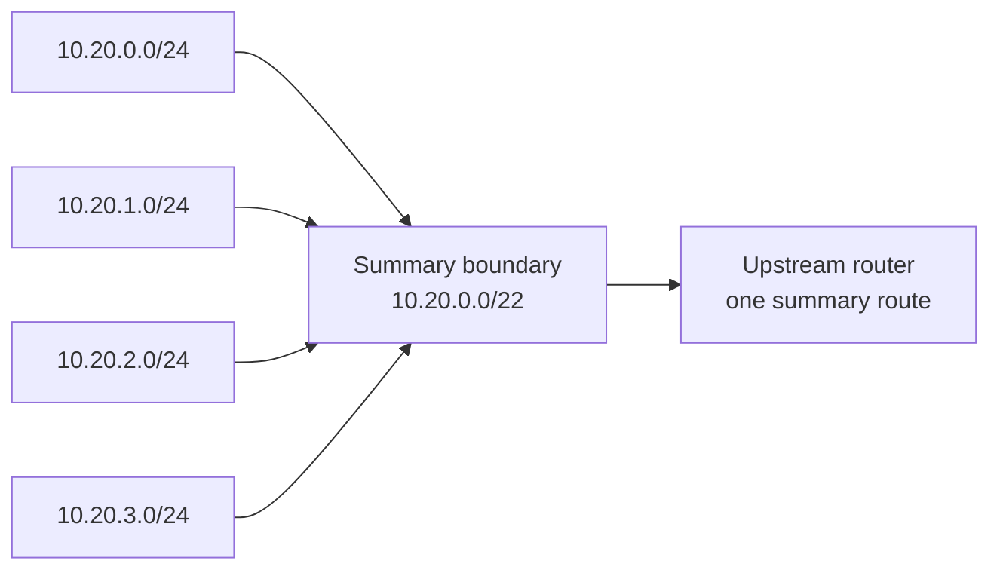

# Subnetting & VLSM Diagrams | مخططات التقسيم

## IPv4 Bit Boundary

## Address Calculation Flow

## VLSM Allocation

## Enterprise Segmentation

## Route Summarization Boundary

Summary is valid only when prefixes are contiguous and the summary start is binary-aligned.
