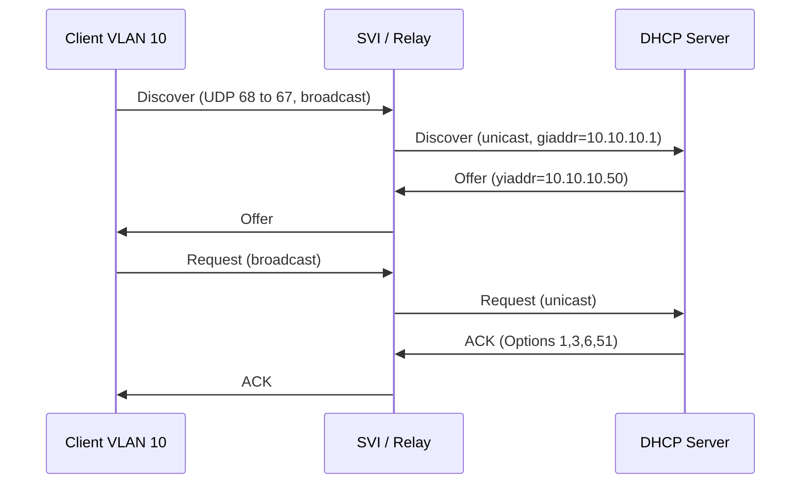
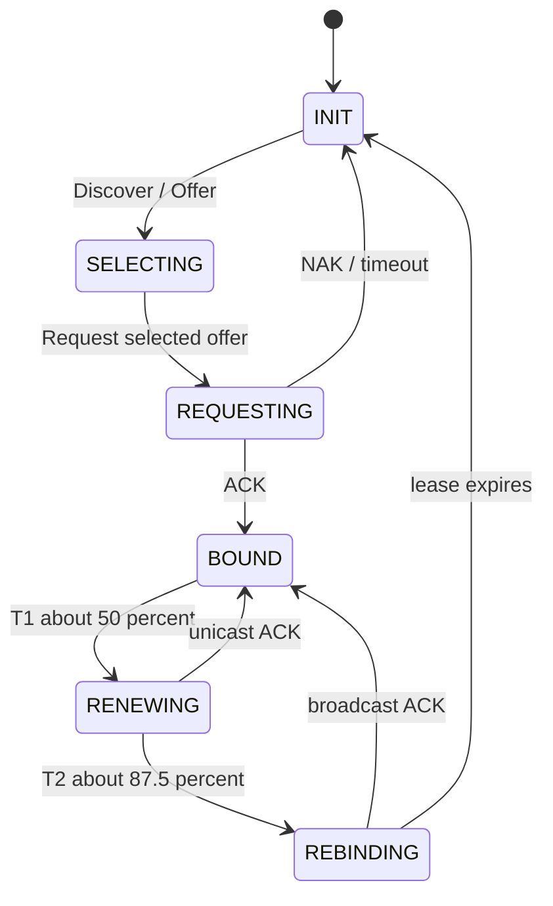
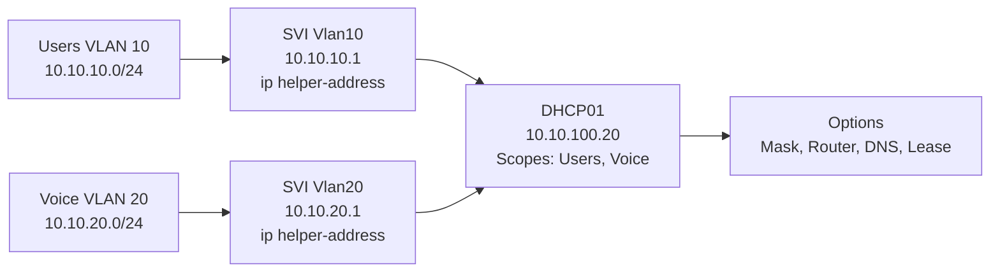
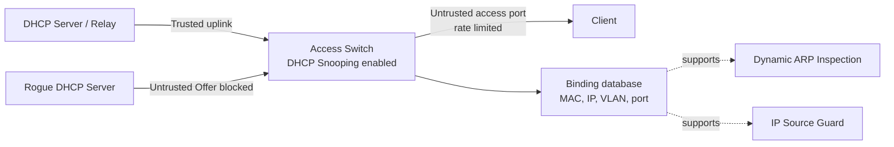

# DHCP Diagrams | مخططات DHCP

## DORA Through a Relay

```mermaid
sequenceDiagram
    participant C as Client VLAN 10
    participant R as SVI / Relay
    participant S as DHCP Server
    C->>R: Discover (UDP 68 to 67, broadcast)
    R->>S: Discover (unicast, giaddr=10.10.10.1)
    S->>R: Offer (yiaddr=10.10.10.50)
    R->>C: Offer
    C->>R: Request (broadcast)
    R->>S: Request (unicast)
    S->>R: ACK (Options 1,3,6,51)
    R->>C: ACK
```

## Lease Lifecycle

```mermaid
stateDiagram-v2
    [*] --> INIT
    INIT --> SELECTING: Discover / Offer
    SELECTING --> REQUESTING: Request selected offer
    REQUESTING --> BOUND: ACK
    REQUESTING --> INIT: NAK / timeout
    BOUND --> RENEWING: T1 about 50 percent
    RENEWING --> BOUND: unicast ACK
    RENEWING --> REBINDING: T2 about 87.5 percent
    REBINDING --> BOUND: broadcast ACK
    REBINDING --> INIT: lease expires
```

## Multiple VLAN DHCP Design

```mermaid
flowchart LR
    U[Users VLAN 10<br/>10.10.10.0/24] --> G1[SVI Vlan10<br/>10.10.10.1<br/>ip helper-address]
    V[Voice VLAN 20<br/>10.10.20.0/24] --> G2[SVI Vlan20<br/>10.10.20.1<br/>ip helper-address]
    G1 --> S[DHCP01<br/>10.10.100.20<br/>Scopes: Users, Voice]
    G2 --> S
    S --> O[Options<br/>Mask, Router, DNS, Lease]
```

## DHCP Snooping Trust Boundary

```mermaid
flowchart LR
    D[DHCP Server / Relay] -->|Trusted uplink| SW[Access Switch<br/>DHCP Snooping enabled]
    SW -->|Untrusted access port<br/>rate limited| PC[Client]
    R[Rogue DHCP Server] -->|Untrusted Offer blocked| SW
    SW --> B[Binding database<br/>MAC, IP, VLAN, port]
    B -. supports .-> DAI[Dynamic ARP Inspection]
    B -. supports .-> IPSG[IP Source Guard]
```
