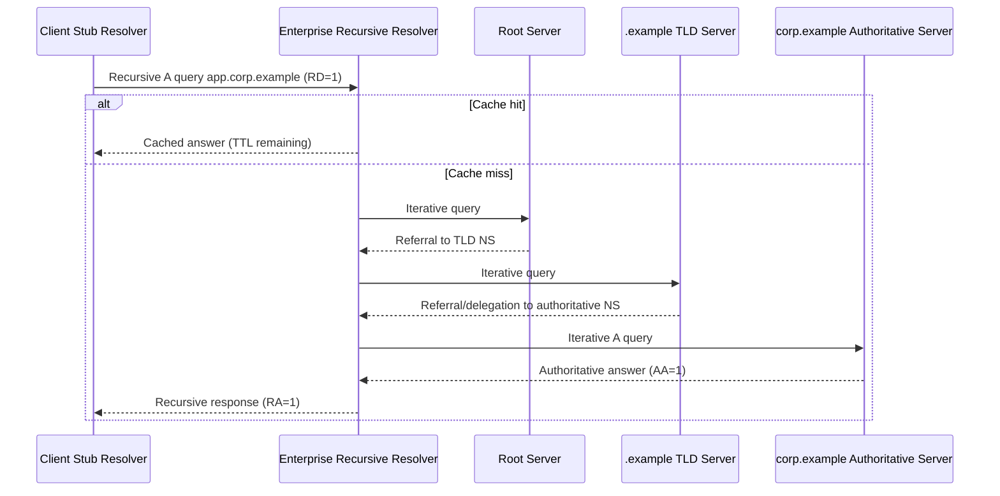
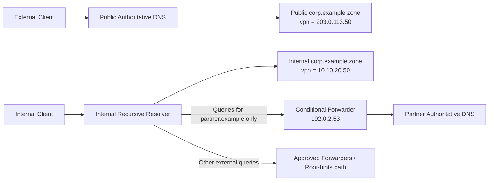
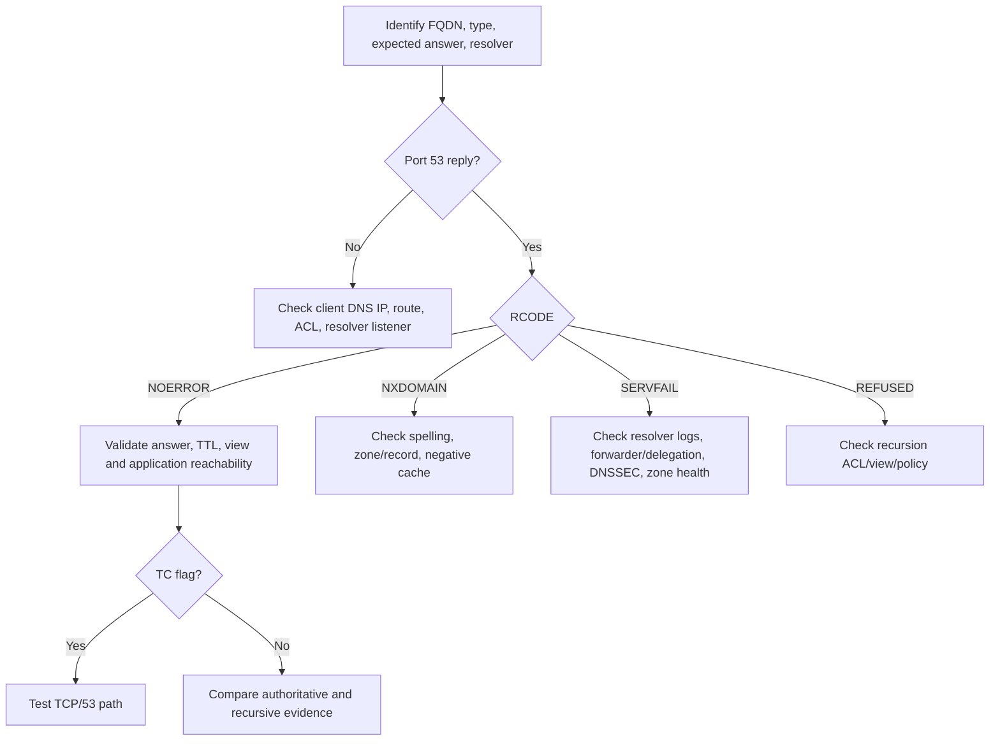

# DNS Diagrams | مخططات DNS

## Recursive Resolution and Iterative Referrals

```mermaid
sequenceDiagram
    participant C as Client Stub Resolver
    participant R as Enterprise Recursive Resolver
    participant Root as Root Server
    participant TLD as .example TLD Server
    participant Auth as corp.example Authoritative Server
    C->>R: Recursive A query app.corp.example (RD=1)
    alt Cache hit
        R-->>C: Cached answer (TTL remaining)
    else Cache miss
        R->>Root: Iterative query
        Root-->>R: Referral to TLD NS
        R->>TLD: Iterative query
        TLD-->>R: Referral/delegation to authoritative NS
        R->>Auth: Iterative A query
        Auth-->>R: Authoritative answer (AA=1)
        R-->>C: Recursive response (RA=1)
    end
```

## Enterprise Split DNS and Conditional Forwarding

```mermaid
flowchart LR
    I[Internal Client] --> R[Internal Recursive Resolver]
    E[External Client] --> P[Public Authoritative DNS]
    R --> IZ[Internal corp.example zone<br/>vpn = 10.10.20.50]
    P --> EZ[Public corp.example zone<br/>vpn = 203.0.113.50]
    R -->|Queries for partner.example only| CF[Conditional Forwarder<br/>192.0.2.53]
    CF --> PA[Partner Authoritative DNS]
    R -->|Other external queries| F[Approved Forwarders / Root-hints path]
```

## DNS Troubleshooting Decision Path

```mermaid
flowchart TD
    A[Identify FQDN, type, expected answer, resolver] --> B{Port 53 reply?}
    B -->|No| C[Check client DNS IP, route, ACL, resolver listener]
    B -->|Yes| D{RCODE}
    D -->|NOERROR| E[Validate answer, TTL, view and application reachability]
    D -->|NXDOMAIN| F[Check spelling, zone/record, negative cache]
    D -->|SERVFAIL| G[Check resolver logs, forwarder/delegation, DNSSEC, zone health]
    D -->|REFUSED| H[Check recursion ACL/view/policy]
    E --> I{TC flag?}
    I -->|Yes| J[Test TCP/53 path]
    I -->|No| K[Compare authoritative and recursive evidence]
```
